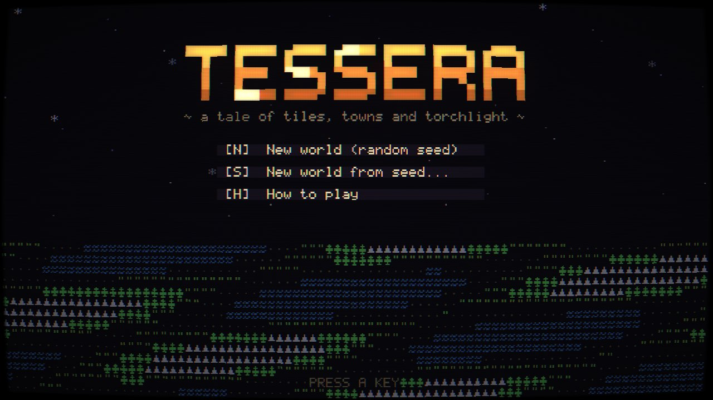
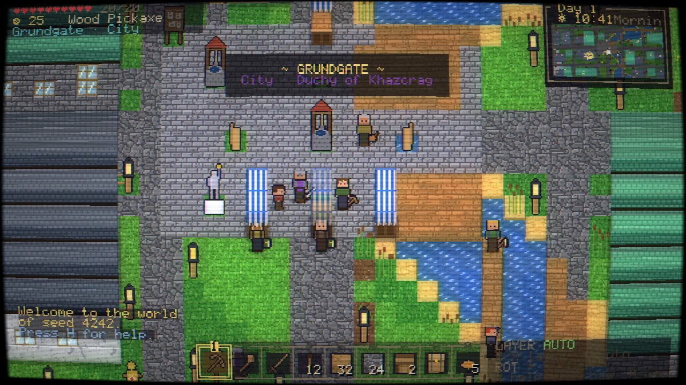
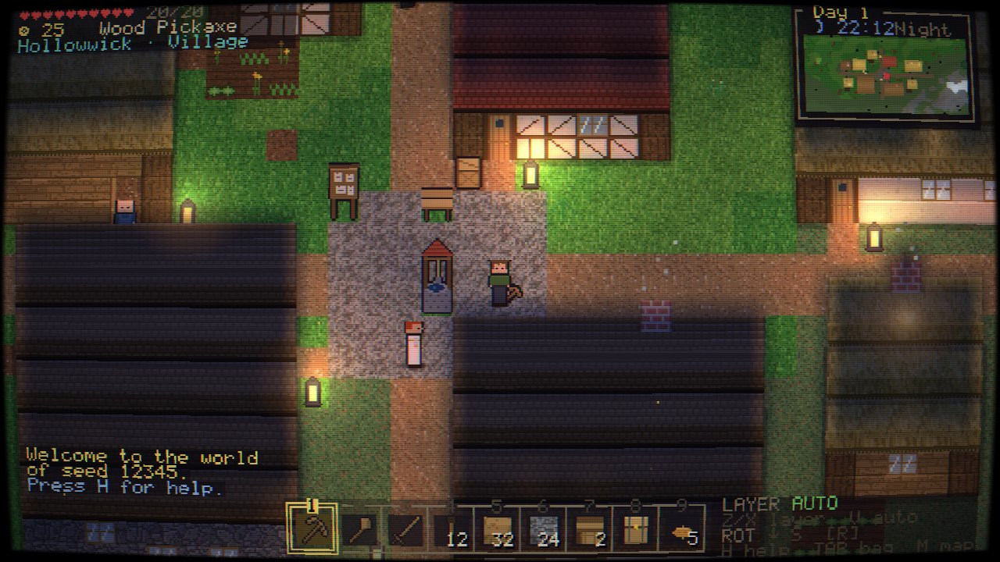
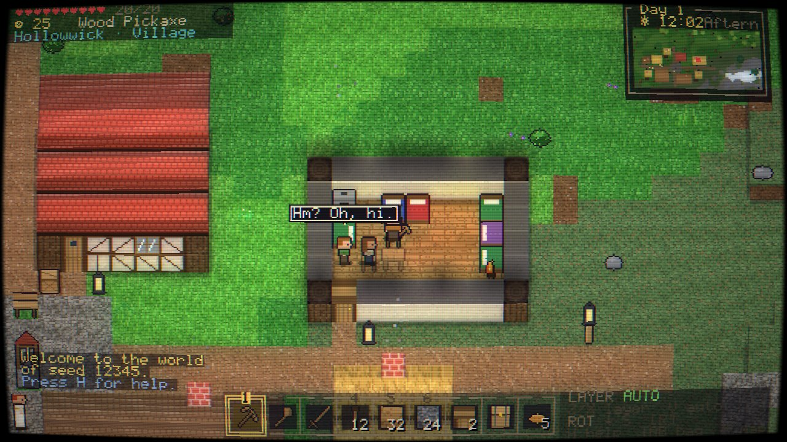
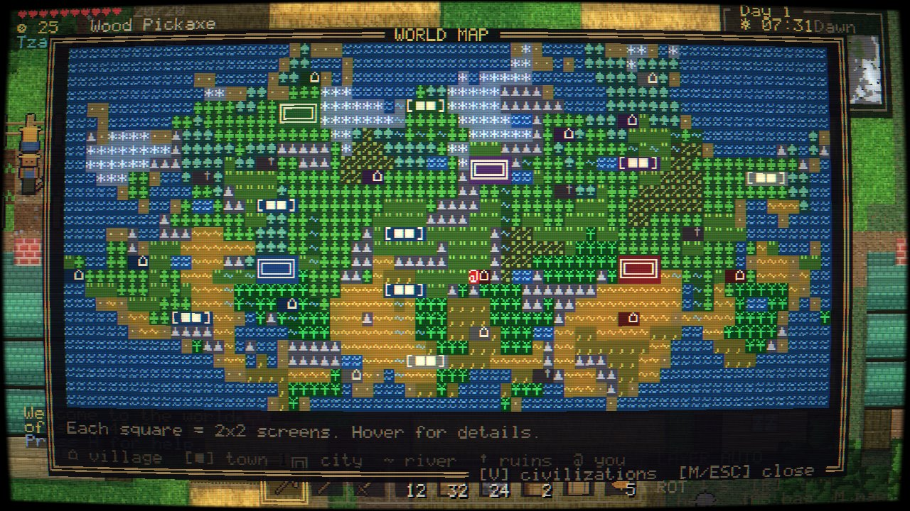
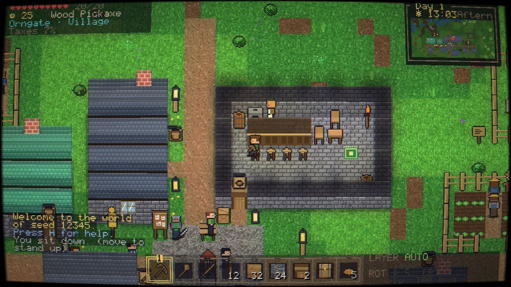
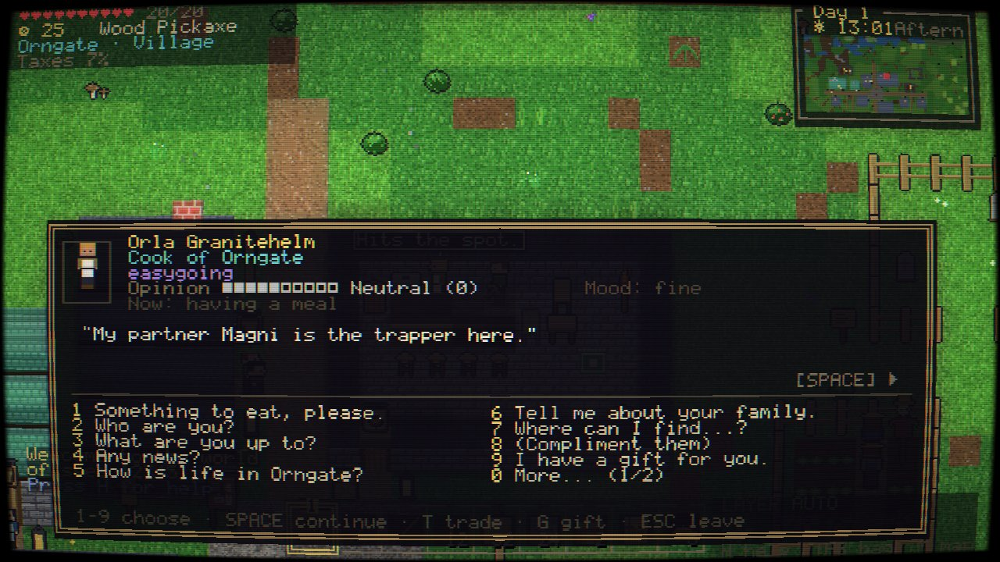
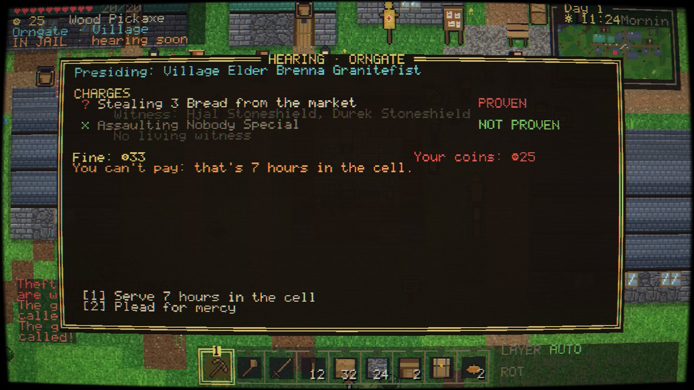
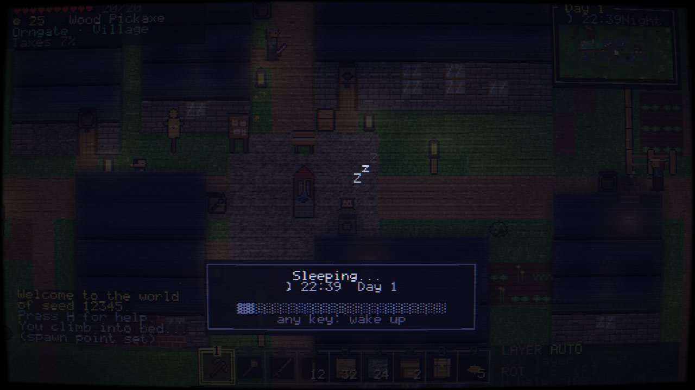

# TESSERA

A 2.5D top-down, grid-based RPG with a heavy retro look: procedural pixel-art
sprites, an ASCII-character UI that dissolves and re-forms when windows open,
and a WebGL CRT screen with scanlines, curvature and a soft glow.

Every world is generated from a seed: stretched and morphed biome splotches,
rivers, lakes, mountains and forests; civilizations with their own cultures;
villages, towns and walled cities full of villagers who live out daily
schedules, and towns that actually run: kitchens, taxes, laws, trials,
funerals and trading trips, whether or not you're there to see them.

No dependencies and no build step: it's plain JavaScript modules and a canvas.



| | |
| --- | --- |
|  |  |
|  |  |
|  |  |
|  |  |

## Running

```sh
npm start          # serves the folder on http://localhost:8080
```

Any static web server works (the game uses ES modules, so it must be served
over HTTP rather than opened as a `file://`). Then open the page and press
**N** on the title screen for a random world, or **S** to type a seed; either
way you make your character first. **C** continues your latest save and **L**
lists all of them.

```sh
npm test           # the quick set: the essentials and this round's tests, in a minute or so
npm run test:full  # every test from every round (slow: ten minutes and more)
```

### Playing together on your network

`npm start` also lets up to four people on the same Wi-Fi play in one world.
There's nothing else to set up.

1. **Make an account.** On the title screen press **M** (Multiplayer), then
   **A**. Pick a username (it can't be changed later), a title (Wanderer,
   Sailor, Knight and more), a picture (24 shapes, 14 colours and 14
   backgrounds, a pattern and a frame) and up to 40 words about yourself.
   You can change everything but the name whenever you like. The account,
   and your saved and hosted worlds, are kept by the game's own server in
   the `saves/` folder as well as in the browser. They're the same whether
   you open the game at `localhost`, at the network address or at
   `tessera.local`. (A friend's account is kept on the host's server too,
   so it survives them switching addresses.) **X** in the account window
   copies a code that carries the account to another computer.
2. **Host a world.** The person running `npm start` presses **N** in the
   Multiplayer menu for a new world (or continues one of the three hosted
   worlds kept on that machine). They name it, choose **Host on your
   network** and make their character. Cloud hosting is shown but greyed
   out; it isn't available yet. The game then shows the address to share,
   like `http://192.168.1.20:8080`. It picks the computer's Wi-Fi or cable
   address, not the made-up ones of virtual machines, WSL, Docker or VPNs.
   The same machine also answers to **`http://tessera.local:8080`**, so
   friends don't need the number.
3. **Join.** Everyone else opens that address (or `tessera.local:8080`) in
   their browser. While a world is being hosted there, the Multiplayer menu
   opens by itself; they press **J** to join. If a friend runs the game
   themselves (`npm start` on their own computer), they don't need any
   address at all: worlds hosted on the same network show up in their
   Multiplayer menu (**J**, **K** and **L** join them). The first time they
   join a world they make a character for it.

In a shared world:

- Everyone gets a notice when someone joins or leaves.
- **P** (or the pause menu's **Multiplayer**) shows who's playing. The host
  can kick, ban and unban players, and invite friends who are on the title
  screen at the same address.
- Right-click another player to see their profile and send a friend
  request.
- Challenge another player to a bout from their profile (**D**, then pick a
  purse: none, ¤10, ¤25 or ¤50). It works like a bout with an adventurer,
  whether or not the host lets players fight.
- Players can't hurt each other unless the host allows it: **V** in the
  host's **P** window turns fighting between players on or off. Everyone is
  told when it changes, the setting is saved with the world, and hurting
  another player is never a crime in town. Blocks and parries work as
  they do against anyone else.
- If anyone goes down into a dungeon, the whole party goes with them, and
  comes back up together. Everyone down there sees a master's fight the
  same way: its waking scene, its health bar and phases, its attacks and
  the ground it fouls, and its fall. A master has 60% more health for each
  player down there beyond the first.
- Each player keeps their own character in the host's world between
  sessions. Their reputation with townsfolk, crimes, citizenship, jobs and
  favours are their own, not the party's.

If the others can't connect:

- Check that everyone is on the same network. Guest Wi-Fi often keeps
  devices from seeing each other.
- Check that the host's computer lets Node.js accept connections. Windows
  asks the first time `npm start` runs; allow it on private networks, and
  make sure the Wi-Fi is set to *Private*, not *Public*.
- `tessera.local` works on most computers and phones (Windows 10 and
  later, macOS, iOS, most Linux and newer Android). Where it doesn't, use
  the numbered address. The host's **P** window lists the computer's other
  addresses too, in case the first one isn't reachable.
- If the host's computer sleeps or its browser crashes, the world is
  released after about a minute, so it can be hosted again.
- To turn off the name and the finding of nearby worlds, start with
  `TESSERA_LAN=off npm start`. `TESSERA_NAME=myname npm start` answers to
  `myname.local` instead.
- Accounts and worlds are kept in `saves/` next to the game.
  `TESSERA_DATA=/some/folder npm start` keeps them somewhere else. Copy
  that folder to move them to another computer.

Useful URL parameters for testing: `?autostart&seed=123` skips the title
screen (and the character screen; add `&origin=crash` or `&origin=native` for
a random character with that origin), `&time=1320` starts at 22:00,
`&goto=city` (or a settlement name, a style like `sun`, or `abandoned`)
teleports you there, `&nocrt` starts with the CRT effect off and `&nomusic`
with the music off; `&nointro` skips a new character's opening scene.
`window.__game` exposes the running game.

## Controls

| Action | Keys |
| --- | --- |
| Move (tile by tile) | WASD / arrow keys, hold Shift to sprint |
| Select belt slot | 1–9 or mouse wheel |
| Interact (doors, chests, workbench, furnace, anvil, trade benches, torches, beds, signs, posters, wells…) | Click the block, or F / right-click |
| Mine | Hold left mouse on a block with a tool or an empty hand (beside you, the block over it comes too, so you can walk into the gap) |
| Cut a step up (to climb out of a hole, or up a wall) | Hold Shift and hold left mouse on the block beside your feet: it stays as the step, and the blocks over it and over your head come away |
| Place block | Select a block item and click (hold to keep placing) |
| Rotate the block you're about to place | R |
| Turn the camera a quarter turn | Q / E |
| Lock the mining/placing layer | Z / X, V returns to AUTO |
| Attack | Left-click a creature or person (a bow, crossbow or sling shoots at range; a javelin is thrown); hold the click for a heavy blow |
| Fight with two blades | Right-click a one-handed weapon in your pack to carry it in the off hand (where a shield goes) |
| Carry a light in the off hand | Right-click a torch, lantern or the Everlight in your pack (it goes where a shield would) |
| Use a Kavorent gadget, or fit an Alloy Edge or Plating | Right-click with it in hand |
| Set down a relic | Hold it and click the ground; click it again to take it up |
| Skip an opening scene | Enter |
| Block / parry | Hold right mouse with a shield (or a weapon) in a fight; raise it just before a blow lands to parry |
| Dodge roll | Space (in the way you're moving, or facing) |
| Talk | Right-click a villager, then pick topics with 1–9 (T trade, G gift) |
| Sit | Click a chair, bench or stool; move to stand up |
| Wait while seated | T, then pick 1–24 hours |
| Raft | Hold a raft and right-click water; A/D turn, W paddles, S back-paddles, F steps ashore |
| Sleep | Click a bed at night (your own, or your host family's guest bed); any key wakes you |
| Toss item | G (Ctrl+G throws the whole stack), or drag it out of a window |
| Eat or drink what you hold, read a newspaper, or put on held armour and clothes | F or right-click |
| Fish | Hold a fishing rod and right-click water |
| Horses | Right-click a wild horse holding an apple, carrot, wheat, berries or cabbage to win it over; right-click your horse holding a saddle to saddle it, then again to ride; F gets down |
| Leads | Make one from 3 string. Right-click an animal holding a lead to lead it; right-click a fence while leading to tie it up; right-click it again to let go (the lead comes back) |
| Wagons | Hold a wagon and right-click the ground to set it down; right-click your horse near it to hitch it, then the wagon to drive; right-click anyone's wagon to climb in the back (move to climb out) |
| Research (as a licensed researcher, at a writing desk in an academy or library) | A/D or ←/→ turn the selected ring, W/S or ↑/↓ pick a ring, Space records the insight once all three marks line up |
| Inventory / crafting / map / journal / help | Tab, C, M, J, H |
| Menu (save and load slots, settings, new game) | Esc |
| Toggle CRT / debug overlay | F2 / F3 |
| Command console (teleport, reveal the map, trigger events…) | ` or / |
| Multiplayer menu (in a world played together) | P |
| Another player's profile and a friend request | Right-click them |

## What's in the world

**Rendering.** The world is a grid of cubes: x/z across the map and 16
vertical layers. It's drawn in an oblique 3/4 view (each cube shows its top
and its south face) with the painter's algorithm, hidden-face culling, soft
edge shading, and entities sorted into the rows they stand in. Walking indoors
cuts the roof and upper walls away so you can see inside; anything that hides
you fades out and can be clicked through. Lighting is a flood-filled light map
(walls block it, windows and open doors let it spill) sampled per visible
surface in screen space, over a day/night sky colour. Torches and lanterns glow
at night, chimneys smoke, weather drifts between clear skies, rain, snow and
fog, and the whole frame goes through the CRT shader.

**World map.** Each map square is one region of 2×2 screens (64×36 tiles).
Biomes are splotches: jittered seed points with random stretch and rotation,
evaluated through a domain-warped distance field, so shapes are irregular and
can be sampled both per map square and per tile. The continent is ringed by
ocean with beaches; mountain splotches become ridged ranges; rivers flow
downhill from the highlands to the sea (or pool into lakes) and meander at tile
level. Press M for the map: it fills in as you explore, villagers' rumours
reveal distant places, and V shows civilization territories.

**Biomes.** Plains, forest, taiga, tundra, desert, savanna, jungle, swamp,
mountains, beach and ocean. Each has its own ground blocks with patchy floor
variants, trees (oak, birch, pine, snowy pine, palm, jungle, acacia, willow,
dead trees, cacti), plants (grass, ferns, flowers, bushes, berries, reeds,
mushrooms, herbs), rocks, ponds or swamp pools, and ores underground.

**Settlements.** Villages (1 map square), towns (2) and walled cities (2×2)
belong to civilizations whose culture (Valeborn, Nordvolk, Sunreach,
Verdani, Kharduum) sets the names and building style. Materials also depend on
the local biome (log cabins and snowy roofs in the north, adobe with flat,
cluttered rooftops in the desert, stone and slate in the highlands). The
settlement's condition matters too: prosperous places get glass windows,
cobbled roads, lamp posts and flower beds; poor ones get cracked and mossy
walls, holes in the roof and dirt roads; abandoned villages are cobwebbed ruins
with loot and monsters at night. Rivers get plank bridges, and water gets piers
and fishing spots. There are houses sized to each household, taverns,
temples with graveyards, smithies, shops, bakeries, libraries, town halls,
guardhouses with training dummies, manors, farms with fenced fields and
scarecrows, market stalls, wells and statues, all furnished inside.

**Villagers.** Population depends on the settlement's size, condition and
culture. Every villager gets a job (farmer, guard, blacksmith, innkeeper,
merchant, priest, scholar, fisher, miner, lumberjack, noble…), a personality
(bravery, sociability, diligence, temper, kindness and early-bird/night-owl
leanings, shown as traits, plus a quirk such as gossipy, generous, stingy,
superstitious or devout that colours how they talk, pay and haggle), a look of
their own (skin tones, hair colours and styles from afros to topknots, hats,
glasses, earrings, freckles, old scars, patterned shirts), one to three hobbies (fishing, reading, music,
dice, praying, gardening, sword practice, stargazing…), equipment from their
job and hobbies, a home and a workplace. Only families (partners, children and
grandparents) share a home. Schedules are built from all of this and offset
per person: sleep, breakfast, commute, work, lunch at home or the tavern,
hobbies, dinner, evening socializing and a weekly rest day. Villagers path
tile by tile, open and close doors, claim seats, beds and work spots, and show
what they're doing with little emotes.

When threatened, villagers decide based on personality and job: the brave
fight back (or step in when a friend or relative is hurt), others shout for the
guards, who come running, and the timid run home. Trappers never run from
animals: a beast that gets close meets their blade.

Villagers also talk among themselves. Two neighbours idling side by side
trade a few lines about the tavern's food, taxes, the weather, the latest
notice on the board, someone they're mourning, each other (partners, friends,
rivals, children playing tag) or you, if you're within earshot.

**Towns that run.** Every villager record carries coins, an inventory, skills,
hunger and mood; every business has a till and a store; every household has a
pantry; every settlement starts with a treasury that ranges from nearly empty
(poor villages) to overflowing (prosperous cities), kept as coin in the town
hall's chests (take some and the treasury really is poorer). Trappers head out
beyond the walls with bows and swords, set new snares on their hunting grounds
and make rounds to check them, and bring meat back to the tavern; farmers
harvest ripe crops by hand and sow the rows again, and the fields grow back
over the following days (wheat, carrots and cabbage each have their own pace
and stages); fishers and farmers sell their catch and harvest; the
cook turns it into meals whose quality depends on skill: *burnt gruel* makes
people (and you) sick, a *savory feast* is a treat. People need to eat every
day: they buy from the kitchen or eat from the family pantry, parents pay for
their children, and when a family can't afford food, the parents (or the older
children) go out foraging and hunting instead. The mayor (a village elder in
villages) reviews the books each morning: raising or lowering taxes, paying for
bread for the hungry, raising fines after thefts, banning drawn weapons after
violence, and throwing a feast day when the coffers are full. The notice board
on the square has two tabs (←/→ or Tab, or click them). **Town** shows the
treasury, taxes, laws and the realm. **News** shows recent events and news
from other towns. (Taxes and laws aren't on the HUD; check the board.) A town that
loses all its guards asks one of its able adults to take up the spear; if
nobody is left who can, its people pack up and move to another settlement
(their own civilization's if they can), and the place stands deserted. Traveling
merchants pack local goods, walk out of town, and turn up days later in other
settlements, where you can trade with them on the square.

**Towns that grow.** Builders make daily rounds and mend whatever gets broken
(a smashed wall, a missing window, a door), block by block from the original
plan. Every town keeps the trades its other trades depend on: a tavern needs a
cook, and a cook needs farmers, trappers or fishers; a smith needs a miner, a
baker a farmer, a carpenter a lumberjack, a tailor a trapper. When a link is
missing the town retrains someone who can be spared, and when a building is
missing (a tavern, a smithy, a bakery) the council pays for one and the
builders put it up on an open lot (see *Streets and lots* below) and someone
is hired to work it. If nobody can be spared, the
mayor writes for settlers, and newcomers take the job. A forge with no rock to
mine nearby gets its ore by cart from the town's merchants. Miners walk out to
the rock with pickaxes and dig stone, coal and ore out of the face (or down
into a quarry pit), sell the ore to the smithy, and in towns with more than
three guards one of them goes along to keep watch. Families short of room get
a new house from the council, couples with a spare bed have children now and
then, and comfortably-off households pay to have their homes enlarged.
Now and then a band of **nomads** pitches its tents (and lights a fire) on
open ground just outside town, by one of the roads in, and weighs the place up:
room for the whole family, full bellies, safety, fair taxes, and whether anyone
put in a good word (you can). They settle and take up the work the town lacks,
or move on; if all that stops them is a roof, the council may build them one.
A nomad family can even bring a deserted town back to life. Either way, the
tents come down when they've made up their minds. Visiting merchants camp the
same way for their stay: a striped tent, a crate and a barrel of stock. Where
you can see it, the tents go up a piece at a time with one of the party there.

Places grow. Building takes **timber and stone** as well as coin: lumberjacks,
miners and labourers fill the council's stores, and when they run low the
council buys some in from passing traders. As people arrive (babies, nomads,
settlers) the council keeps a bed or two to spare by putting up houses, and
adds the trades a bigger place should have. With enough people, buildings and
money, a **village becomes a town** (a general store, a carpentry, a
guardhouse) and a **town becomes a city** (a library, a tailor, a temple),
with a feast on the square to celebrate. A new city **walls itself in**: its
builders raise a crenellated stone wall round the old edge of town, leaving
the roads open as gates. A walled city that has run out of room pulls down a
stretch of its wall and builds beyond it, and houses and lots outside the old
bounds still belong to the town. The notice board shows the town's stores and
how close it is to growing; the mayor will gladly take timber, stone or coin
from you for the building fund (and remember you for it).

Life goes on: when a mayor dies the town chooses another after a couple of
days, single folk from different families marry and set up home together,
children come of age and take up the family trade (or what the town lacks),
and in the night beasts come to the edge of town, driven off by the watch,
or not, if there's no watch to speak of. People who've gone hungry two days
running forage, bake their own wheat into bread, or are fed by the council.

**Growing up and growing old.** Lives run much faster than in the real world.
A child grows up in about three and a half weeks of game days. A grown-up
works for three to four months before growing old: their hair greys and they
stoop and slow down. Elders give up the hard trades (guards, miners,
lumberjacks, builders, labourers, trappers, fishers and farmers), and the town
finds someone else for the work. Shopkeepers, priests and mayors keep at it.
Old age comes to everyone in the end. It usually takes a few weeks, and each
night the chance gets higher. The notice board notes who is getting on in
years, and the dead are buried and mourned as usual. All of this happens in
every town, including ones you've never visited, and the towns keep their
numbers up with weddings, babies and newcomers.

**Realms.** Each civilization is ruled from its capital, its largest city,
by a ruler who lives there like anyone else. What they're called depends on
the realm: a monarch (a jarl, a thane, a sultan, an emir, a caliph, a satrap,
a protector...), a council of three under its speaker, or a high elder.
Rulers grow old and die like everyone else. A monarch is succeeded by their
eldest grown child, or by a noble of the court. A council fills its empty
seat, and a high elder's place goes to the eldest in the capital. The news
goes up on every notice board in the realm. If another city clearly
outgrows the capital, the court moves there.

The ruler reviews the realm once a week and may issue a decree every town
must keep on top of its own laws:

- a least tax, when the realm is short;
- a weapons ban, when there's trouble across the realm (always, in a martial
  realm);
- a tariff on a hostile realm's merchants, who then pay a cut of their sales
  to the town.

Every town sends a share of its morning taxes to the capital (less under a
kind ruler, more under a hard one). Every other day the capital spends some
of it on a poorer town of the realm. It sends coin for a watch that can't be
paid, or a guard from its own watch where there's none. It can also pay for a
road to the capital, a wall for a town that beasts keep raiding, or coin for
an empty treasury. The notice board shows the realm, its ruler, the decrees,
the tribute and any help received. You can also ask people about the realm
and its ruler.

**Relations between realms.** Two realms are friendly, wary or hostile.
Several things move them:

- trade between their merchants warms them;
- towns of both reaching for the same land cools them (a border dispute goes
  up on both notice boards);
- merchants jeered and short-changed in the other realm's markets cool them;
- a merchant killed by one of the other realm's citizens cools them a lot;
- tariffs rankle;
- gifts between towns across the border warm them.

Relations drift back toward where they started (realms that value the same
things start on better terms).

Hostility has consequences. Merchants won't take their wares into a hostile
realm, towns refuse its letters, the ruler brings in a tariff, and a citizen
of a hostile realm pays more at the market.

**Adventurers** travel from realm to realm, a handful of them in the world at
any time. In each place they stop they pitch a tent and light a fire just
outside town for a day or two. They sell what the road gave them (hides,
bone, ore, a gem now and then) to the shops, subject to the same stock
limits, and buy meals, salves, arrows and better armour from the smithy.
Each day they leave their mark on the town:

- tales at the tavern;
- a bout with the watch;
- beasts hunted down (for a bounty, if the treasury can pay);
- bread for the hungry;
- driving off a night raid.

In a town you're in you'll see them at the market, walking the streets,
sparring with the guards or holding forth at the tavern. You can also meet
them on the road between towns.

Adventurers are far better armed than townsfolk. They carry decent iron, and
the renowned ones wear jewelled armour and carry a jewelled blade and bow.
They are hard to beat in a fight:

- they slip blows and roll clear;
- they turn arrows aside with a blade;
- they keep their distance with a bow;
- they drink a salve when it's going badly;
- they call up their stones in earnest: a ring of fire, a burst of frost, a
  second wind, a thunderclap or a shockwave.

Attack one and lose, and they'll let you live, but take a quarter of your
purse. Kill one and their gear is yours, though in town it's murder like any
other.

How they treat you depends on who you are:

- **You're a citizen somewhere:** you're a local to them. They ask about the
  place, and for ¤30 they'll stay an extra night and stand watch over your
  town.
- **You belong nowhere:** they treat you as one of their own. You can swap
  stories (a place they've been goes on your map), ask for somewhere worth a
  look (a town beasts are troubling), challenge them to a friendly bout for a
  wager, and get a traveller's discount when you trade. A bout is no crime:
  it ends when one of you is down to a quarter of your strength.

Mayors write to each other by the hands of traveling merchants (or a courier,
or you, for a fee): asking for money when the treasury runs low, for guards or
settlers, sending gifts to cool neighbours, proposing closer trade (more
merchants on the road), building a **road** between them (laid tile by tile over
the days that follow, bridged with planks over water, drawn on the map as ═,
and halving the journey), and warning the neighbours about criminals. A town
that was warned about you greets you coolly and thinks less of you. The mayor
may ask you to carry a sealed dispatch to another town's mayor: they tell you
which way it is and how many hours' walk, and mark it on your map (the letter
goes in your journal). Ask a mayor about the neighbouring towns and they'll
tell you where each one lies, who governs it and how the two towns get on.

Traveling merchants carry the news both ways: what's happened in their home
town goes with them, and they bring back word from where they've been. Ask
around ("Any news?") or read it on the notice board under *News from afar*,
where it fades as it goes stale and comes down after two days.
Out in the country you may meet a merchant on the road between two towns
(along the new road, if there is one), pack on their back, happy to trade
from it before walking on. Travellers keep to the land: down the road where
one's finished, otherwise the long way round lakes and rivers. Someone on foot
with no way round pushes a raft out and paddles across; a rider or a wagon
looks hard for a way round first and fords the river only if there isn't one.
Townsfolk visiting another town just look about: only merchants cry their
wares.

Furniture, barrels and other props are never placed where they'd block a
doorway, and whoever you're talking to (or trading with) stops to listen.
Voices inside a building stay inside: you only see what people say indoors
when you're in there with them, or near an open door. About a third of the
guards in a town of three or more keep the night watch. While you sleep and
time races, everyone else keeps pace, and so do the animals and monsters
within forty tiles or so of you (further off, they carry on as normal).

**Weather** is the same for everyone: rain, snow and fog come and go over each
part of the world in spells of a few hours, whether you're there or not.
People talk about it (farmers are glad of the rain, children want to build
snowmen), and in rain or snow the lazier and gloomier outdoor workers knock
off early and go home, while the hardworking carry on. Rain soaks the fields
(the soil darkens), and **moist farmland grows crops twice as fast**; it
dries out a day after the rain stops. On dry days farmers fill a bucket at the
well and water their rows, and so can you: craft a wooden bucket (or buy one),
fill it at a well or open water, and pour it over a patch of farmland.

When you're far away, a settlement isn't stepped frame by frame: its books are
caught up hour by hour (the same rules, fast) the next time it matters (up to
the last month and a half), towns you've been to keep ticking over in the
background, building work carries on through those days, and merchants and
visitors arrive as events. Leave a town for a few weeks and come back to find
new faces, new houses and perhaps a different mayor.

**Reputation.** Each villager you meet has an opinion of you, from *Hated* to
*Trusted*. Gifts (especially food for the hungry or something for their hobby),
kind conversation and fair trades raise it; insults, violence and stealing
lower it, and a bad name with most of a town sours everyone else there too.
Opinion changes prices, how people greet you (rarely, and only if they like you
or you're a neighbour), how warmly they answer and what they'll talk about.
Conversations have real topics. "Ask about..." covers who they are (ask again
and they tell you something new), what they're doing, their work, local news
(which also reveals other towns on your map), life in town, family (offer
condolences, or ask what happened to someone they lost), directions, the laws,
and anyone they know: their opinion of that person, where to find them right
now, and gossip. Small talk sometimes turns into a question for you ("Have you
tried the tavern's food?"), and your answer pleases or annoys them depending on
who they are. Then there are gifts, trading, favours, and job-specific topics
(citizenship and professions with the mayor, work with a shopkeeper, hiring or
surrendering to a guard, a blessing from the priest).

Killing a beast that was after someone earns their gratitude, and their
family's, and anyone who saw it thinks better of you too. Such deeds (and
favours, dispatches carried, bounties, a good word for newcomers) add up to
**renown** with a town: enough and you're its *Friend*, more and its *Hero*.
People greet you by your title, think better of you from the start, and the
mayor offers you the good-worker price; your best title shows in the journal
and on your profile.

**Favours.** Ask "Need a hand with anything?" and people may want something:
a cook needs meat, a blacksmith ore, a hungry neighbour a meal, a child some
flowers, a guard or farmer wants beasts put down near town, and someone wants
a letter carried to their partner or a friend. Requests are tracked in the
journal (J), pay what the person can afford (or the treasury, for official
ones), build goodwill, and lapse, with some disappointment, if you take too
long.

**Crime and punishment.** A crime only counts if someone sees it, and people
only see what's in front of them: walls and closed doors block their view
(windows and open doors don't), and someone with their back turned only
notices what happens right behind them. Crimes include stealing from
a chest or a snare, harvesting a town's fields, smashing things, trespassing in
a home at night, brandishing a weapon where it's banned, assault and murder.
Witnesses shout, think less of you, and call the guards. Even an unseen murder
or theft is found out eventually: the town asks who was seen near the scene
around that time, and if that was you, you become a suspect. Guards order you
to halt. Come quietly and a guard takes your weapons, ties your hands and leads
you to the cell on a rope; resist and you're beaten unconscious and disarmed
(the town never kills you, unless you've been banished). The mayor, a guard
and the witnesses (each at their own spot) come to the jail and talk it over,
and the hearing decides what can be proven, from what people saw directly and
who was seen nearby, and sets the fine or the hours you'll serve if you can't
pay (sleep on the cot to pass the time). You can plead for mercy. Released
prisoners walk out of the opened cell and get their weapons back, unless they
killed someone. Break out instead and an empty cell tells its own story: you're
wanted, guards who spot you try to arrest you, and one of them goes to patch the
jail up, bar by bar. Citizenship is revoked, and repeat serious offenders are
exiled (guards attack on sight) or executed. A citizen the town has come to
hate gets a visit from the mayor: mend your ways within a few days, or lose
your citizenship.

**Death and graveyards.** Every settlement has a fenced graveyard with room to
grow; when someone dies (old age, a wolf, you) a gravestone with their name,
trade, day and epitaph is added, and the yard is extended when it fills up.
Families and friends mourn: they visit the grave, go quiet, talk about who they
lost, and gather for a funeral the next afternoon with the priest.

**Citizenship.** Ask the mayor in the town hall to become a citizen. You're
taken in by a family with a spare bed while the town's builders put up a
cottage for you on an open lot with a street at its door (if none is free, it
waits for the next one) over the next day or two (you can watch it go
up, block by block, as soon as the builders are on site). While you stay with
them, their home is yours: sleep in any free bed, use their chests. Citizens pay a little tax each day, get better prices and
warmer greetings, and your profile reads "Citizen of ..." instead of
"Adventurer". Ask the mayor (or a builder) to enlarge your house, from a
cottage to a proper house to a family home with six beds: builders put it up
around the old one, keeping your door. The mayor takes a quarter off for
citizens who've done good work for the town; a builder pockets the fee, and
charges friends less. Every building has a hanging sign with its trade (or the
family's name) that you can read.

**Work.** The mayor licenses official professions. Citizens with a clean record
can join the **town watch**: you're sworn in with an iron sword, a bow and
arrows and a guard badge, wear the uniform (which softens blows), are paid from
the treasury for the hours you spend walking your beat between 6:00 and 20:00,
and earn a bounty for every beast killed near town. Guards may carry weapons
where arms are banned, but a guard held on trial, or one who insults the
mayor, is thrown off the watch and hands back the badge and kit. Licensed **trappers**,
**fishers** and **farmers** get starter tools, a premium from the town's traders
for their goods, and the right to empty the town's snares or harvest its
fields, and once or twice a day townsfolk seek you out to buy your goods.
Shopkeepers may take you on (if they like you and their till can afford it).
You're paid at closing for work actually done: each shift brings chores (take
stock of the shop's chests and barrels, bring in supplies and put them away),
and customers come in to buy from the shop's stock through you. On shift you
may use the shop's containers freely; you also get a staff discount.
Insulting or attacking your employer gets you fired on the spot, and skipping
too many days gets you let go. Discounts show in the trade window as the old
price struck through in red. You can **hire a guard** as an escort for a few
hours up to three days (if the town can spare one): they follow you anywhere,
fight off beasts, keep you company, won't stand against the law, and walk
home when the contract ends. Good friends (people who like you a lot) will
come along as **companions** for free until you send them home, or until you
lose their respect. The journal (J) shows your job and chores, escort,
requests and criminal record. People you've just done a favour for won't ask
again for a day or two.

**Player.** Walk tile by tile, mine with tools or bare hands (blocks drop
items you pick up by walking over them), place blocks and rotate asymmetric
ones, switch the working layer, fight with melee weapons or a bow, toss items,
craft at a workbench, furnace or anvil, trade with shopkeepers (their stock and
purse are real), eat, sit, sleep in beds to pass the night (the world dims and
time races to dawn) and set your spawn point, push through leafy canopies,
till farmland with a hoe and plant wheat seeds, carrots or cabbage seeds (a hoe
also brings in a bigger harvest), and save your game (Esc → Save; the game
also saves itself every morning at 7:00). **Fishing** takes patience: cast
into water with a rod, watch the bobber (nibbles make it twitch), press SPACE
when it goes under, then hold SPACE to keep the green catch zone over the fish
until the line is in. Fishers in town have their lines in the water too. The
first drink from each well you find, and the first night's sleep in each
village, make you a little hardier (+1 max HP each, up to a limit). The
Wanted banner fades once you're away from the town that wants you.

**Who you are.** A new game starts on the character screen: your name, skin,
hair, face, shirt, trousers and accent colour (with a turning preview), your
starting gear (wanderer, soldier, fisher, farmer, builder or merchant), four
stats to spread points across (Strength for harder blows and quicker digging,
Agility for speed, Endurance for health, Charm for prices and making
friends), two specialties (Angler, Haggler, Forager, Digger, Brawler, Green
Thumb, Light Step, Herbalist) and up to two traits (Honest Face, Tough,
Strong Swimmer, Lucky, Early Riser, or a flaw like Frail, Blunt or
Heavy-Footed that gives a stat point back). Then pick where you come from:
**Crash Landing** wakes you on a beach beside the wreck of your ship, with a
battered chest of what washed ashore and nobody on the island who knows you;
**Island Native** starts you at home in one of the island's towns, a
citizen living with your family, and everyone there knows you and likes you.

**Armour and clothes.** Fifteen pieces to wear on your head, body, legs and
feet: leather caps, tunics, trousers and boots, iron helmets, chainmail,
breastplates, greaves and boots, straw hats, wool hoods, linen shirts, a fine
coat and a gold circlet. They show on your character, take a share off every
blow (up to 60%), sit in the Worn column of the inventory (right-click one to
put it on, click a worn piece to take it off), can be sewn by hand or forged
at the anvil, and are sold (and bought) by smiths, tailors and trappers.

**Saves.** Five save slots and an autosave (written every morning at 7:00),
each showing who, where and when; save or load from the menu, or pick up
where you left off from the title screen. Games are compressed and kept in the
browser's database, which has far more room than its small local storage, so
saving doesn't fail on a big world. Older saves still load.

**Town life, continued.** Children out playing find each other and start a
game of **tag** (whoever's it chases the rest until they catch one) or
**hide-and-seek** (one counts at the base while the others tuck themselves in
behind walls, barrels and trees, then goes looking), on the streets, round
their houses or on the square. Meals, lessons (morning and afternoon classes)
and guard shifts are staggered, so a town is never all at lunch at once.
Every town has an **alarm bell** (two in a town, four in a city, spread out so
one is always near): a night guard who spots trouble while the rest of the
watch sleeps runs to the nearest bell and rings it, and every guard turns
out. You can ring one too, but the watch won't thank you for a false alarm.
Taxes are really collected: fractions of a coin carry over, so even small
earners pay and a higher rate brings in more (the notice board shows what was
collected), and citizens pay a small head tax plus the rate on what they
earned in town (the journal shows the last bill). Builders who like you knock
10-30% off enlarging your house, and knocking bits out of your own house
upsets nobody. Market stalls face the square, three counters wide with the
awning up on posts so you can see who's selling. New lots and extensions keep
clear of gates and the roads out of them. Weather covers wider areas, changes
in six-hour spells and drifts slowly across the island.

**Laws.** Every town has its own laws, from six: a weapons ban, a curfew
(nobody in the streets from ten at night to five; guards send you home, then
fine you), a tariff on outsiders, a game law (only licensed trappers hunt
near town), a tree law (no felling in town) and an open market (cheaper
prices). Each has townsfolk for and against it: trappers like the game law,
barkeeps hate a curfew. Every morning the mayor weighs public feeling and
what's been happening (violence, night-time trouble, poaching, felling, the
state of the coffers) and may pass or repeal one. You can take a hand: ask
the mayor to consider a petition, go round the town collecting signatures
(people sign or refuse depending on their own views and what they think of
you), and bring it back. Ask anyone about the laws and they'll tell you what
they make of them.

**Trades.** Licences depend on the size of the place: trapper, fisher,
farmer, woodcutter and miner anywhere; herbalist, baker, smith and tailor in
towns and cities; scribe and jeweller only in cities. Townsfolk come to buy
only what their own work needs (a cook wants your meat, a smith your ore),
or plain food for the table.

**Voices.** Everyone speaks in their own consistent way: mayors, nobles and
priests formally, miners and trappers roughly ("aye", "nothin'"), the
hot-headed gruffly, the shy tersely, children brightly, with a word they
call you by and habits they come back to. Townsfolk talk among themselves
about their work, the laws (and argue), funerals, weddings and babies, the
new mayor, the alarm bell, news from other towns, shared hobbies and old
times. When someone dies, a relative carries a gravestone out to the
graveyard a little later, and family and friends gather for the funeral the
next afternoon, whatever else they had planned. Children don't always play
games: they wander, stand about, sit on benches; in tag the tagger runs off
shouting "You're it!" while the new one counts to three.

**Settings.** Music and sound volume, the CRT effect with its curvature and
glow, screen shake, damage numbers and window animations, from the title
screen (O) or the menu, and remembered between games. The character screen
has tabs (basics, looks, stats, skills, traits) with hats, beards and face
details, clothes styles and patterns, shoes, stance, more colours and eleven
starting kits.

**Sound and music.** Footsteps that sound like what you walk on, chopping,
chipping and harvesting, armour clanks, bows, buckets, the fishing reel and
the bite, a bell, children squealing, chests, sleep and a fanfare for new
titles; birds, crickets, owls, frogs, gulls, waves, wind and wolves by place
and time of day. The music is made up as
it plays and follows you: a theme for each biome (a pentatonic stroll on the
plains, a Hijaz scale in the desert, a cold sparse tune on the tundra), one
for villages, towns and cities (quieter at night) and taverns, an eerie one
in ruins and abandoned places, a slow tolling one in graveyards, and battle
music when beasts or the town guard come for you. Set its volume in the
settings.

**Rafts.** Craft one at a workbench (planks, sticks and string) or buy one
from a fisher or a carpenter. Push it out onto open water and climb on: it
turns on the spot with A and D, picks up speed gradually as you paddle and
drifts to a stop. It moves smoothly, not tile by tile, and the logs are
turned pixel by pixel to face any heading, with you sitting on top. Merchants
travelling between two towns on the same river or coast go by raft too,
which is quicker than the road.

**Streets and lots.** Towns grow along their roads. When a town runs short of
open lots, or something is waiting for one, its builders lay a new street
(two tiles wide, a stretch at a time) out from the end of an existing one, and
the town's ground grows to take it in. Lots are marked out along both sides,
each a doorstep back from the street with a sign on it (read it to see the
lot's size and what's waiting to be built). Every new building, including
your workshop and your house, needs an open lot with a street at its door. If
none is free, it waits its turn and goes up as soon as one is.

**Towns building.** When a town puts up a new building, the builders lay a
road from the lot to the nearest street first. A sign on the site says what
is going up, when it was started, how far along it is and who is working on
it; it comes down once the frame is up. New lots keep a couple of blocks
clear of the houses already there, and their doors face the nearest street.

Nothing appears out of thin air. Streets, doorsteps, lot signs, paths to new
lots, city walls and the sets for weddings and feasts are all put in by the
builders, block by block. In a town you're in, a block only goes in within
reach of a builder, and the crew walks along the job as it goes. A wall goes
up a stretch at a time round the town, and each stretch is finished before
the next. A town's crew takes one job at a time: a wedding or feast set
first, then whatever was started first. Roads between towns are laid a tile
at a time from both ends during the working day, until they meet. A road
starts at the end of one of the town's main streets (in a city, at one of
its gates), runs straight out for a stretch, then heads across country. On
the world map a road is a thin, faint line along the way it really runs,
drawn over the land, and only the stretches built so far and in places
you've seen. While you
sleep or wait, the work carries on at the usual pace.

**Towns you've never seen.** Every town, including those in lands you haven't
found yet, draws up its plans a few seconds into the game. From then on it
grows, trades, lays streets, orders and builds buildings, and holds its
weddings and feasts, whether or not you're there to see it.

**Shops and shopping.** Shopkeepers, smiths, tailors, carpenters, herbalists,
scholars and stallholders earn only what they sell. Their takings come from
people who need what they stock, and those people walk to the shop or stall
and buy it over the counter (you'll hear them ask for it, and the shopkeeper
name the price). People shop for:
- worn-out tools of their trade: a miner's pickaxe, a trapper's arrows, a
  farmer's hoe, a fisher's line;
- new clothes now and then, and something fine if they can afford it;
- things for the house, bought by whoever keeps it;
- salves when they're ill or hurt;
- books and ink, for readers;
- armour, and now and then something jewelled, for guards.

Shops restock from outside suppliers and keep enough back for wages.

**Selling to traders.** A trader doesn't want a heap of one thing. Once
they have a couple of something, each one you sell them pays a little less,
and at eight they won't take any more. The trade window tells you when
they're getting full up. A little of the surplus goes to passing traders
each day, so in time they'll buy again. This doesn't apply to the goods
their trade runs on: a cook or innkeeper takes all the fish, meat and
vegetables you bring, a smith all the ore, coal and ingots, a carpenter all
the logs and planks, a tailor all the leather and cloth, and so on.

**Merchants** come in three standings: peddlers, traders and master merchants
(master merchants only from a realm with Guild Charters).
The better the merchant, the more they start with (a master merchant's stock
includes gems, gold, fine clothes and jewelled weapons), the bigger their
purse, and the more they make on a trading trip. Their standing shows as their
title when you talk to them.

**Blue hearts.** Drinking from a well (where the realm knows Clean Wells) or
sleeping in a town's bed (where it knows Hospitality) gives you blue hearts on
top of your red ones. They take damage first and break when the day ends.
Townsfolk who sleep in proper beds wake with them too.

**Alarm bells and healing.** Townsfolk run to ring the alarm bell when
something attacks. Guards deal with the threat themselves and only ring a
bell that is within ten tiles. A badly hurt guard rings the bell if one is
close, or falls back to the other guards. Wounded townsfolk heal by eating,
or by praying at the temple, where a priest may bless them.

**Morning hearings.** Arrested at night, you stay locked in the cell until
morning, when the mayor, the guard and the witnesses are up. You can sleep on
the cot while you wait. Witnesses are also harder to come by: it's harder to
see in the dark, people further away often miss things, and people busy with
work or a meal notice less.

**Couriers.** A mayor with a letter and no merchant heading that way pays
someone from town to take it. They walk it there and come back to collect
their pay.

**Weather and waiting.** Clear spells are longer. Deserts, savannas and
beaches rarely see rain and never see snow. Weather moves faster when time
is sped up, for example while sleeping or waiting. The notice board keeps a
longer history, which you can scroll with the mouse wheel or the arrow keys.
The title screen has music once you click or press a key; browsers don't
allow sound before that.

**Turning the camera.** Q and E turn the view a quarter turn either way, so
you can see behind buildings. The world visibly swings round to the new view.
Market stall canopies keep their stripes and colour whichever way you look.
While the view turns, time and you stand still. The HUD, falling rain and snow
and people's speech bubbles stay upright while the world swings round under
them; fog and the grey of a wet day turn with it, dimmed by the night as ever.
Movement keys always move you across the screen,
the minimap turns with the view (N marks north), and the placement arrow shows
which way a block will face. A new world always starts with north up; a saved
game keeps the view you left it in.

**Pointing and building.** Whatever is drawn under the mouse is what you point
at, down to the pixel: a lamp post, a person in front of a wall, or the top or
front of a block. Blocks go onto the face you point at, and the tooltip says
what your tool will do and why a block can't go somewhere. An icon in it shows
the tool that mines the block best, and its outline turns red when the block is
out of reach.

**Belonging to a town.** As a citizen you count in the town's population (the
notice board says "you among them"), and on the watch you count as one of its
guards. Losing your citizenship costs the town a citizen. Joining the watch
gives you a uniform in the civilization's colours (a tabard, a helmet and
boots) to wear from your pack; the uniform is what protects you, and it goes
back when you leave the watch. Night duty pays a quarter more than day duty.

**Licences and workshops.** Every licence has a fee. The more a town needs a
trade, the less it charges; citizens pay a quarter less, and joining the watch
is free. Trades that need a building (tailor, herbalist, scribe, jeweller,
baker, smith) cost more, and the builders put up a workshop for you on an open
lot, with your bench inside. If no lot is free, the workshop is ordered and
waits for the next one. Ask the mayor, or any builder or carpenter, "How's my
workshop coming along?" (or your house): they'll tell you whether it's still
waiting (and how far the new street has got), how far along it is and how many
builders are on it.

**Trade benches.** Each trade has its own bench, which only a licensed holder
can use:
- Tailor's loom: clothes dyed in seven colours, which add charisma so people
  warm to you.
- Herbalist's still: potions. Vigor gives blue hearts; Might, Swiftness,
  Fortitude and Charm raise an ability for a few hours.
- Scribe's desk: pick up to four stories from the town's record and news from
  afar, and print copies of a newspaper on paper and ink. Hand them out when
  you talk to people: they read it, talk about it, and may pay a coin.
- Jeweller's bench: set a cut gem into a weapon or armour through a timing
  game under a loupe: the stone sits in a gold collet with four claws round
  it, and a gleam of light runs round the rim. Press as the gleam crosses a
  claw and the pusher bends it down over the stone; each slip puts a crack
  through the stone, and a third shatters it. Each gem raises an ability, and what else it does depends on what
  it's set in (see *Gems* below). Jewelled gear looks like the plain piece,
  wrapped in a pulsing glow the colour of its stone (a thinner one out in the
  world than in your pack). Worn jewelled armour has a faint glow round its
  outline, on you or a guard.

**Gems.** A stone works differently in a blade, a bow or armour, and the same
effects work for guards who carry jewelled gear:

| Stone | In a blade | In a bow | In armour |
| --- | --- | --- | --- |
| Ruby | each swing throws an arc of flame toward the mouse pointer (at their foe, for a guard); it spreads a few paces and sets alight whoever it catches, so mind where you swing it in town | arrows burst into flame where they land, scorching all around | whoever strikes you catches fire |
| Sapphire | swings faster, and chills (slows) what it cuts | arrows fly faster and frost what they hit | whoever strikes you is chilled |
| Emerald | each hit mends you a little | each arrow that strikes mends you | your wounds slowly close by themselves |
| Topaz | hits sometimes leap as lightning to another foe | arrows call down a dazzling flash | attackers may be dazzled |
| Amethyst | blows stagger and throw foes back | arrows knock their target back | part of every blow is turned back on the attacker |

Each ability shows: flame arcs, frost rings, green crosses for mending, lightning
between foes, violet shock rings. Anything on fire burns with animated flames,
embers and smoke; a stunned foe has stars circling its head, and a chilled one
sparkles with frost.

Guards with coin to spare buy jewelled pieces from master merchants, or from
you if you're a jeweller. Miners who turn up a rough gem or some gold bring it
to a jeweller to sell.

Wooden recipes take any kind of plank or log.

**Born here.** Starting as a native gives you your family's surname, parents
and brothers and sisters who treat you as family, and their house as your
home. People think of you as one of their own, not a newcomer. The mayor can
have a place of your own built, cheaper than for incomers.

**Guards** don't walk through people: they push through crowds ("Make way!"),
and a prisoner on their rope is pulled through after them.

**In the cell overnight.** Locked up at night with the hearing in the morning,
you can sleep on the cot until seven.

**Names.** People, families (including trade surnames like Cooper and
Fletcher), civilizations (a Sultanate, a Jarldom, the Free Cities...), taverns
and shops (The Red Anvil, The Golden Crust...) are drawn from much bigger
pools of names.

**Children** spend less time playing. They wander the streets or tag along with
a parent at work, helping out.

**Towns on the map** grow their icons as they grow: one cell for a village,
two for a town, a block of four for a city, with a double outline once walled.
A town that has grown only spreads into a neighbouring square of the map once
one of its streets actually runs into it.

**Weddings and feast days.** A wedding, a feast day or the celebration of a
town growing is announced two days ahead on the notice board. The day before,
someone goes round town putting up posters (a heart for a wedding, a sun for a
feast) that you can read. On the day, the builders put up the set:
- for a wedding, a flower arch, lights, a rug aisle and rows of benches;
- for a feast, laden tables, bunting strung between posts, and something to
  dance round. What that is depends on the people:

| People | Dance round | Lights | Colours and banners |
| --- | --- | --- | --- |
| Valeborn | a ribboned maypole | lanterns | red, gold, blue and green; a gold star on red |
| Nordvolk | a bonfire | torches | blue, white and red; a white cross on blue |
| Sunreach | a lantern post in a ring of rugs | lanterns | gold, crimson, teal and indigo; a crescent on crimson |
| Verdani | a fire pit, with flowers where people stand | torches | orange, green, pink and yellow; zigzags on green |
| Kharduum | an anvil | lanterns | dark red, gold and iron grey; a hammer on red |

The builders also go all round town: bunting strung across the streets from
house to house, banners by the doors of the hall, the tavern and the temple and
at the roads in (more for a town's own celebration), all in the town's
colours. A wedding's are white and pink, with flowers at the couple's door.
The more a town has grown, the more of it they dress.

In the hour or so before it starts, guests drift in a few at a time: the
couple and whoever leads it first, then the keen and the early risers, with
the lazy and the scatterbrained just in time or a little late. Not everyone
goes. Family and friends of the couple nearly always do, as do the outgoing
and the cheerful. The shy, the gloomy, the grieving, the unwell, anyone in a
low mood and most of the watch stay away, and they'll tell you why if you ask.

At a wedding, family and friends take the benches, the priest (or the mayor)
marries the couple under the arch, and everyone cheers. Guests standing keep
a little room around them, and it's a quiet affair: a remark now and then,
one at a time. At a feast, people eat
at the tables, the cooks serve, and dancers go round and round the maypole.
Everyone who went is in better spirits afterwards, and turning up yourself
earns you some goodwill. The next morning the builders take it all down and
the posters come down.

**Outings.** Now and then someone in town decides to go and see another town of
the realm, more often when there's a wedding, a feast or a celebration on
there. They ask a friend or two along (their partner, family and friends first),
and the watch usually sends a guard with them. The mayor and the people the town
can't do without (the guards, the cook, the herbalist, the priest, the smith, the
builders) rarely go, and never more than about a fifth of a town is away at once.
They take the town's wagon and horses if they're free, and otherwise walk.
Where you're a citizen and the one planning it likes you, they come and ask you
along: say yes and they'll wait for you by the road out of town when it's time to
go. At the other end they stay for the do (or a day), look round the town, go to
the tavern of an evening and tie their horses at the hitching post. Back home
they talk about it to the ones who went with them and to the ones who didn't, and
they'll tell you about it if you ask. Once in a while someone liked the place so
much that they pack up and move there.

**Horses and wagons.** A town keeps a few horses and, once it has a carpenter
with timber and coin, a wagon or two (a village one or two horses, a city up to
six and three wagons). An animal handler (taken on from the labourers, farmers
or anyone else the town has plenty of) breaks in wild horses; wild horses graze
the plains and savanna. They stand tied to a hitching post by the road into
town, with the wagons beside them. The town's merchants take a wagon (more goods,
quicker) or a horse (quicker still) when one is free, as do townsfolk on an
outing. Riders and drivers get down when they reach their camp or their
destination, and tie their horses to a post with a lead. Townsfolk on an outing
ride in the back of the wagon. Once a town has two horses and money to spare it
builds stables, with a stall for each horse; the handler works there, and the
wagons stand out front. Until then the horses are tied to the hitching post.

**Your own horse.** Wild horses on the plains and savanna can be won over with
food: offer two to four apples, carrots, wheat, berries or cabbages and it's
yours. Put a saddle on it (made at a workbench) and you can ride it, a good deal
quicker than on foot. F gets you down, and it waits where you leave it.

**Town horses.** The animal handler saddles the town's horses one by one
(with leather from the stores, or bought in). As a citizen you can right-click
one of the town's horses to untie it and take it out. If it's saddled, ride
it; if not, you can put your own saddle on. Get down near its stables or
hitching post and it goes back in (your own saddle comes back to you). Anyone
else is told to keep their hands off. If you break the post a horse or any
other animal is tied to, it pulls free and wanders off. A town's or a
trader's horse turns up back at its post about half a day later.

**Leads.** A lead (3 string, by hand) goes on any animal or beast: hold it
and right-click the creature. It follows you about. Right-click a fence post
to tie it there, and right-click it again to take it back on the lead or let
it go. Calm animals never break free. A beast that wants a fight (a wolf, a
slime, a skeleton, a boar you've angered) strains against it. A bar over its
head fills up, and after about 14 seconds (20 for an angry boar) it snaps the
lead and comes for you. While it's tied up it bites anyone who stands too
close. If you get too far ahead, the lead slips out of your hand. Animals
aren't kept in a save, so any leads on them come back to your pack when you
load.

**Cooking with fire.** Meat from a beast that dies while it's on fire (from
a ruby blade, a ruby arrow or a ruby-set armour's flames) drops already roasted.

**Your own wagon.** A wagon is made at a workbench. Set it down, bring a horse of
yours close and right-click the horse to back it into the shafts (or ride up to
the wagon and right-click it). Then right-click the wagon to take the reins.
Anyone's wagon, yours or a town's or a trader's, you can climb into the back of
and sit a while. A covered wagon keeps its canvas up over you, with the sides
rolled up so you (and anyone else riding in the back) can be seen.

**Trading companies.** Three companies of traders wander the roads and never
settle anywhere. Each has a banner on its wagons' canvas and on its horses'
saddle cloths, one or two wagons pulled by horses, a trader or two, a driver and
a guard on horseback. They travel by day. At night they pitch a striped tent by
the roadside, light a fire, park the wagons and tie up the horses, and set off
again at first light. Reaching a town, they camp outside it for a day or two and
trade: their goods from far away go to the shop, the smith, the tailor and the
herbalist and to townsfolk with coin to spare, and they buy food and the
town's produce for the road. You can trade with them, and ask where they're
bound, about the company and about the road.

**Nomads** turn up a little more often, and some bands travel with a plain
wagon and a horse or two, with no banners.

**Breaking away.** A town far from its capital that pays its tribute and gets
little back grows restless, and more so under a harsh ruler, a high tax floor or
a hostile realm next door. The notice board shows how much support there is for
leaving. When enough people want it, the town declares itself a free state,
with its own colours on the map, and its old realm counts it as hostile. A town
close enough to another realm's border may swear itself to that realm instead,
which its old realm takes even worse.

**Walls and gates.** City gates have real gates. They stand open by day. At
night a guard on watch shuts them ("Closing the gates for the night!") and opens
them again for anyone who needs to pass, closing them about five seconds after. From inside you can lift the bar
yourself; from outside, with no guard nearby, the gate stays barred till morning.
When a walled city has grown past its walls, the builders put up a new ring of
wall round the houses outside, with gates where the roads go through.

**Herbalists** are fairly common in villages and towns as well as cities. Outside
cities they sell herbs and salves, not potions (and nobody brews potions until
the realm has learned Alchemy). Townsfolk who are ill or hurt go
to them to be tended.

**Setting things down.** You can put what you're holding down on the ground (B).
It stays where it is: walking over it doesn't pick it up, and it doesn't get in
anyone's way. Mine it to take it back. Pointing at it shows what it is and whose.
Something on a table or counter sits on top of it, so it's drawn above
neighbouring blocks that are lower down.

Townsfolk only set things down for a reason. At the tavern a barkeep, innkeeper
or cook brings a meal to the table for someone who's paid for one. They sit and
eat a while and leave a dirty dish, which the staff come round and clear. A
merchant sets out a thing or two they have plenty of on the counter beside them.
It's still for sale, and they take it off when it sells out. Taking something
that isn't yours (someone's dinner, a piece off the counter) is theft if someone
sees, and a piece taken off a merchant's counter is gone from their stock. If
nobody sees, the merchant notices it's missing later.

**Thefts add up.** Several things taken from the same building (or the same
owner) within an hour or so count as one theft of all of it, not a string of
separate ones.

**Curfew.** Where there's a curfew, a guard on night watch who sees you out in
the streets after ten comes over and tells you to get indoors. If you're still
out a little later, they fine you. Guards also send townsfolk still out after
curfew home.

**Funerals.** Mourners stand spread out along the graveyard paths and just
outside the gate, a pace apart, with the priest at the foot of the grave.

**Bigger towns.** Villages and towns start with a few more people and a few more
guards, and a place needs more people (26 for a town, 50 for a city), buildings
and money to move up a size.

**Busy hands.** You can see what people are doing. Dice players throw two real
dice onto the table and cheer or groan at the faces. Food goes down a bite at a
time: the plate's picture gets smaller and crumbs and chunks of the food fall
off it (you get them too when you eat). At the tavern the barkeep pours, a mug
of ale is set down in front of whoever's drinking, foam flies with every sip,
and when they're done an empty mug is left on the table for the staff to clear.
Cooks go back and forth to the hearth or oven with the pot on and steam
rising, and someone at home puts breakfast on of a morning. Smiths throw
sparks, carpenters sawdust, bakers flour; pipes smoke, lutes give off notes,
scribes blot ink. Merchants toss the coin and hand over what you bought.

**Roads between towns** don't run straight. They find a way across the land,
with bends and corners, and they're built a stretch at a time by the builders
of the towns at each end, working out from both. Go to the end of a road being
built during working hours and you'll find the crew there, digging. They walk
out from town to it in the morning and back along it in the evening (and when
it's finished), never just appearing or vanishing where you can see. Every
realm pays for its roads from the capital, however far it is from you: out
from the capital to each of its towns first, then between its towns, then to
a friendly neighbour. Free towns on good terms with a neighbour ask for one by
letter. On the world
map a road shows as a line through each square it crosses: straight across,
straight down, or round a corner. Every town starts with a builder, and takes
another on if it loses theirs. When a ruler or a mayor dies, someone always
takes their place.

**What the realm knows.** Every realm (and every free town) works through a
tree of learning: four branches of seven arts, each starting from one root,
splitting into two lines and joining again at a capstone that needs both. An
art needs the one before it on its line.

| Branch | Root | One line | The other line | Capstone |
| --- | --- | --- | --- | --- |
| Economy | Bookkeeping: taxes bring in a tenth more | Guild Charters (master merchants) → Gemcraft (jewellers, jewelled gear) → Banking (treasuries earn interest) | Market Days (merchants come nearly twice as often) → Caravan Law (merchants travel faster and are harried less) | Trade League: trade warms relations half again as fast, tariffs rankle half as much |
| Warfare | Drilled Watch: guards are tougher and hit harder | Archery (guards carry bows) → Cavalry (the watch rides out, armies field riders) | Muster Rolls (levies half again as large) → Field Fortifications (log walls in battle, town walls sooner) | Steelworking (steel swords), then Siegecraft: a won battle takes the town behind it far more often, capitals too |
| Law & Society | Written Law: the ruler sets how many stand watch | Alchemy (potions) → Hospitality (blue hearts from beds) → Schools (research a quarter faster) | Prisons (a great prison for the capital, fewer escapes) → Conscription (elders and children may be drafted) | Embassies: alliances come easier, wars are declared half as often |
| Engineering | Masonry: building goes a quarter faster | Clean Wells (blue hearts from wells) → Watermills (fields yield more) → Aqueducts (more children born) | Surveying (roads half again as fast) → Cranes (building faster still) | Fortification: walled towns hold far better |

Some realms start with a first step their culture holds dear. The ruler (a free
town's mayor) chooses what's studied next: their own leanings, their people's,
and what's going on (raids and war call for arms, an empty treasury for trade,
unrest for law). Ask a mayor "What are our scholars studying?" to see the tree:
the four branches run out from the realm's crest in the middle, each art an
icon. Hover one to see what it does, scroll (or +/-) to zoom, drag (or the
arrow keys) to look around, and click an art to fly to it and open a side panel
with what it does, its story, how much study it needs and what it leads to.
Learned arts glow, the one being studied shows how far along it is, Home or
Space brings the view back to the middle, and Esc closes the tree.

**Research.** The study is done by researchers at an academy (scholars at the
library help a little before there is one). A realm's capital, and later its
cities, build an academy once they can afford it and take researchers on. You
can be one too: ask the mayor for the researcher's licence (a town or city with
an academy or library). At a writing desk there, an astrolabe of three brass
rings turns slowly, each with a marked glyph. Turn the selected ring with
A/D or the arrows (the ring inside it turns half as far the other way), pick a
ring with W/S, and when all three marks sit under the pointer, press Space to
write the insight down before the candle burns out. Each one moves the work on
and the town pays you for it.

**Borders.** A realm's land on the map grows as it grows (more people, a
bigger watch, more learning, a full treasury) and shrinks when it loses towns
or wears itself out in a war. Land next to its own towns that a neighbour holds
is wanted most: a stronger realm sets boundary stones there, which is a border
dispute, and sometimes takes the land. A free village surrounded by a realm's
land may swear itself to it. Press V on the map to see the territories.

**Alliances.** Realms on good terms swear alliances, unless their ways clash
(the pious won't stand beside a people who put books above the gods, war-chiefs
won't bind themselves to shopkeepers, farmers and sea-traders can't agree on
anything, and a free state hasn't forgiven the realm it broke away from).
Enemies of the same realm make friends more easily. Allies grow closer, but an
ally's tariff on your merchants is a broken promise, and an alliance that sours
far enough is broken. A small realm long allied to a much larger one of like
mind may join it outright.

**The watch and the draft.** Towns keep their watch up, taking people on when
it runs short. Once laws are written down, the ruler decides how big the watch
is: a light watch in quiet, poor times, a heavy one (a quarter of the grown
folk) when raids come or war is on. A realm that knows Conscription, losing a
war, can draft the elders, and in a desperate one the children too. Draftees
keep day hours, and go home when the draft ends.

**Raids.** Hostile realms send small raiding parties over the border at night:
three to five of the watch and the boldest of a border town, after coin and
stores, not land. Riders are seen on the road beforehand: merchants and
caravans keep away from the town, and the notice board warns of it. The watch
turns out, and rides out on horseback to meet them where the town keeps horses
or the realm knows Cavalry. If you're in town, the raid happens in front of you:
raiders in their realm's dark colours, hooded, some with torches, come in over
the fields making for the square, fight whoever stands in their way, grab what
they can and run. Townsfolk scatter and ring the bell. Fighting raiders is no
crime. A raided town builds its wall sooner (for less, with Field
Fortifications), and every raid sours the two realms further.

**War** is rare and needs a reason: land the two keep quarrelling over, raid
after raid, merchants beaten and robbed, a town that broke away to be brought
back, a vassal that threw off its lord, broken promises. The two realms must
already hate each other, and the attacker must think it can win. A realm at war
calls on its allies (one that won't come breaks the alliance) and its vassals.

Every few days the armies meet near the front, out in the fields before
whichever town is on the back foot. It's announced the day before in the towns
on both sides and marked on the map with an X. Each side's captain picks a plan:
a frontal assault, a flanking attack (better with cavalry, on open ground), a
pincer when they have the numbers, holding good ground (woods, rocks, a ford), a
fortified line of log walls and stakes (Field Fortifications), a feigned retreat
that turns on the chasers, or, badly outnumbered, falling back (or making a
stand with the town at their backs). Plans beat other plans, and the ground
favours some. The soldiers are real people from real towns, and those who fall
are buried at home. A decisive win can take the town behind the field.

**Called up.** If you're a citizen of a realm at war, you're called to its
battles: when one is planned you're told where and when (it's marked on your
map), and reminded within the hour. Be on the field when it starts and stay in
the fight (the other side knows which line you're in), and the realm pays you
for it. Stay away, or leave the field, and you're named a deserter, wanted in
every town of the realm until you answer for it in one of them (the charge is
then dropped everywhere). Locked up at the time? You're excused. Fall in the
battle and you may only be knocked senseless: you lie there till it's over, and
if your side loses you wake up a prisoner of war in a cell in the enemy's
capital, your weapons taken. They let you go after a few days, or at the
peace, or you can try to break out.

**How big an army is.** Each side can call on its watch (the garrisons of its
towns, a few left at home) and a levy of its grown folk (bigger in martial
realms and with Muster Rolls, smaller among merchants and scholars), so a large
realm with a big watch can field far more than a small one. How many actually
march is the leader's call: at least a third of what they could raise, more for
an all-out assault or a pincer, fewer to hold ground or fall back, more when
they're defending their own fields or brave by nature, fewer when the war has
worn them down or they're badly outnumbered. Levies carry spears. The battle
report says how strong each side was and who led it.

**Prisoners.** Not everyone who falls in a battle or a raid dies: many are
knocked out, and those left lying on the field when their side loses are taken
prisoner. Captives are marched to the captor's capital and locked in a cell in
the jail. When the cells run out, the capital builds a stockade, or with the
Prisons art (Law & Society) a great prison with room for scores. You can visit
them: by day they sit in their cells and will talk, at night they sleep. Two
realms holding each other's people trade them, prisoner for prisoner; a realm
with coin to spare buys its people back (¤40 a head, more readily from a kind
ruler and once the fighting's over); and captives from a realm the captor isn't
at war with (raiders caught after a raid, say) are let go after ten days or so. A rare prisoner
picks the lock at night and runs for home; the watch gives chase, and a crowded
stockade leaks more than a prison. When peace is made everyone held is set
free.

If you're nearby, the battle is fought out in front of you: two lines in their
realms' colours, wings swinging round, walls going up, the hurt falling back,
and the side that breaks running for home. You can join in, on either side.

Wars wear realms down. Every week, every lost battle, adds to the weariness,
which makes towns restless: some break away, and a town near the front on the
losing side may open its gates to the enemy. Allies on a losing side may make
their own peace, or betray it and go over to the enemy. In the end the wearier
side sues for peace: a truce and nothing won, a town ceded and coin paid, or,
badly beaten, service to the victor, paying tribute every week until it's
strong enough (or angry enough) to throw the yoke off. The notice board shows
your realm's allies, lord or vassals, its war and how it's going.

**By raft.** Raiders don't only come over the border. A realm with a town on
the sea, a lake or a river can put a party on rafts and strike a town on the
water much further off (beyond any border). The rafts are sighted a night or
two before; if you're there, you see them paddle in off the water, drag
themselves up the bank and make for the square. An army bound for a town far
over the water goes by raft too.

**Peoples and their ways.** Each people cooks its own food: herb pottage and
apple tart in the vales, fish chowder and smoked herring in the north, spiced
lentils and flatbread in the south, maize tamales and hot cocoa in the
jungle, goulash and oatcakes in the mountains. Taverns cook the hot dish and
bakers bake the rest. They dress in their own colours and patterns, build
in their own stone and timber, and hold their own feasts (Harvest Home,
Midwinter Blot, Lantern Night, the Rain Dance, Forge Day and more).

**Faith.** Every realm has a faith of its own, with its own god, symbol, holy
day and feast; a free town keeps the folk ways of its people. Each faith
asks something of the faithful: no meat, no fish, no strong drink, no work
on the holy day, no hunting near town, no felling the old trees, no weapon in
a temple. Break a custom in front of people and they think a little less of
you (and say so), but it isn't a crime. Ask anyone about their faith and
customs, and nothing a faith forbids is ever on its tavern's menu.

**History and legends.** Every town has a past: who founded it and when,
fires, floods, sieges, plagues and omens, what it's famous for, and the old
story told round the fire. It's cut on the plaque by the statue on the square,
written in the library's books, and told by anyone you ask (children tell the
ghost story). What happens now goes into it: raids, battles, a new ruler, a
town become a city, bandits seen off. A hero of the town gets a statue on the
square (you, when you're named Hero; the bravest soldier of a decisive
battle; whoever stood out in a fight you were drafted into).

**Crime among the townsfolk.** A rare few have a vice: light fingers, a short
temper, no love for the laws. Now and then they act on it in front of you: a
purse lifted, a brawl in the street, a rant on the square against the taxes.
Whoever sees it shouts, the nearest guard comes, takes them in and walks
them to the cells, and the mayor hears it in the morning: a fine, a day or
two in the cells, or, for a third offence, exile. The exiled take to the road
as adventurers, start again in another realm, go off with the nomads, or join
the bandits.

**Bandits.** Exiles and outlaws band together in the wilds: a ring of tents and
a fire well away from any town. They rob merchants on the road, raid weak
villages by night (fought out in front of you if you're there), and move camp
every week or so. Go too near their fire and they warn you off, then set on
you. The towns they hurt put a price on their heads, posted under WANTED on
the notice board; bring one down and claim it from the mayor, and rid a town
of a whole band for its gratitude. Adventurers go after the bounties too. A
realm losing a war, with coin to spare, may hire a hungry band to fight for
it.

**Markets.** Sell a flood of something in one town, or buy it all up, and its
price moves there and, over the next days, in the towns round about. The
trade window says when something's cheap or dear here, the notice board lists
what's going cheap and what's short, and folk mention it. Merchants come to
buy up what's cheap and carry it where it's dear (and prefer to take their
goods where they're short), which evens it out; left alone, a market settles.
Keep a town supplied with something for weeks and it builds to use it: steady
iron brings a new smithy, timber a workshop, grain a bakery, cloth and leather
a tailor's, herbs an herbalist's (if the stone, timber and coin are there).

**Lives.** People change jobs, take up a trade the town lacks, open a shop of
their own with their savings (and run it), go out of business when trade dries
up (CLOSED on the sign), get made Captain of the Watch, or leave to seek their
fortune and turn up years later as a merchant visiting home. There are
affairs, partings, families feuding and shopkeepers who can't stand each other;
the gossips will tell you, and feuding neighbours have words when they pass.
People move for work, for love, or for a better mayor.

**Good times and bad.** A thriving town (coin in the coffers, people fed and
cheerful, shops open) hangs banners in its colours by the hall, the tavern and
the temple; its streets and its tavern are busy and its music quick and
bright. A struggling one boards up the windows of its poorer houses, has
beggars on the square and a quiet tavern, and its tune goes slow and minor.
Each people's music has its own sound, and it all changes back as the town's
luck does.

**Fighting.** Nobody strikes in an instant: every blow is wound up first (a
red "!" over the attacker and the ground it will hit lit red), so you can see
it coming. Your own blows too: barely a moment with a fist, a long haul back
with a war hammer, and once a swing has started you're committed to it (no
stepping away, no rolling out of it); if they've moved off by the time it
comes round, it whiffs. With a weapon in hand a click always swings (at the
air, if nothing's there; it never digs). Roll clear with Space (on the move
too): a quick tumble, faster than running, that carries you past someone in
your way, then a moment's slower step as you find your feet. Take it on a
shield (hold the right mouse), or hit them first and knock them off their
stroke. Raise your guard in the last instant before a blow lands and it's a
parry: a crack of light, the world holds still a moment and slows, sparks fly,
and they reel back dazed for a few seconds, wide open to a riposte.

Stamina is counted in points (about ten, more with Endurance; the pips under
your hearts): a punch costs one, a blade two, heavier arms three to five, a
heavy blow twice that; rolling and taking blows on a shield cost some too, and
it comes back slowly when you ease off. Run out and your guard breaks.

Blows land with weight: the moment holds for an instant on a hit, sparks and
dust fly, the target's knocked back, and the swing itself is drawn big (the
weapon hauled back and trembling, then whipped round in a wide arc with a smear
of light, or jabbed straight out; the body lunges in after it). Take a hit
yourself and the screen jolts and reddens at the edges.

Each weapon fights its own way: a sword cuts, a spear or halberd thrusts two
paces, an axe chops slow and heavy, a mace or flail staggers (a flail swings
round the edge of a shield), a dagger stabs twice, a quarterstaff, greatsword
or battle axe sweeps everything in front of you, a war hammer flattens. Heavier
arms come round slower, for enemies as for you. Two-handed arms (greatsword,
battle axe, war hammer, halberd, quarterstaff, and every bow and crossbow)
leave no hand for a shield: it's slung on your back while one's out. A
one-handed blade can go in the shield arm instead, for a second blow hard on
the heels of the first; some guards, bandits and adventurers fight that way
too. At range: a hunting bow, a longbow (further, harder, slower), a crossbow
(bolts that punch through a raised shield), a sling (it throws any cobble) and
javelins (thrown, and left lying to be picked up). Smiths forge the new arms;
the trapper sells slings and longbows, the carpenter quarterstaves.

**Shooting.** Hold the mouse button to draw a bow (wind a sling, crank a
crossbow), aim with the mouse, and let go to loose: the arrow flies the way
you aimed and strikes the first thing in its way (a wall stops it). A dotted
line shows where it will go and how far, turning gold at full draw; a full
draw flies further and hits harder, and one let go too early is let down
again (you keep the arrow). Drawing slows your step and costs a little
breath, holding a full draw more (a cocked crossbow holds for free), and
there's no rolling with an arrow on the string; right-click lets it down.
Aim at someone's head and an arrow that takes them there strikes half as hard
again; archers can do the same to you. Anyone carrying a shield and facing
the archer turns most arrows (crossbow bolts often go through). A bow never
digs; a javelin is thrown at once, where you aim.

Each beast fights its own way (wolves lunge, or snap quickly close in; slimes
slam the ground all round; a boar lowers its head and charges), and someone
fighting bare-handed jabs, or now and then throws a big swing from the
shoulder. Skeletons carry what they found: a sword, an axe, a spear, a club,
or a bow (and keep their distance with it, loosing arrows). At night there
are worse things: ghouls, quick and low in twos and threes, that rake three
times from one wind-up (each stroke taken on a shield costs breath; roll or
parry rather than hide) or spring at you from two paces off; and
will-o'-the-wisps, drifting lights that keep away from you and lob balls of
cold fire where you stand, marked on the ground before they burst (keep
moving, and run them down; they flit off when you get close). The watch is
hard to beat: guards hit harder, string two or three blows together (each
reaching only as far as their weapon does), and if you only step aside as a
blow comes they follow you and strike where you are (roll, or block). They
carry all sorts: swords and shields, sabres, spears and halberds, axes, maces
and flails, greatswords, bows (where the realm has learned archery). Sworn in
as a guard yourself, you're issued whatever the watch's rack has that day.

**Stones in a fight.** A gem set in a shield works when the shield turns a
blow (and more so on a parry): a ruby singes whoever struck it, a sapphire
chills them and makes parrying a touch easier, an emerald halves the breath a
block costs and mends you a little, a topaz may dazzle them, an amethyst
throws them back a pace. One set in armour works when you roll as well: a
ruby leaves a burst of flame where you were, a sapphire makes rolling cheaper,
an emerald brings your breath back quicker, a topaz makes the first blow out
of a roll a sure, hard one, and an amethyst knocks aside whoever you roll
past.

**Dice.** With dice in hand, right-click to throw them on the table in front
of you (or the floor), like anyone in a tavern. Someone at the table who
plays may take you on: they throw after you, and the higher throw takes a
coin off the other.

**Wildlife.** Butterflies over the grass on a fine day; songbirds nesting in
the crowns of the trees, flitting down to peck about and off again if you
come close (and asleep in the nest at night); owls on the branches after
dark, hooting, eyes catching the light, gliding from tree to tree. Pigs,
sheep and cows graze out on the grass, and every farming town keeps a few by
its fields.

**Potions for a fight.** Herbalists (where the realm knows alchemy) brew a
Tonic of Deep Breath (more stamina), a Second Wind Elixir (it comes back
faster), Berserker's Brew (harder blows) and a Quicksilver Draught (quicker
ones), each good for two or three hours.

**Who you are.** Seventeen specialties and eighteen traits on the character
screen, among them Duelist, Shield Wall, Marksman, Tracker, Tinker, Cook,
Scholar, Horseman and Sailor; Nimble, Tireless, Sure-Footed, Iron Stomach,
Devout and Silver Tongue; and flaws such as Clumsy, Short of Breath, Outlander
and Notorious, each of which gives a stat point back.

**Talk.** Ask anyone "How are things?" and they make small talk that's
made up as it's said, about what's around them: the weather (when it's foul,
everyone's talking about it), their own trade, their partner and children by
name, the neighbour who never gave the ladder back, what's dear or cheap on the
market, hard times or good ones, a war, the next feast, the town down the road,
what the scholars are working on and what they've just mastered, the town's
ship, where the portal on the square goes, the prisoners out at the quarry,
aches and cures, the goat that got out, old stories, chores.
Underneath is a phrase grammar (sentence frames with choices in them, so a few
hundred frames make many thousands of sentences) and word chains trained on
what the frames make: everyone's talk on a topic is learned once and shared,
and each kind of speaker (their people, manner, quirks and trade) adds a small
chain of their own on top, so it finds new sentences without gluing half a
line about rain to half a line about bread; lines that trail off or repeat
themselves are thrown back. (The talk itself lives in game/talk/corpus.js:
adding lines is adding frames.) One thought leads to
another now and then ("Mind you, ..."). Then it's said in their people's way
(northerners say aye and bairns; southerners call you cousin), their own manner
(formal, rough, chirpy, terse, gruff) and their quirks (pious, gloomy,
superstitious, gossipy, nosy, stingy, absent-minded...). Folk in the street
chatter the same way.

**Building styles.** Northern longhouses have horns on their gable ends and
shuttered windows; southern houses hang striped awnings over the door and
keep pots of flowers on their flat roofs; forest folk let their thatch
overhang the walls, grow vines up them and set carved posts by the door;
highlanders raise stone pinnacles at the corners of their roofs; the vale
folk keep window boxes.

**What a realm knows.** Nothing the tree hasn't unlocked: no forge or
blacksmith without Metalworking (an early step, which smithing peoples start
with; elsewhere the watch carries wooden spears, clubs and stone), no bows in
the watch without Archery, no steel without Steelworking. Every town has
somewhere to study (a small Scholar's Study if nothing better) and at least
one researcher, so free towns learn too; the mayor spends coin, timber and
stone fitting it out, three times over, and each makes the study faster. The
perks are stronger, and some show once they've settled in (days later, the
capital first): a square paved in stone (masonry), gravelled lanes and cobbled
streets (surveying), helms on the watch (drill), archery butts (archery), hay
stacked by the barns (watermills), children with their books (schools), guild
awnings over the shops (guild charters).

Every realm starts out knowing something already: one to seven steps of the
tree, more for a big realm of cities, fewer for a handful of villages, chosen
mostly by its people (highlanders build and forge, northerners fight,
southerners trade, forest peoples keep law and healing, valley folk farm and
build) and what it holds dear, a little by chance; nothing past the middle of
the tree.

**Travellers you follow.** Follow a trading company (or a merchant, an
adventurer, settlers, townsfolk on an outing) down the road and into the town
they're bound for, and they arrive there with you: the company makes camp, the
merchant sets up at the market, the villager goes home, from the spot where
they walked in, even if their journey's reckoning had them arriving later (or
earlier). The world map marks a trader where they really are when they're on
the road near you, one mark per company.

**The world map.** Smoke rises over a town raided in the last few days; a
bandit camp shows once someone has told you of it (or you've seen its smoke;
a Tracker from further off); armies march toward tomorrow's battlefield under
their banner; and a few gold specks move along the roads where the merchants
are.

**Raids.** Bandits on a raid go through the houses for the chests, throw
torches onto roofs that will burn (a haystack or a fence, if the roofs are
slate), and leave the town marked as raided. Fire spreads a little, burns
away what it catches, and rain puts it out sooner. A band hired for a war
stands on the flank of the battle in no colours, and runs the moment the day
looks lost.

**Hard times and good ones.** Farmers sow whatever's short (or whatever fills
a belly, in a famine); a smith out of iron sends to wherever it's cheap, or
mends pots and makes stone tools till it comes, and turns to swords and mail
when iron's cheap. Those who leave to seek their fortune may become merchants
who visit home, settle far away, come home rich, come home with nothing, or
never be heard of again. Famine and long poverty send families away in waves
to better-off towns, bring crowds to the town hall, drive the desperate to the
bandits, and give a starving realm a reason to go to war over its neighbour's
fields. Now and then a crowded town sends a few families out to found a
village: you can follow them down the road and over the wilds, see them pitch
their tents and watch their builder raise the first houses; it goes on the
map like any other village.

**Rulers with a dream.** Some rulers (not all) chase one: a merchant prince
builds roads twice as fast and market halls in every town; a zealot sends
missionaries over the border and forces the faith on what the realm
conquers; a warlord takes any border quarrel as cause for war.

**Faiths.** Each faith has its own clergy (godi, shamans, forge-priests,
star-readers...), a virtue it prizes, its own way with the dead (pyres, boats,
cairns, burial, a tree planted over them) and a sacred beast; new taboos too
(mushrooms, digging near a mountain town, harming the sacred beast). Faiths
travel the roads with the merchants until a town turns; a conquered town keeps
its old gods unless its new masters force their own on it, and then it
resents the new taboos for weeks (and a realm of the old faith has cause for a
holy war). The devout go on pilgrimage to their faith's holy city.

**Histories.** A town's past fits its people: northern towns remember raiders
from over the sea and the Long Winter, southern ones droughts, star-readers and
caravans, forest towns fevers and floods, mountain towns mine collapses and
silver strikes; its realm's values add their own (a war memorial, a guild
charter, a holy relic). Founders, legends and haunted places are each
people's own.

**Choices on the tree.** The tree has 48 steps, and seven of them come in
pairs where a realm must choose: free trade or customs houses, banking or
guild monopolies, a shield wall or great weapons, longbows or crossbows,
clemency or iron law, schools or apprenticeships, aqueducts or granaries.
Learning one side bars the other for good (crossed through on the tree), so
realms grow apart; rulers lean to the side that suits their people and their
temper. Every step says exactly what it does ("Taxes bring in 20% more in
every town"). Work on a step that gets barred, or that's put aside, isn't
lost: it's kept, and picked up again if it can be.

**A town's share.** Each town's study counts toward its realm's, and the town
remembers what it put in. When it changes banner (taken in war, sworn to
another realm, or breaking free) it loses whatever its new realm doesn't know,
but its work goes with it: a town that did a fifth of the work on
metalworking brings a fifth of metalworking to its new realm (all of it, and
the realm learns it there and then).

**Great works.** The far ends of the tree:
- *Battering rams and catapults.* Armies bring them to battle: catapults
  behind the line, each with a crew, lobbing stones into the enemy (they
  fall where they're aimed, and hurt whoever's there; roll clear), and a ram
  rolled up to the wall of a walled town. If the attackers carry the field
  and take the town, you see the ram go on to the wall and break through; the
  town's builders mend the breach later. You can hack an engine to pieces.
- *Trade ships.* A town on a river or the coast builds a pier and a great
  ship. Up to five of its merchants sail together to ports abroad, faster
  than by road and with three times the goods; you see them walk the pier,
  the ship cast off and sail out of sight, and come home days later with a
  good profit for the town.
- *Portals.* Every town of the realm raises an arch on its square. Step
  through (a small fare if you're not of the realm) to any other town of the
  realm; merchants, visitors and armies use them too. A town taken by another
  realm goes dark: its arch is closed to its old realm (and lights again if
  its new masters know the art).
- *Prison labour.* By day the prisoners go out to quarry stone and cut wood
  for the town, one guard for every two (as many as can be spared; none,
  and they stay in the cells). Each day worked takes two off a sentence, and
  prisoners of war go home after eight days' work.

**Wars on the ground.** An army on the march is where the map shows it:
mustering in its town, then a column on the road to the field. Battles come
the same day they're called, a few hours on, and begin as soon as both lines
are drawn up. Soldiers walk up to their places and off again afterwards;
nobody appears or vanishes in front of you.

## Round 26: old places, the Kavorent, and where you come from

**Openings.** A new character's story opens with where they come from.
*Castaways* begin on the deck of the ship that brought them, out on open
water at sundown: walk the deck (WASD) and talk to the crew (F): the captain
at the wheel, the first mate, the navigator, the cook, the deckhands, the
lookout, a scholar bound for the Kavorent spires, the cabin child. Each has a
few things to say and to be asked, and between them they'll tell you where
you're bound and why you were aboard (it depends on what you brought). Then
the wind rises: cloud comes over, the rain starts, then it pours slantwise;
lightning walks over the sea, the crew run about shouting, seas come over
the rail, until a bolt strikes the mainmast, the canvas burns, the deck
heaves and everything goes black. A few lines in the dark, and you wake on
the beach. *Natives* watch their home town build itself up out of the bare
ground as its history is told year by year (the hall and the square first,
then outward street by street, each house rising floor by floor, the walls
last), then see it as it is today, its people about their day, and the
camera comes down at their family's door. Enter skips either.

**Old places.** The world is bigger now (40 by 29 regions), and in its wilds
are the places of its past: barrows (sealed doors in the turf), collapsed
mines (shafts), drowned crypts (sinkholes in ruined chapels), bandit
holdouts (cave mouths), and the Kavorent spires. Every one has a story (who
was laid in the barrow and when; how many were lost when the mine fell in;
how the crypt drowned; whose band holed up in the caves) told in the history
of the town nearest it. You find them by wandering, or ask anyone in town
about "old places round here" and they'll tell you one (and mark it on your
map). Going in takes you to a place apart, made as you reach each floor and
kept as you leave it: two to four floors of rooms and corridors built from
hand-made room kits (guard rooms, ossuaries, flooded halls, shrines,
collapsed passages, galleries, store rooms, and more of each kind's own),
dressed in the stone of the people who made them, linked by stairs and
ladders. Nothing down there runs while you're away.

**Below ground.** It's dark down there: torches matter, and you can set your
own as you go (and carry one in your off hand, as anyone can). Wisps light
their rooms; kill one and it's darker. Skeleton patrols with mixed arms,
ghouls that wait in niches or burst out of coffins when you come close,
drowned things in the black water, and things you won't see on the surface.
Traps and puzzles: pressure plates that set off arrow slits; levers that
open gates elsewhere on the floor; cracked floors that drop you a level;
weak walls with hidden rooms behind; three braziers to light; a flooded
hall a lever drains; and one sealed room a floor, opened only by the sigil
its captain carries. Once its master is dead, a place is done, and its way
in falls shut behind you. You find old coin (a fair price anywhere), old
blueprints (bring them to a mayor: coin, renown, and a push to whatever the
scholars are studying), and relics.

**Relics.** Set one down and a circle of turning runes lights the ground
round it, in its colour: a Hearthstone closes everyone's wounds near it,
slowly; a Vigil Lamp keeps night things out of its circle and burns the dead
in it; a War Totem makes blows struck near it land a fifth harder; a Warding
Idol makes them land a fifth lighter; a Windcharm brings breath back twice
as fast; a Seed of Plenty grows the crops near it twice as fast. Take them
up again any time.

**The Kavorent.** A people before people, not human, whose works make
today's realms look like children's toys. What's left on the surface are
their spires: five-by-five pillars taller than anything, with runes rising
up the middle of each face, fading and coming again. Set a cut stone in the
hollow of a face and it opens on a lift down into the ruin: an utterly vast
place of dark alloy seamed with cold light, a good few days to see all of,
ruined but not dead. Its makers' guardians still keep it, each in its own
way, and they work together: sentinel drones that hang back and fire beams
down a line at you, wardens whose shields turn any blow from the front (and
shelter the drones and menders beside them), menders that weld their hurt
kin back together, arc mites that swarm, golems that stand dormant till
you're close, a Prime in its foundry, and at the bottom the Overseer,
shielded while the power nodes round its hall still burn. Their traps: emitters firing across a hall in turn, walls of light
that drop for the plate that matches a console's glyph, plates to tread in
the order shown, rings of power nodes to put out, vaults under glyph seals.
Their loot is mostly Kavorent Scrap (it sells well, and a smith or a furnace
turns it into iron), Gem Shards (five of a colour fuse into a stone, four at
a jeweller's), now and then a Kavorent Core (one to four in a whole ruin),
and rarely their gear: the Phase Blade (it slips past shields and armour),
the Arc Lance (each thrust throws a lance of light four paces), the Pulse
Caster (it needs no ammunition, only breath), carapace, visor, greaves,
treads, the Aegis Projector (a wall of light no arrow gets through), the
Blink Shard, the Mending Cell, the Field Projector, the Lodestar, the
Everlight, and Alloy Edges and Plating that better a weapon or armour for
good.

**The Ancient Technology Tree.** Give a Kavorent Core to a mayor: a good
deal of coin and a lot of standing, and the realm's scholars begin to learn
the Kavorent's arts. With a core in hand (or once you've given one), the
council's tree has a second page (T): the Ancient Technology Tree, rings of
glowing seals round a turning core, nothing like the realm's own tree. Its
arts cost one to four cores, and some need others first: the Growth Lattice
(crops grow twice as fast under lattices of alloy), Coldfire Lamps (cold
light along every street; night things keep further off), the Glyph Archive
(research twice as fast), the Alloy Forge (the watch's arms edged with
alloy), the Mending Spring (a basin by the well that closes your wounds;
nobody in town stays sick), Ward Pylons (round the town's edge, striking
anything that comes at it), the Kavorent Panoply (every guard in carapace and
visor), the Storm Engine (battles open with lightning falling on the enemy
line) and the Skyward Beacon (a pillar of light from the capital, seen for
days around; trade booms). Every town of the realm puts them up.

**Adventurers below.** Adventurers go down into old places on their own or
in bands, whether you're there or not: they come back stronger, with old
coin and better, or don't come back at all (their gear waits where they
fell). What they bring up they set in their blades or wear. The bravest go
into Kavorent ruins and, rarely, bring a town a core. Places they've been
are lighter of loot and of guards when you get there.

**Fighting, and the body.** A swing at the air lands on whoever's standing
there, foe or not (and a blade in the other hand follows it round). Training
dummies rock and show each blow's damage, and a tally of a run of blows.
Raising a shield or a blade brings it up across you. Wounds no longer close
on their own: food, sleep, potions, herbalists and stones mend you. Each day
you go without sleep takes a point off your stamina (shown on the HUD) until
you sleep it off. Sprinting costs little breath when you're whole, and much
more the more you're hurt. A ghoul feeding on your breath is plain to see.

**Stones.** Every stone works its own way set in a shield. Three new rare
stones: onyx (shadow: blows echoed by your shade, arrows that split, armour
that slips you out of sight), moonstone (moonlight: crescents thrown off the
blade, arrows that mark, armour that wards you) and bloodstone (blood:
wounds that bleed, and armour that hits harder the nearer you are to death).

## Round 27: deeper down

**Floors.** Rooms come in every shape and size now: plain halls, round
chambers, eight-sided halls with their corners cut away, cross-shaped
chapels, L-shaped rooms and ragged caverns, from cramped closets to great
halls. Each kind of place keeps to its own: a barrow's chambers are round
and its passages wander a little; a mine is all caverns and long galleries
joined by twisting drifts; a crypt is laid out by masons, eight-sided halls
and cross-shaped chapels on straight passages; a holdout is caves walled off
square. Passages are routed round the rooms, turning square, rather than
scraping along their walls. The sealed vault, a treasure room and the
master's hall each have exactly one way in, so a sigil door is a single
door across its passage, facing the right way. There's always a way across
a room between its doorways (rubble, pillars and fittings are cleared from
the line if they'd block it). Each place has its own fittings: urns, roots
and cobwebs in a barrow; stalagmites, glowing fungus, ore carts and powder
kegs in a mine; candles, statues, chains and heaped skulls in a crypt;
weapon racks, war banners, powder kegs and alarm gongs in a holdout. Below
ground nobody climbs onto the fittings or the bookshelves, or up onto the
walls. A floor that gives way drops you into the nearest room on the floor
below (never into rock or onto a wall, nor into the master's hall).

**Their own dangers.** In a mine the roof comes down now and then where you
stand (dust trickles first: move). In a barrow the dead reach up out of the
earth for your ankles (roll free). In a crypt a cold draught snuffs your
flame for a moment. In a holdout, whoever spots you runs to strike the
nearest gong, and the whole place comes for you (break the gongs first).
A powder keg broken open, or caught by fire, goes up and sets off any keg
near it, hurting whoever's close, theirs or yours. Each place has its own
dark, its own sounds (drips and whispers, a mine's groans and scuttling, a
crypt's chains, a holdout's fires and far-off voices) and its own motes in
the air (barrow mist, falling grit, pale ghost-lights, smoke and embers).

**Music.** Every kind of place has three tunes: one for exploring, one for
a fight, and one for its master.

**The masters.** The master's hall is behind a great gate. Open it and go
in, and it crashes down behind you. The master wakes, and its name and
title drop in across the top of the screen with its health bar: red, with
a pale trail that catches up after each blow, a white flash as a blow
lands, and a pulse when it's nearly done. When it falls you see
VANQUISHED, the gate grinds up, and it leaves you a relic. A master never
leaves its hall; get out and stay out a few seconds and it settles back
to wait (a little healed). Each kind of place has three masters, one
chosen at random:
- *Barrow*: **the Barrow King** (now also a spectral charge, and rings of
  grave-cold rolling out from him), **the Mound Witch** (blinks away when
  you close in, leaving a chilling mist; sets hexes kindling round you;
  ties a thread of your life to hers that you must break by getting away
  or out of her sight; raises wights), **the Pale Huntsman** (his barrow
  hounds, volleys of three arrows, snares set where you'll step, and a
  mark that doubles it all).
- *Mine*: **the Deep Worm** (now also spits pools of acid), **Foreman
  Gask** (throws fizzing blasting charges, brings the roof down across the
  hall and leaves the rock where it fell, calls his dead miners back to
  work), **the Brood Mother** (webs that hold you, venom that pools, egg
  sacs that hatch broodlings unless you burst them, and she climbs up into
  the dark and drops onto you).
- *Crypt*: **the Drowned Priest** (now also a whirlpool that drags you
  in), **the Ossuary Horror** (now also spikes of bone bursting along the
  floor four ways), **the Hollow Saint** (splits into images of herself and
  trades places with one, throws grave-light in threes, and consecrates her
  hall's floor one square in two, then the other half).
- *Holdout*: **the Bandit Warlord** (now also a war cry and a shield
  charge), **the Twins** (Rook and Wren, together, one bar between them:
  Rook's hammer and charge, Wren's knives and Wren behind you while Rook
  winds up; they swap places when Rook is hurt; when one falls the other
  goes berserk), **Mother Nettle** (flasks that leave the floor poisoned,
  caltrops when you crowd her, and smoke she steps out of behind you).
Lingering dangers (poison, webs, snares, caltrops, whirlpools, mist,
smoke) are drawn on the floor in their colour while they last.

**Loot.** The first floor's chests are poor (odds and ends, a coin or two),
and they get better the deeper you go: potions and ingots, then gold,
gems and good steel. A chest holds only a few kinds of thing, and far
fewer coins than before. Relics are rare in chests now; every master
(outside the Kavorent's ruins) keeps one. Old coin is worth half a gold
piece: any merchant changes them, two for one.

**Adventurers.** Nobody goes down into the old places in the first twelve
days, and after that bands go far less often. Only a place already worn
down by three bands can lose its master to them, and even then rarely.

**Fixes and smaller things.** Agility gives a little more stamina. The
Deep Mines and Catapults upgrades have icons. Labels on the tech tree no
longer overlap (each tries below, above, then further out; the one you
point at always shows). The world map shows a square's name when you
point at it. The HUD has the stamina bar under the health bar, with coins,
what you hold and where you are below it. The journal scrolls (wheel,
arrows, W/S, Page Up/Down). Bird nests are rarer. A beast hit by an arrow
runs from whoever shot it. Waking from a bed in a house puts you beside
the bed, not on the roof. A torch in the off hand is held upright in your
hand. A shield on your arm no longer stops you eating, drinking or using
things. A duel counts down ("Three... Two... One... Fight!") before your
opponent comes at you, unless you swing first. Hot dishes (stews,
chowder, pottage, goulash, tamales, cocoa, ale) give a little health at
once and more over the next several seconds, more in all than food that
mends at once (the tooltip says how much, and how long). Healing flashes
the screen's edges green. More sounds: eating, gulping, healing, a
heartbeat when you're nearly dead, bones on bone, arrows thudding into the
ground, wings, urns shattering, gongs, fuses, the gate slamming, a roar
and a sting as a master wakes, a victory.

## Round 28: the spire wakes

**The spire.** A Kavorent spire throws a beacon up into the sky from its
top: a column of light with bands climbing it and rings going out. The
ground round it (sixteen paces out) is blighted: the turf violet, the
trees' leaves gone purple, and strange things grow there (voidblooms that
open and close, clusters of glowing crystal, tendrils taller than you with
lights at their tips, watcher stalks whose eyes turn to follow you), with
violet motes drifting up. Its keystones (four of them round the door) have
a hollow cut in them the shape of a gem. As you come near, the camera draws
back to take it in and a dark, alien song plays. Set a cut stone in the
hollow and it opens in a scene: bars come in at the top and bottom of the
screen, the music swells, the camera rises toward the top of the spire,
the door's face comes apart into light, the runes up its sides wake in
every colour and change faster and faster, and then the beacon bursts to
full force with a flash and a boom. The runes on its sides no longer show
once you're inside it.

**Kavorent floors.** Each of a ruin's six floors is lit its own colour:
cyan, then violet, amber, green, crimson and, at the bottom, a pale gold.
The light in the alloy, the glow round every light, the tint of what's lit
and the motes in the air all take the floor's colour. The halls are a good
deal less dark than before. They're dressed to overawe you: sentinels of
alloy twice your height with blades of light, black monoliths with glyphs
climbing them, light-screens throwing a turning glyph into the air,
bundles of conduits with pulses running along them, the husks of fallen
constructs, and vents in the floor that breathe out steam. Halls have
ranks of sentinels; the Overseer's hall has them down both sides, with
monoliths between and conduits along the back. The machinery breathes and
sparks round you (vents puffing and hissing, sparks off the monoliths and
screens, conduits spitting), with deep pulses of sound. The sentinel drone
no longer has a haze of light over its face.

**The masters.** Every master is drawn half as big again, breathing, with
its own colour pooled on the floor round it, a ring of signs turning in
the pool (faster when it's badly hurt), a rim of its light round its body
(white as a blow comes), motes coming off it (embers among them when it's
badly hurt), and a glow of its colour that lights the dark round it. Three
of them walk on legs of their own: the Brood Mother on eight hairy legs,
the Ossuary Horror on six legs of bone with a skull at each knee, and the
Overseer on four alloy legs with glowing joints, its great eye turned on
you. Each foot stays planted where it falls, and steps only when the body
has gone too far from it, half the legs at a time; heavy feet thud and
raise dust. They have new bodies too: the Brood Mother's banded abdomen
with its red hourglass and her working fangs, the Horror's heap of the
dead with red light through its ribs, the Overseer's great ring of alloy.
The Hollow Saint's images look just as she does. Masters are tougher:
30% more health and 15% harder blows.

**Two scenes.** The first time you go into a master's hall, the camera goes
to it as it wakes, the hall's fires catching one after another, then a
roar and a shockwave, and back to you (nothing moves while it plays). When
it falls, the world slows to a crawl, the camera goes to it as it flickers
white and comes apart in its own light, then a flash, rings of light, a
boom and the fanfare.

**What you find below.** Anything you find in an old place isn't yours
until you've brought it back up. Die down there and it all spills out
where you fall (half your coin with it) into your pack, left lying on that
floor, glinting so you can find it; go back down for it (you're told when
you come near it). Climb out alive and it's yours for good. The HUD shows
how many things you're carrying that you'd lose. (A place you've beaten and
that's shut behind you takes nothing from you.)

**New below ground.** Some chests, deeper down, have teeth: reach for one and
it wakes as a mimic, and gives up what it held when you kill it. Rows of
spikes in some passages come up in turn (a rattle and a puff of grit first):
time it and go through between. An old idol stands in some floors with its
eyes burning: lay a hand on it for a blessing (an hour of harder blows,
quicker swings or quicker breath, or your wounds closed), once. Cracked
floors that give way are gone.

**Fixes and smaller things.** Peddlers and merchants on the road change up
to a hundred old coins a day (a shop in town, thirty); the trade window
says how many more they'll take today. A spear thrust north or south now
points the way it goes, and thrusting north it's drawn behind you, not over
your head. The holdout's cave mouth is cut into its rock face in the rock's
own texture, at the right height. Enemies close by find new paths sooner
(and as soon as you move). With no room in your pack, things on the ground
are no longer drawn toward you. A wisp outside can no longer lob its light
into a building.

## Round 29: the blight below, and the Overseer's works

**Stranger halls.** Kavorent ruins have far more oddly shaped rooms:
diamonds, four-pointed stars, hexagons, wheels (a ring round a hub with
spokes across), crescents, rooms with toothed walls, wedges and zigzags,
among the old rectangles, octagons and crosses. Labs and archives take
some of the new shapes too.

**Blighted rooms.** On each Kavorent floor a room or a few (more the deeper
you go) has been got into by the violet blight from the surface: its floor
gone violet with veins of light, the blight's growths coming up through it,
much of the alloy round it eaten through, spores drifting and a whisper
when you walk in. The constructs in it are infected: they glow faintly
violet round their edges, are a quarter tougher, and fight differently. An
infected drone blinks to your side; an infected warden or golem lashes out
with a tendril that drags you to it and slows you; an infected mender
heals its infected kin (and itself); an infected mite bursts in a cloud of
spores, and any infected thing that dies leaves one behind.

**The Overseer's works.** Besides its beams and its grid, the Overseer now
cycles through four works, faster once it's badly hurt. *Force walls*: it
marks out two or three lines near you, then raises walls of light along
them that change the hall for a while before they fade. *The rush*: a red
lane marks where it means to go, then it charges down it, throwing aside
anyone in its way, and ends in a slam that knocks back everything round
it (and leaves it dazed a moment). *Spikes*: it fires a ring of alloy
spikes into the floor, charges them with lightning and pulls them up into
a ring that swings round it, cutting anyone it passes, before they fly
back to it. *The great beam*: it draws in light, then pours out a long,
slow-turning beam, three paces wide, that follows you for several seconds
and leaves the floor burning behind it (fire that spreads a little and
dies down after a few seconds).

**Masters break through.** Every master smashes through blocks you've
placed in an old place: in its way while it chases you, or when it's been
held up behind them, it comes for the wall and breaks it apart.

**Spoils.** The Overseer drops two Kavorent cores, four to eight scrap and
**the Overseer's Eye**; the Prime Golem (the guardian standing in a Kavorent
foundry) drops a core. Use the Eye and the Overseer's beam pours from you
for a few seconds, turning after your aim, burning the hostile things on its
line and setting the floor alight; it then needs thirty seconds to
recharge.

**Lighter constructs.** The Kavorent's ordinary constructs (drones, wardens,
menders, golems and mites) have about half the health they had.

**A clearer view.** Coming toward a spire, the camera now draws back
smoothly and gradually (starting further out) rather than in steps, and the
world stays sharp while it does; the same goes for the masters' scenes,
which were blurred before.

## Round 30: masters in three acts

**Big masters are as big as they look.** The Overseer, the Ossuary Horror,
the Brood Mother, the Deep Worm and a Prime Golem now fill three paces
across, as they're drawn. They never stand where a wall would cut into them
(nor charge, lunge, rush, come up out of the floor or drop from the ceiling
into one), nothing walks into them, and nothing shoves them about. A blow,
an arrow or a beam anywhere on that ground lands on them, and you're in
reach a pace from their edge, not their middle. (The others,
drawn half as big again as you, are still one pace.)

**Masters keep moving.** A master no longer stands about: if it's done
nothing and gone nowhere for a moment, it moves somewhere new to fight
from: round you, at the range it likes (close for the brutes, a few paces
off for the Priest, the Witch, the Saint, the Overseer), shuffling about
if there's nowhere better. And it takes a breath between its attacks (a
little shorter as it's worn down), so they come one after another and never
all at once. A master never loses you in the dark of its own hall.

**Three phases.** Every master fights in three phases: whole, worn (a third
of its health gone) and desperate (two thirds gone). As it crosses each mark
it roars, the ground jolts out from it (you're thrown back), the screen
flashes, ENRAGED or DESPERATE flares over it and across its bar, and it
brings out an attack or two it was holding back. Its bar has a notch at
each mark and shows its phase (I, II, III) at the end:
- *The Barrow King*: worn, his crown of frost and grave-blades bursting up
  in three lines toward you; desperate, a wraith's step through a cold mist
  to your back, blade first.
- *The Mound Witch*: worn, her tether and her dead husbands; desperate, a
  ring of hexes closing in on you, and more of her hexes.
- *Foreman Gask*: worn, the roof brought down and three charges at a time;
  desperate, a chain of charges laid to you, going off one after another,
  and the roof down both ways at once.
- *The Brood Mother*: worn, up into the dark and down onto you; desperate,
  webs three at a time and venom left where she goes.
- *The Deep Worm*: worn, the roof shaken down and a tremor racing along the
  floor to you; desperate, down again almost as soon as it's up, and acid
  in threes.
- *The Drowned Priest*: worn, the whirlpool; desperate, the tide from two
  sides at once and his cold thrown in threes.
- *The Ossuary Horror*: worn, spikes of bone four ways and the dead's hands
  up out of the floor to hold you; desperate, spikes eight ways and a nova
  of bone rolling out from it.
- *The Hollow Saint*: worn, consecrated ground and her images; desperate, a
  beam of violet grave-light turned slowly after you (it chills).
- *The Bandit Warlord*: worn, his war cry; desperate, a wall of fire across
  the hall and fire pots in threes.
- *Rook and Wren*: worn, the swap, and Wren's knives four at a time;
  desperate, Rook's earthshaker and Wren's shadow dance (here, there, a
  knife from each).
- *Mother Nettle*: worn, her smoke, and flasks in pairs; desperate, a bloom
  of poison opening out round her, and flasks in threes.
- *The Prime Golem*: worn, the beam from its core and its mites; desperate,
  an overload of beams four ways and then the four between.
- *The Overseer*: whole, its beams, walls of force and spikes; worn, the
  rush, the grid, its beams fanned in threes, and menders; desperate, the
  great beam and arc mites.

**Grander, darker music, climbing with the fight.** Every master's theme is
slower and heavier to begin with, in a darker key: a low drone under it all,
a choir breathing in each bar, brass stabs, timpani on the bar and rolling
into every fourth, and a deep bell with a tritone ringing in it. As the
master moves into each phase the same tune climbs over a few bars rather
than cutting to another (a swell and a timpani roll into it): quicker,
busier, the drums driving and then savage, more brass, and at the last the
tune doubled an octave up.

**The Overseer's sentinels.** The Overseer's shield is held up by its
sentinels now, not by power nodes (those are gone from its hall): it calls
three at once (never more), each taking a post round it with a pulsing rim
of light, a lens turning under it, and a crackling thread of light from it
onto the shield, a dome of hexagonal cells round the Overseer with a sweep
running round it. The shield turns arrows, bolts, stones and pulses (they
glance off in a ripple of light); a blade goes straight through. Kill all
three sentinels and the shield shatters, and stays down for a good while
(fourteen seconds or so) before it can call three more.

**Smaller places.** Most old places now go one to three floors down (a mine
now and then a fourth), and their floors are laid out a little tighter. A
Kavorent ruin goes four floors down (its colours cyan, violet, amber and,
at the bottom, the pale gold), its floors a good deal tighter, with fewer
rooms, one foundry with its Prime Golem, and three vaults. The Prime Golem
has three quarters the health it had. Burial rooms have two or three rows of
coffins down the middle, never more than eight, rather than a field of them.
The Pale Huntsman doesn't come up as a master for now.

## Round 31: below ground, behind locks, and the fine work

**Digging you can read.** Down in the ground (rock or earth over your head,
not a roof), the whole view is cut away at your feet into a plan of the
workings. Rock you'd dig through is dark and hatched; every passage's edge is
traced in light; ore glints in the walls near you; a step up shows a pale
arrow, a drop a blue one; and anywhere the roof's too low to stand is hatched
amber. Surface folk and things overhead aren't drawn over it. The pointer
works on that plan: point at rock beside you and you dig it, and the rock
over it goes too (a dashed square inside the outline shows that), so what
you dig you can always walk into and you can't strand yourself in a tunnel
too low to stand in. Point at the floor and you dig down (it's marked -1);
point at open floor with a block in hand and it goes there, level with you.
(Lock the layer with Z/X and you dig one block at a time as before.)

**Where a block will go.** The block you're about to place is shown with a
dotted line dropped from it to the ground it stands over (that ground's top
outlined, with a cross), and its height against your feet (+1, 0, -2...)
beside it. A block you're pointing at that isn't level with you says its
height too, and holding something to place, the tooltip says "click set it
here", "on top" or "below" instead of offering to mine.

**Quick fixes.** The mouse wheel, with or without Shift, only picks the
hotbar slot now (Z and X still change the working layer). A master the size
of a person (the Barrow King, the Warlord, Wren...) is a little easier to
hit: a blow or an arrow that comes within most of a pace of it finds it, and
its hover box is bigger. A master you died to no longer starts its fight
again when you come back to its floor: it only wakes for you walking into
its hall or striking it, never for the wounds it settled back with (and its
waking scene plays once a place). The darkness no longer flickers while a
master's scene zooms the camera.

**The title's songs.** The title plays one of eight songs, moving on to
another every few minutes and never the same twice running: The Long Road,
Dawn over the Vale (on bells), a Hearthside Waltz (three to the bar, sung in
parts), the Ballad of the Barrows, Under the Banner (a march, with brass),
Far Shores (a shanty), What Lies Below (a slow bell in the dark), and Glass
and Starlight (the Kavorent's scale, as a waltz). What's playing is shown in
the corner.

**A bigger character screen.** The LOOKS tab scrolls (the wheel, the arrows
on its bar, Page Up/Down, or just moving down it) and has more in it: eye
colour, a beard worn full, long, as a goatee, stubble or a chinstrap, marks
on the face (war paint, an inked teardrop, rosy cheeks, a mole, red
stripes), two more hair styles (wavy, an undercut), a tricorn and a leaf
wreath, a belted tunic and a travelling coat, patched clothes, and a
kerchief, a cloak and gloves in a colour of your choosing. On the first tab
you can pick which people's names "another name" draws from. New starting
gear: Herbalist, Smith, Bard and Cutpurse (lockpicks!). New traits: Night
Owl (breath back twice as fast from dusk to the small hours), Steady Hands
(easier locks), and the flaw Squeamish (raw meat and fish do you no good).
Townsfolk now wear some of these too (kerchiefs on fishers, gloves on
smiths and guards, a cloak on a mayor).

**Three more of the holdout's own.** Bandit dungeons have three new kinds,
each dressed their own way:
- *Bombarders* (a scorched apron, goggles, gloves, a bright bandana) hang
  back four to nine paces, light a stick of dynamite ("Fire in the hole!",
  the fuse sparking in their hand) and lob it at you: it tumbles through
  the air, lands, fizzes a moment with the ground it'll throw marked, and
  goes up, hurting anyone near, their own side as well, and setting off any
  powder kegs. Too close to throw, they back off; cornered, out comes a
  knife. They drop dynamite: right-click with it to throw it where you
  point.
- *Thieves* (all in black, cowled and masked) are quick, carry two blades
  (or a short sword and a knife), and slip out from under your blows. Face
  to face in a line with you (a corridor suits them best) they roll clean
  past you to your back, so you're caught between them and the rest. They
  sometimes carry lockpicks.
- *Cowards* (in rags, hunched) keep three to six paces off, shouting for
  help now and then: one or two of their own nearby come running. Left with
  nobody of their own near, they lose their heads and come at you in a
  frenzy, stabbing three and four times a go.

**Locked chests.** A household's own chest is locked (not your hosts', not a
shop's, not a barrel), and most homes now have one. With a lockpick (four
are beaten out of an iron ingot at an anvil; thieves carry them) and
nobody watching, you can pick it: the lock is shown cut away, each chamber
with its spring, driver pin and key pin, the shear line across them, your
pick in the keyway. Flick a pin up (↑ or a click) and its spring brings it
back down; turn the plug (SPACE or a right-click) just as the gap between
its pins meets the shear line and the pin catches. Turn at the wrong moment
and the pick takes the strain; too much and it snaps. A village's iron lock
has three pins; a town's brass, four; a city's, five; a manor's steel, six.
Better locks bind in an order (only the binding pin will set: it's stiff to
lift and quivers when flicked) and the best have spool pins that give a
false set first. Someone coming and you slip the pick out. Picked, a chest
stays open a couple of days until its owners notice and lock it again (and
what you take is still theft).

**The fine work, for the long run.** Fishing, setting stones, study at the
desk and picking locks each have ranks (one to ten, shown in each), rising
with every success, and the work changes as you rise:
- *Fishing*: what bites depends on the water (perch, carp and trout in
  fresh water; mackerel and sea bass in the sea) and on your rank (pike and
  eels for an old hand, more eels in the rain and pike at night, swordfish
  out at sea, and now and then a golden carp). Each kind fights its own way:
  a perch drifts, a carp is heavy and hauls your zone back, a pike rests
  then darts, an eel weaves, a trout zigzags, a golden carp goes
  everywhere. Big ones fight harder and land an extra fish, and sometimes
  something glints on the bottom: keep it in your zone a moment and it
  comes up with the catch. The reel is drawn under the water now: light
  moving on the bottom, weed, bubbles, your zone a net of light, the fish
  itself in its colours with its tail going.
- *Setting a stone*: more claws as you rise (four to six), unevenly spaced,
  a gleam that turns back on itself and later quickens and slows, and
  cracked claws among the good ones that must be left alone.
- *Study*: the rings drift quicker, their gearing varies (the ring inside
  may turn half against, half along, right back, or not at all: shown
  between them and down the side), a fourth ring comes in, and insights one
  after another without a blot run on as a streak worth more each time. The
  sky inside has drifting nebulae and falling stars; blots stay on your
  notes.
- *Lockpicking*: practice widens the gaps and eases the strain.

## Round 32: the rite, the lift, and the floors below

**Falling, and rising again.** When you die the world slows and goes dark
around you, until all that's left is your body lying where you fell, in
whatever you were wearing. YOU HAVE FALLEN, what killed you and what you
lost are written in the dark. Then the Kavorent's rite begins. Twelve glyphs
cut themselves into the ground around you one at a time, each traced by a
point of light, white-hot, throwing sparks. Rings draw themselves between
the glyphs, and the circle starts to turn, faster and faster, with light
pouring up from every glyph and motes spiralling in. You're lifted slowly
back onto your feet and off the ground, a column of light rising through
you. Then the screen goes white, and you're standing where you last set
your rest. A slow lament plays in the dark, and the rite's strange, climbing
song takes over when the circle catches. Space, Enter or R hurries it on.

**Kavorent lifts are a ride.** Going into a Kavorent ruin, or between its
floors, is no longer an instant jump. The world fades away into the lift's
shaft and you stand on its platform: three paces by three, plated, its
seams lit, a ring turning under your feet. The shaft's walls slide past,
with rails on either side, bands of light rushing by and a whole floor's
slab going past halfway. The drive spins up, each band whooshes past, and
it winds down to a stop with a clunk, dust and sparks, before the floor
you've arrived at fades in around you. Nothing can hurt you while you ride.

**Every floor its own.** Each floor of a Kavorent ruin above the master's
was built for something, and you're told what as you arrive ("floor 2 of
4: the Archive"). No two floors in a ruin are alike:
- *the Coolant Works*: glowing basins let into the floor, ringed with vents.
- *the Archive*: aisles of monoliths and light-screens, some still showing
  what they kept.
- *the Dynamo Halls*: pairs of pylons across the halls that arc between
  them in turn, so time your crossing, with conduits along the walls.
- *the Fallen Galleries*: heaps of fallen alloy to dig through or go round,
  and the husks of what they fell on.
- *the Garrison*: sentinels in rows along the walls, and some of them aren't
  statues.
- *the Blighted Deep*: the blight in most of its rooms, with things growing
  in the passages.

Each kind has its own mix of what lives there.

**The spire.** A spire opened with a stone now opens on all four faces, not
just the one you stood at. Its opening scene zooms out smoothly from
wherever the camera already was, with no sudden jump. Its music comes in on
cue: the swell from the first moment, and the full song the instant the
beacon bursts. Music that belongs to a scene now keeps playing for a while
after the scene ends instead of cutting out. The blight around a spire has
a ragged, lobed edge that thins out tile by tile, and in the snow it turns
the snow lavender instead of only catching the odd patch of grass.

**Fights.** Click again while you're still swinging and the next blow is
lined up: it follows straight on, with the recovery cut short, as long as
you have the stamina for it ("combo x2"). One can be queued at a time, and
it lapses if you don't get the chance. No master goes long without
attacking now: after a few seconds without an attack, whatever it has comes
ready, and if even that brings nothing it comes straight at you. Before
this, the Mound Witch could idle for 17 seconds and the Overseer for 11.
The Overseer's shield turns blades as well as arrows, so its sentinels must
come down first. When there's no way round a wall of force (its own or
the ruin's), it switches off the part in its path and goes through, and the
wall comes back up a few seconds later. It leaves walls it has only just
raised around you alone. Attacking it no
longer stalls the game: its many-legged body was being drawn under a
filter every time it flashed, and is now drawn once and filtered once.
Blighted constructs have about two-thirds the health of their kin, and
walking into a blighted room no longer puts up a message.

**Tents.** Tents are big enough to stand up in, about two and a half paces
across, pegged out with guy ropes. They show a doorway with its flaps tied
back, a laced-up back or a long side depending on which way they face, and
camps pitch them three paces apart. Nomads, visiting merchants and
adventurers go into their tents at night and come out in the morning.
While someone's asleep inside, Zs drift up off the ridge.

**Quick fixes.** Starting as an island native in a town that bans drawn
weapons, your weapon is put away and you're told about the law, so the
watch doesn't arrest you on arrival (and nobody is warned for weapons
during a scene). Turning the camera while it's zoomed out now animates
instead of jumping. The glowing particles at bird nests are gone. Clicking
a wagon's bench puts you on the bench (or drives, if it's yours), and
clicking its back puts you in the back. Passengers in a wagon are drawn
whole instead of as a floating head.

## Round 33: the Dagoni Islands

**A much bigger world.** The world map is now 320 by 240 squares, up from
40 by 29: some sixty times the area. Your island, Thessa, is one of three called the
Dagoni Islands, and they sit inside a storm. Beyond it lie two great
continents, Velmarch to the north and Ostria to the east, and five far
isles. Those are land and biomes only for now, with nobody living there.
Only the Dagoni Islands and the storm around them are worked out when a
world is made; the rest of the world is worked out square by square as the
map or anything else looks at it, so a new game starts as fast as before.
(Saves from before this round can't be loaded: the world under them has
changed.)

**The storm.** A ring of wild water surrounds all three islands. Rain gets
heavier and the wind rises as you near it, and lightning cracks overhead.
No raft gets through: paddle into it and it throws you back ("it would take
a real ship to get through"). The same goes for swimming or wading out.
Inside the ring, the sea between the islands is calm, and a raft can cross
from one to another.

**Kharos, the fire island.** Ashlands, cinder woods of black trunks and
ember-red leaves, steaming geyser fields with hot pools and vents, and in
the middle the Sleeper, a volcano with a lava-filled crater. Rivers of lava,
old ones cooled to basalt and obsidian, run down its sides. The ground has
sulphur crusts, fire lilies and scorched patches. Its people are the
Ashborn, who build in basalt and black glass, keep a fire lit by every door
and eat fire-pepper stew and bread baked in the ash.

**Myrrow, the misty island.** Mangrove swamps on stilt roots, moors of
heather and peat, and forests of giant mushrooms, some of them glowing.
Two peoples live there: the Mirefolk, in dark-timbered houses with
mushroom-stalk posts, living on mushroom broth and glowcap tea; and the
Stiltfolk, mangrove-built fishers with barrels and nets by every door,
living on crab boil and kelp cakes.

Each of the three new cultures has its own names, dress, gods and clergy,
rites and sacred beasts, music, history, ship names, festival
decorations, way of talking and stories.

**Volcano.** Every 60 to 100 days the Sleeper wakes. Three days before, the
ground shakes and Kharos's towns hear that it's stirring. When it goes up,
everyone on all three islands hears and feels it: the screen shakes and
flashes and you hear a deep roar. Ash then blots out the sun everywhere for
two to four days, turning the light brown at noon while ash and embers
drift down. New lava flows pour down its sides, glow for a few days, then
cool to black rock and glass where they lie. On Kharos, people die and
roofs burn, the closer to the mountain the worse, and the treasury takes a
loss. The builders then repair the damage. If you're on Kharos when it
erupts, burning rock rains down around you for a while, so keep moving.
News reaches the other islands. `erupt` in the console sets it off now,
and `erupt days` tells you how long until the next one.

**Island creatures.** Kharos has ash lizards basking on the warm ash and
magma crabs with glowing cracks in their rocky backs; both leave you alone
unless you hit them. At night cinderlings drift out: sparks of the
mountain that spit fire at you, and the ground burns where it lands. Myrrow
has fat mire toads in the pools, and shroom crawlers overgrown with the
mushrooms they eat, which puff stinging, slowing spores when you hit them.
At night, hand-sized gloam moths glow like lamps (their dust quickens a
draught), and there are more will-o'-the-wisps than anywhere else. The
islands also have their own ambient sounds: vents hissing on Kharos,
frogs in the mangroves on Myrrow.

**Fish.** Kharos's waters hold the ember eel, which keeps to the warm
water by the vents, and the black snapper. Myrrow's hold the mist carp and
the glowfin, which bites best at night. Each bites only off its own
island.

**Goods and recipes.** You can saw cinder and mangrove logs into planks.
Two peat turves char into coal, and a turf on a stick makes torches.
Three obsidian shards knapped onto a stick make an obsidian blade, which is
sharp and quick. You can forge a harpoon, and sulphur with coal makes
dynamite. Crab cooks like any other meat, and gloam dust can stand in for
feathers in a draught of swiftness. Traders from Kharos carry sulphur,
obsidian, ash bread and blades; traders from Myrrow carry glowcaps, peat,
crab and harpoons.

**Each island's own learning.** The tree of learning is shared, but each
island's realms can learn three steps nobody else can:
- *Thessa*: Royal Roads (merchants come more often), Crop Rotation
  (bigger harvests) and Horse Lords (riders even without a stable, and
  harder-hitting raids).
- *Kharos*: the Sulphur Trade (weekly income), the Obsidian Edge (guards
  armed with obsidian, and harder-hitting armies) and Ash Masks (the
  eruption kills far fewer).
- *Myrrow*: Outriggers (faster crossings, stronger raids by sea), Fog
  Wardens (towns defended better) and Spore Lore (potions without alchemy,
  and townsfolk who heal overnight).

**Across the water.** Realms on different islands deal with each other just
as neighbours do: letters, envoys, trade, alliances, grievances, raids and
wars. Nobody marches over the sea. Soldiers and raiders go from coast to
coast by raft, a crossing of up to 70 squares (the outriggers make it
quicker). They paddle in off the water and come ashore to fight. Traders
cross too, so merchants from another island turn up in port towns.

**The world map.** The map zooms out until the whole world fits and in to
twice the old scale. Use the mouse wheel (toward the pointer) or +/-,
drag it or hold W/A/S/D (or the arrows) to move, and press Space to come
back to where you are. Close in, each square is drawn with its glyphs. A
little further out the glyphs are squeezed into each square. Furthest out,
each square is a dot of its colour, under the fog of where you haven't
been; lands you've only heard of show as an old chart's outline. The
storm is drawn as a ring, the Sleeper smokes on its island, and each
landmass is labelled. The map stays inside the world's edges and is
centred when it all fits.

**Fixes.** Holdout cowards no longer spawn, for now: they were far too good
at keeping out of reach. A town without metalworking no longer hands a new
guard a stone woodcutting axe; it gives them a club instead. A camp that
finds no flat ground by the road it came in on now tries the town's other
roads.

## Round 34: three islands, three peoples

**The voyage.** The castaway's opening now fits the Dagoni Islands. The ship
finds a gap in the Wall, the storm round the islands, and runs it. It is
wrecked on the way through, and you wash up on Thessa.

**The storm on the map.** The Wall is now drawn as banks of black cloud that
drift and roll over each other. Lightning forks through them now and then
and lights up the cloud round it.

**Asking the way.** Anyone you can talk to can be asked about "the islands
and the world". You can ask:
- which island this is, who holds it, and what the other two are like
  (each people sees them its own way);
- how to get to the other islands, which way and how far;
- about the storm, and what the old charts say lies beyond it;
- about the mountain on Kharos;
- the way to the coast, to the nearest lake or river, or to a town.

Children know a little, and say so.

**Laws of their own.** Each people passes laws nobody else does. Its watch
warns you once, then fines you if you carry on.
- *Thessa*: no riding in the streets.
- *Kharos*: a fire tithe (more tax, and the mountain spares the town some
  of its wrath) and the black-glass law (no iron blades at the smithy, and
  obsidian sells cheap).
- *The Mirefolk*: a light after dark or a fine, and the town's mushrooms
  are everyone's.
- *The Stiltfolk*: a share of every catch to the town (fish fetch less),
  and raft dues (¤2 to put a raft in at their shore).

**Festivals of their own.** Each people has its own festival, with its own
stage and posters:
- the Ashborn keep a vigil when the mountain stirs;
- the Mirefolk have a lantern night;
- the Stiltfolk have a tide feast;
- Thessa keeps its fairs.

**Dress.** Each island dresses its own way:
- *Kharos*: ash wraps, hoods, masks and helms.
- *The Mirefolk*: mist cloaks and mushroom caps.
- *The Stiltfolk*: tide wraps, cone hats and shells.

**Towns.** Each island builds its own way:
- *Kharos*: flat basalt roofs with braziers on them.
- *The Mirefolk*: mushroom and moss roofs.
- *The Stiltfolk*: reed thatch, plank decks and mangrove posts.

Each people also has its own lamps, roads and squares.

**Each island's own tree.** Each island now learns from a tree laid out its
own way, with steps dropped, moved and added:
- *Thessa*: horse archers, toll roads, windmills.
- *Kharos*: magma forges, ash fields, glassblowing, fire-walking.
- *Myrrow*: bog venom, tide charts, pearl diving.

**A trade for each people.** Each people has a trade nobody else has, with
its own building and bench. You can take out a licence for each.
- *Thessa*: the windmill and its miller, who grinds flour. The sails turn
  over the street.
- *Kharos*: the glassworks and its glassblower, who makes smoked-glass
  goggles against the ash.
- *The Mirefolk*: the spore cellar and its sporewright, who makes a
  fogsight tincture for seeing at night.
- *The Stiltfolk*: the pearl house and its pearl divers. A licensed diver
  swimming in open water comes up with a pearl now and then.

Each trade's step of the tree makes it better:
- Great Windmills: cheaper bread.
- Glassblowing: cheaper glass, and sales every week.
- Pearl Diving: twice the pearls.

**Music.** Each people has its own sound:
- *The Ashborn*: anvil drums, a buzzing lead, and the mountain's drone.
- *The Mirefolk*: a reed flute, dripping water, and a drifting pad.
- *The Stiltfolk*: steel drums and wood blocks.

Each island has its own tunes for town, for out on the land and for a
fight. Its sound is also laid over everything else you hear there,
dungeons included. Each island's own kind of old place has its own
explore, battle and boss themes.

**Night monsters.** The far islands' nights bring their own monsters, each
fighting its own way.

On Kharos:
- the ash wraith fades out, blinks up behind you, and slows you;
- the magma slug leaves a burning trail, and splits when it dies;
- the glasshide stalker charges down a line, and arrows glance off it.

On Myrrow:
- the bog lurker waits in the water, drags you in with its tongue, and
  sinks when it's hurt;
- the lantern thief snatches your torch or lantern and runs (kill it and
  you get it back);
- the spore puffer swells up and bursts into spores.

**Old places, island by island.** The usual kinds of old place are each
island's own on Kharos and Myrrow. Each has its own stone, dark, motes,
sounds, things lying about, loot and dwellers.
- *Kharos*: Ash Barrows, Glass Mines, Glass Crypts with lava pools, and
  Ash-Raider Dens.
- *Myrrow*: Bog Barrows, Peat Cuttings, Mist Crypts, and the pearl
  pirates' sea-cave Coves.

Each island also has a kind of old place nobody else has, with its own
door on the map:
- *Thessa's Wildwood Hollows*, under the roots of the oldest trees, walled
  in roots and full of thornlings.
- *Kharos's Kiln-Deeps*, the old Kiln-Kings' forges, still hot: forge
  brick, slag floors, crucibles and lava.
- *Myrrow's Tide Grottoes*, sea caves of coral rock and shell sand, with
  kelp and giant clams.

These take some of each island's sites: about a quarter of Thessa's, and
two in five of the other islands'.

**Masters.** Every island has its own masters, three to each kind of old
place, 33 in all, and none is met anywhere else. When they came in, every
one changed its hall as it fought: walls, floods, lava, bog, briars, trees
or darkness. (Since Round 35 only eight still do; the rest have ways of
their own. See Round 35 below, which also changed some of what's listed
here.) The far islands' masters have 25% more health and hit 15% harder
than Thessa's. Whatever a master did to its hall is put back when it
falls, and none of it is ever saved.

On Kharos:
- *Ash Barrow*:
  - the Cinder King runs fire between his braziers and relights them;
  - the Urn-Mother pours ash that snuffs your light, then breathes the
    hall in and fire out;
  - the Smoke Herald fills half the hall with smoke, throws you with his
    horn, and splits the floor into lava.
- *Glass Mine*:
  - the Glass Wyrm bores up under you and tears the walls open;
  - the Magma Tender lets lava spread from vents;
  - the Bellows Golem blows the fires out, then overheats and must vent.
- *Glass Crypt*:
  - the Obsidian Abbess raises glass walls her bolts glance off, and seals
    you in a glass cell;
  - the Kiln-Priest heats the floor row by row (find the cool tile);
  - the Vitrified Horror leaves shards and burns a prism beam across the
    hall.
- *Ash-Raider Den*:
  - Kharn the Ash-Reaver oils the floor and lights it, and drags
    barricades across the hall;
  - Pyrrha the Bombard-Queen leaves rubble where her shells land, and lays
    a powder line;
  - Scorch, the chained drake, is held by its chain till it snaps.
- *Kiln-Deep*:
  - the Kiln-King pours metal that sets into walls of black glass;
  - the Slag Titan throws slag that sets into pillars;
  - the Molten Heart is held up by four chains, then erupts the floor in a
    checkerboard.

On Myrrow:
- *Bog Barrow*:
  - the Bog King turns the floor to bog;
  - the Moth-Mother puts out every light;
  - the Willow Wight hides in curtains of moss and floods the floor.
- *Peat Cutting*:
  - the Spore Colossus bursts giant mushrooms up through the floor;
  - the Lamprey Queen floods the hall in channels and swims them;
  - the Gas Bloat's marsh gas waits for a flame.
- *Mist Crypt*:
  - the Lantern-Lord is shielded by grave-lanterns, and breaking them
    brings the dark;
  - the Hollow King comes apart and comes together behind you;
  - the Drowned Choir floods the crypt (stand on the plinths).
- *Pirates' Cove*:
  - Makoa Sharktooth throws a harpoon and opens sluices into currents;
  - the Pearl-Queen Kailani fires ricocheting pearls and shuts herself in
    a nacre shell;
  - the smugglers' kraken sends arms up anywhere, and a grab that throws
    you.
- *Tide Grotto*:
  - the Tide-Mother brings the tide in (climb her coral islands);
  - the Abyssal Clam can only be struck while it's open;
  - the Coral Colossus grows a reef maze, then bursts it.

On Thessa, in a *Wildwood Hollow*:
- the Thorn Queen grows briar walls and closes a briar ring in on you;
- the Elder Stag brings trees up through the floor, and his charges
  splinter them;
- the Hollow Oak sends roots that stay as walls, and drives in taproots
  you can cut.

**Adventurers wait.** Adventurers leave the far islands' old places alone
until at least day 40. After that they still wait until you've had 10
days on that island. If you never go there, they wait until day 90. The
day you first set foot on each island is kept with your save.

**Fixes.**
- Village halls had sometimes lost their treasury chest to the jail cell;
  every town hall now has one.
- The map cursor picks one glyph at a time, not two.
- Lava burns whatever stands in it and sets it alight, unless it lives in
  fire. Beasts, people and paths keep out of it.

## Round 35: painted masters, and their own ways

**Clothes.** Everyone's clothes are repainted (see `render/people.js`).
Cloth is shaded the way a painter would: lit on the left, in shadow on
the right, lighter on top, with darker folds, hems, seams and creases.
Shadows lean toward violet and lights toward gold. Each outfit gets
details of its own:
- buttons, laces, collars and cuffs;
- a smith's apron with its ties, a guard's tabard with its trim;
- robes whose folds swing at the hem;
- a hunter's quiver strap, a rope belt on the tidewraps;
- capes that flutter as you walk.

Hats and armour are redone the same way. Faces get a jaw and a neck in
shadow, and lose the stray pixels.

**The masters, painted.** Every master is redrawn by hand in code, with
the same light and palette, and drawn one to one. The old way blew a
small sprite up by half again, which made some pixels bigger than
others. Now every pixel matches.

The masters shaped like people are painted as full figures, half again
as tall as anyone else (see `render/bossfigs.js`). Each has its own:
- dress and armour;
- hat or crown or hood;
- weapon, held as it should be and raised as a blow comes.

The beasts are painted at their full size (see `render/bossbeasts.js`),
and the three that walk on legs keep their legs, round newly painted
bodies.

**Moving parts.** All of them breathe, quicker as they're worn down.
Each has parts of its own that move. Among them:
- *figures:*
  - the Cinder King's crown burns, its flames licking;
  - the Hollow Saint's halo turns, broken in three places;
  - the Mound Witch's husbands' souls circle her;
  - smoke rolls off the Smoke Herald's shoulders;
  - the Lantern-Lord's lantern swings, and fog drifts round his feet;
  - fog leaks from the joints of the Hollow King's armour;
  - moss sways from the Willow Wight's arms;
  - the Bombard-Queen's fuses fizz;
  - the Kiln-Priest's censer swings and his glaze drips;
- *beasts:*
  - the Urn-Mother's ash arms wave, and her lid lifts on the smoke (and
    is thrown back as she breathes in);
  - the Glass Wyrm's jaw drops open, glowing;
  - the Bellows Golem's bellows pump, its stacks smoke, and it glows red
    as it heats;
  - the Molten Heart beats twice and rests, its veins flaring;
  - the eyes on the Moth-Mother's wings open and glow as she fixes you;
  - the Abyssal Clam's shell opens on a glowing pearl;
  - the Kraken's arms curl;
  - the Tide-Mother rows;
  - the Hollow Oak's leaves follow its seasons (blossom, green, falling
    gold, bare and snowed on).

What a master is doing shows on it:
- Kharn's eyes go red and he steams as he goes berserk;
- Sharktooth's hoard glints on him;
- the Pearl-Queen shuts in a shell of nacre;
- the Lamprey Queen, under the water, is only a fin;
- the Hollow King's echoes look just like him, but they don't breathe.

**Harder far islands.** Masters on Kharos and Myrrow have 25% more health
than Thessa's and hit 15% harder. They are quicker, too:
- their powers come round faster, the first time much faster;
- they rest less between attacks;
- in their first stage they rest less still, so they don't hang back
  feeling you out.

**Their own ways.** Most masters no longer change their halls. Only eight
still do: the Magma Tender, the Obsidian Abbess, the Kiln-King, the Bog
King, the Lamprey Queen, the smugglers' kraken, the Tide-Mother and the
Thorn Queen. The rest each fight in a way of their own. Many of these
work on you rather than on the hall, and what's on you shows under the
master's bar.

Kharos:
- *the Cinder King* lays decrees on you: KNEEL (stand still and strike
  nothing) or BEGONE (keep moving). Obey and he's satisfied, and off his
  guard a moment; defy him and fire comes down on you.
- *the Urn-Mother* breathes in, then swallows you. Strike, and strike,
  to burst out, and she's left reeling. Too slow, and she spits you out,
  burned. Roll away from the breath.
- *the Smoke Herald*'s horn sends out rings of sound to roll through.
- *the Glass Wyrm* hunts you from under the floor by your footsteps.
  Stand still and it loses you.
- *the Bellows Golem* heats up as it fights and must stop to vent steam.
  That's your chance; striking it while hot heats it faster.
- *the Kiln-Priest*'s glaze coats you. Three coats and you're fired
  solid. A hard blow to him cracks one off.
- *the Vitrified Horror* shatters into shards at two-thirds and at a
  third of its health. Break them before they crawl back together: each
  one that makes it mends it, and if none does, it reforms cracked and
  open to you.
- *Kharn the Ash-Reaver*'s fury rises with every blow he lands and
  cools when you parry him. Full, he goes berserk.
- *the Bombard-Queen* rolls lit kegs. Hit one and it rolls back to her.
- *the Slag Titan*'s lodestone tears iron out of your hand (go and pick
  it up) or drags you in by your iron armour.
- *the Molten Heart* spits, and its meltdown is rings of fire.

Myrrow:
- *the Moth-Mother* opens the eyes on her wings. Meet her gaze and
  you're mesmerised: your feet go the wrong way. Look away.
- *the Willow Wight* marks the ground under you and under her. Still on
  the mark when it's done, and you trade places, into the trap she left
  there. Step off it.
- *the Spore Colossus* coughs spores that take root on you. Roll to
  shake them off before they bloom.
- *the Lantern-Lord* takes pieces of your soul (a heart each) into
  grave-lanterns. Break a lantern to get yours back.
- *the Hollow King* leaves echoes of himself. They look like him but
  burst at a blow.
- *the Drowned Choir* rings stones about the crypt in an order. Step on
  them in the same order to break their song.
- *Makoa Sharktooth* picks your pockets with every blow. Hit him hard to
  knock your things back out; they all spill when he falls.
- *the Pearl-Queen* turns 60% of a blow back on you while she's in her
  shell.
- *the smugglers' kraken* inks you blind.
- *the Abyssal Clam* can be prised open by parrying its snap.

The grove:
- *the Elder Stag* charges in a straight line until something stops him.
  Sidestep by a wall and he stuns himself on it. When desperate, he
  wheels and comes straight back.
- *the Hollow Oak* goes through the seasons:
  - spring: taproots and acorns;
  - summer: sun;
  - autumn: falling leaves, and it is soft to your blows;
  - winter: frost, and it is hard as iron.

Whatever a master did to you is put right when the fight ends: your soul
back, your feet and sight your own, your things returned.

**Fixes.**
- The Elder Stag was never stunned against a wall: it counted itself as
  the thing in its way.
- The Bombard-Queen's kegs had no picture.

## Round 36: sculpted masters, and towns of their own

**Kharos's houses stand out.** The Ashborn used to build in basalt on
black basalt ground, so their towns melted into the land. Now they build
square on the black rock but never of it:
- houses are pale ash plaster (washed white every spring);
- halls are red kiln brick, cornered in dressed basalt;
- flat roofs are terracotta kiln tile, or green copper over the great
  halls, each with its brazier kept burning for the mountain.

Their squares are paved in dressed basalt. When a town falls into ruin,
its plaster falls away to the basalt underneath.

**Furniture in each people's own wood.** Doors, chests, chairs, tables,
benches, stools, beds, barrels, crates, counters, bookshelves, signs,
notice boards, windows and fences are now made in the craft of whoever
lives there (see `CRAFTS` in `render/textures.js`):
- the Ashborn: black-red cinderwood with bronze fittings, studded doors
  and amber clasps;
- the Mirefolk: grey-green bogwood with dark iron and glowcap-green clasps;
- the Stiltfolk: sea-bleached driftwood lashed with rope.

Thessa keeps its oak. A piece takes the craft of the town it stands in.

**Each people's square has its own great thing.** The well or statue in
the middle of every square is gone from the far islands. Each great
thing stands on nine paces (see `render/pieces.js`), drawn bigger than a
block and moving in twelve frames:
- *the Ashborn's heartfire*: a great bowl of fire on a basalt dais,
  burning day and night (cold in a deserted town);
- *the Mirefolk's Old Glowcap*: a mushroom as tall as a house, glowing;
- *the Stiltfolk's conch fountain*: water poured from a great shell on a
  coral spire. You draw water from it as from a well.

Ashborn and Mirefolk towns get a well at the corner of the square
instead. A Thessan town that learns Aqueducts swaps its well for a
fountain.

**Learning shows in the towns.** Kharos's and Myrrow's trees now change
how their towns look as they advance, step by step:
- *Kilnwork* (Kharos's first step, in place of Masonry): buildings go up
  35% faster, and the square is laid in a mosaic, a sun of red kiln tile
  on black basalt with a border of glazed brick.
- *Surveying* on Kharos lays the lanes in black basalt and the streets in
  dressed slabs.
- *Glassblowing*: the street braziers are remade as lamps of amber glass,
  brighter.
- *Magma Forges*: bronze grates are let into the streets over channels of
  the forges' heat, glowing all night.
- *The Ember Ward* (new, Kharos's great step): the heartfire is set in a
  heart-crystal that raises a dome of heat over the town. An eruption
  breaks on it (nobody hurt, no roof burnt, nothing lost from the
  stores), burning rock stops at its edge, and no raider's torch takes
  under it. You can see the dome: a shimmer of heat, a beam from the
  crystal, embers, and rings where rock bursts on it.
- *Fog Wardens*: fog lanterns at the crossings and round the edge of town.
- *Spore Lore*: glowcaps grown along the lanes, lighting them at night.
- *Pearl Diving*: the square laid in tiles of mother-of-pearl.
- *Tide Charts*: fishers bring in half as much again.
- *Heart of the Mire* (new, Myrrow's great step): the Old Glowcap grows
  great and bright, and the conch's pearls kindle. No night horror rises
  within thirty paces of the realm's towns, and anyone resting by it on
  the square is slowly mended.

**The masters, sculpted.** Every master is rebuilt (see
`render/sculpt.js`). Instead of shaded flat shapes, each is modelled as
rounded masses that blend into one another: a body with a chest and
hips, shoulders, a neck, a jaw. Each surface is textured as what it's
made of, with its own sheen. Among the materials:
- skin and cloth, velvet, leather, mail and plate, gold;
- scales and chitin, fur, feathers, bark, bone and shell;
- rock, black glass, cooling lava, glass, coral, fungus, moss, slime and
  ash.

Clothes drape, armour is riveted, robes are trimmed, hats and crowns sit
on heads, and weapons are shaped as they should be. The Brood Mother,
the Ossuary Horror and the Overseer are sculpted the same way, and their
legs are drawn as whole limbs: glossy chitin banded at the joints, bone
with a skull at each knee, plated alloy with lit joints.

**Moving of themselves.** What should move freely now does, worked out
every frame rather than painted frame by frame (see `render/bossrig.js`):
- *the Glass Wyrm* and *the Lamprey Queen*: their long bodies follow
  their heads along the way they came, segment by segment, swaying.
  Each is drawn as one smooth, shaded length: black glass with crystal
  spines for the Wyrm, a slick body with a fin for the Lamprey.
- *the Deep Worm*: one ringed body rising out of its hole.
- *the Chained Drake*: a real chain of iron links from the collar at its
  throat to the stake in its hall. The chain sags, drags on the floor and
  pulls taut as the Drake strains. When the chain snaps, it trails
  behind. The Drake's wings beat as separate pieces.
- *the Molten Heart*: four chains, one to each anchor in its hall. When
  you break an anchor, its chain falls loose and swings. The heart now
  has the arch of an aorta and torn vessels glowing inside.
- *the Moth-Mother*: four wings, each its own piece beating on its hinge.
  The wings are shaped and marked as a moth's: veins, a pale band, a
  fringe, and eyes that open and glow.
- *the Kraken*: eight smooth arms, pale and suckered underneath.
- *the Urn-Mother*: ash arms that wave, with embers in them.
- cloaks that trail and flutter, censers and lanterns that swing on their
  chains, and the Hollow Saint's halo turning.

**Smoother.** Masters breathe in twenty-four frames, not eight, at twelve
a second (quicker as they're worn down). Every loop comes round without
a jump; lava and slime used to slide on and snap back. Wings, chains and
bodies move every frame. Frames are painted a few at a time as they're
first needed, so meeting a master never stalls the game.

**Fixes.**
- Dungeon stairs could stand in a passage or across the way through a
  room. Stairs now go against a wall, away from doorways, never on a
  pace a room needs to get from one door to another, and always with a
  clear pace in front of them. You arrive on that pace.
- The chains to the Chained Drake and the Molten Heart were drawn as
  thin flickering beams.

## Round 37: the old synthesizers, and room to walk

**Every piece of music is new, and sounds like the old synthesizer
records rather than a chip.** The bare square and triangle waves are
gone. Everything is played on made-up versions of the old synths and
drum machines (see `game/synth.js`):
- pads of detuned saws through a string machine's chorus;
- a bell-toned electric piano, and bells;
- a breathy pan flute and a tin whistle;
- plucked synths whose filter snaps shut, a koto, a kalimba, a marimba,
  a harp;
- synth brass that swells open, a far horn, a squeezebox, a choir, an
  organ, strings;
- a saw lead that glides from note to note;
- a fat analogue bass, a slapping FM bass, a deep sub, a drone;
- a drum machine with a big gated snare, claps, hats, toms, congas,
  great drums and timpani.

Each tune is played in a room of its own: a small room, a hall, a cave
or a cathedral, with a tape echo set to its tempo. It all goes through a
gentle compressor.

**Every place has its own instruments and mood.**
- *Out in the country:*
  - plains: a pan flute over an electric piano and a warm pad;
  - woods: a flute and a twinkling kalimba;
  - taiga: bells and glass, no drums;
  - tundra: a few bells and the wind;
  - desert: a koto in the old desert mode, hand drums, finger cymbals,
    a drone;
  - savanna: a marimba with a flute answering;
  - jungle: kalimbas and marimbas over toms and wood blocks;
  - swamp: an out-of-tune reed, water dripping, a heartbeat;
  - mountains: a horn over strings, a great drum far off, the wind;
  - shore: an electric piano and a flute, a lazy swing, the waves;
  - open sea: bells and glass, their echoes, the swell.
- *Towns, by size:*
  - a village is a pan flute over an electric piano, a light step;
  - a town has a plucked lead with a flute answering, the piano
    comping, a walking bass and the drum machine;
  - a city has a saw lead, strings and brass, a slapping bass and
    sixteenth-note hats;
  - a tavern is a squeezebox shuffle.
- *Each people plays its own way:*
  - the north: in dorian, a horn over a harp, the bass in fifths;
  - the sun peoples: the desert mode on a koto over hand drums;
  - the wild peoples: bright and strange, kalimbas over toms;
  - the high peoples: a march of brass and organ.
- *How rich the town is:*
  - thriving: quicker and brighter, with a counter-melody, an arp and a
    fuller kit;
  - struggling: slower, in a sadder mode (sad, not hopeless: a major key
    goes to dorian, not minor), the tune alone on an electric piano over
    a warm pad, the drums down to a shaker.
- *By night:* slower and dimmer. The saw lead becomes glass, brass a far
  horn, a pluck a kalimba. The drums drop to a shaker or stop, the room
  rings longer, and a few high bells shimmer.
- *Fights:*
  - beasts (wolves, boars, the islands' lizards and crabs) get the hunt:
    great drums and toms but no snare, a plucked ostinato, a pumping bass
    and brass;
  - things of the night: harmonic minor, a saw lead, an octave-jumping
    bass, the gated snare, a choir;
  - the watch: a march with brass and a galloping bass;
  - bandits (new): an outlaw's twanging string over hand drums and a
    stamp, with a long echo.
- *Below ground,* everything is ominous, slow and in a cave's ring:
  - a barrow: a choir, a tolling bell, a heartbeat, a drone;
  - a mine: bells, dripping water, a hammer far off;
  - a crypt: an organ and a choir in a cathedral's ring;
  - a holdout: tense hand drums and a muted pluck;
  - Kavorent ruins: glass and bells in a scale nobody uses.

  Each one's fight is the same dread, driven.
- *Masters* climb with the fight:
  - phase 1 is half-time and heavy: a drone, a choir, timpani, brass
    stabs, and a deep bell with a tritone in it;
  - phase 2 drives: a pulsing bass, a racing arp, strings;
  - phase 3 is savage: a galloping bass, shivering strings, the tune
    doubled an octave up, and the key lifted a step.
- *The islands:*
  - Kharos: a buzzing shawm, anvils and the mountain's rumble;
  - Myrrow: a reed flute and a fog of glass;
  - the stilts: steel drums, wood blocks and a skanking piano.
- *The title's songs and the scenes are remade:* the Hearthside Waltz on
  a squeezebox, the shanty on a tin whistle, the storm on a saw lead and
  a choir.

**Written as tunes, played as pieces** (see `game/compose.js`):
- A tune grows from a motif: the motif, the motif answered over the next
  chord, a variation, then a cadence. The cadence closes at home, or is
  left open asking to go on.
- The middle has its own motif and its own chords. A counter-melody
  moves against the tune.
- Chords are voiced to move as little as they can from one to the next.
  The bass walks, bounces, pulses or gallops by the style.
- A tune plays in a form: an intro, the tune, its middle, the tune again
  with more around it, then a breath or a break. Each part comes in with
  a fill and a crash.
- It is rewritten a little each time round, so a long walk isn't one
  loop. Timing and touch are a little human, and in fights the pads duck
  under the kick.

**Light on the sound card.** A chord's notes share one filter and
envelope. A sound made of several waves is drawn as one wave. The drums
are struck once into samples (in the background) and played back from
them, like the old drum machines. A fight costs about as much as a few
dozen plain notes.

**Fixes.**
- Town hall chests weren't locked. They are now, under an advanced lock:
  a town's or city's as hard as a city manor's, a village's one grade
  easier.
- Some shopkeepers' chests weren't locked (only homes' were). Every
  shop, workshop and trade building now keeps its chests locked, except
  to its own staff on shift.
- Town squares could be walled off by stalls and their centrepiece.
  Squares are bigger now (a village's 9×7, a town's 17×10, a city's
  21×13, up from 7×6, 11×8 and 15×10), and their ways across are kept
  clear:
  - a street running on through the square is carried straight across
    it;
  - any other way in is kept clear two paces in;
  - a ring two paces wide is kept round the fountain, the heartfire or
    the well.

  Stalls, benches, wells, statues, boards, bells, gossip spots and
  festival trappings all stay off these ways.
- The far islands' towns paved their bridges over water in oak planks.
  Each people now uses its own wood for bridges, piers, stilt decks,
  boarded-up windows and barns:
  - the Ashborn use cinderwood planks (black-red, and they don't burn);
  - the Mirefolk use bogwood;
  - the Stiltfolk use bleached driftwood.

  Cinderwood and bogwood planks are made from cinder and mangrove logs.
  All of them count as planks in any recipe.
- A wall built round a town no longer hangs gates on a bridge out over
  open water, where no wall stands either side.
- A guard can ring an alarm bell from two paces away. Before, a guard
  could get caught waiting for a beast to step out of the way before
  ringing.

## Round 38: into the storm

**You can sail into the storm round the islands now. You won't come out
the other side** (see `game/stormsea.js` and `render/stormfx.js`).
- *Coming up to it:* the sky darkens and banks of black cloud billow in
  over you, lower the nearer you come.
- *Under it:* the dark closes in until it's pitch black. A torch only just
  holds it off. Each flash of lightning shows what's out there:
  - a ship's hull keeled over, its ribs stove in, a snapped mast with a
    rag of sail;
  - a bow standing up out of the water;
  - barrels bobbing;
  - planks.
- *Further in:* the dark turns red. The sea goes red and seethes, froth
  breaking on it, red bubbles and steam. The lightning comes down all
  round you, nearer each time, until it hits the raft.
- *Then:* white, then black, and you come to on the nearest beach,
  battered (down to about a third of your health), with no raft.

The raft is heavy going in the storm's seas: the deeper in, the slower.
Other people's rafts are still thrown back as before.

**New music.**
- Out on a raft there's a sea-song: a flute over a squeezebox, a harp
  turning under it, the waves; at night a gentler one.
- Into the storm the music turns ominous, then dread in the black, then
  terror in the red. It is one tune climbing, as a master's fight does:
  a choir, strings, a tolling bell, the wind, and a savage drum kit at
  the end.
- After the wreck, the wreck's lament.

**Every item's picture is redrawn** (see `render/iconsmith.js`), the way
the masters of the old places are made:
- *Weapons and tools* are built up out of rounded masses: a blade is a
  ridged slab with a point, a grip a wrapped rod, a pommel a ball, and a
  crossguard, an axe's flared bit, a mace's flanges, a bow's curve and
  its string. They still lie corner to corner.
- *Armour* fills the square, seen from the front: caps and helms
  (riveted, with a nasal), hoods with a face in their shadow, tunics with
  laces and a belt, mail, breastplates with a ridge and pauldrons, coats
  with gold buttons, tabards with an emblem, trousers, greaves, boots and
  shields.
- Each part is surfaced as what it's made of:
  - steel, iron and gold, each with its own shine;
  - wood with its grain, wrapped leather, cloth;
  - stone, bone, glass, black obsidian;
  - the Kavorent's glowing seams.
- It's lit from the upper left onto a ramp of its own colour (shadows
  going violet, lights going gold), with a cool rim of light on the far
  edge and an outline darker than whatever it borders.
- Everything else (food, stuff, potions, stones, oddments) keeps its own
  picture, given a body and lit the same way, with a glint where
  something shiny catches the light.

**Other new things.**
- *The windmill turns.* Its sails go round on the hub, drawn as they
  look from where the camera is: full on, four sails sweeping round;
  from the side, edge-on, rising and falling past the hub. They spin
  faster in a storm and lazily in an abandoned town. (Old sail blocks in
  saved worlds no longer show.)
- *Dungeon stairs* have a faint pulsing outline: gold for the way down,
  pale for the way up. Once you've been in their room, they're marked on
  the minimap.
- *Handing over a Kavorent core or old plans asks first.* You're told who
  they go to and what you'll get, and that there's no taking them back.
  Then you say yes, or keep them.
- *Holding a weapon,* the hover box shrinks to just what's under the
  pointer, see-through, so it's not in the way of a fight.
- Rafts are a little quicker (top speed 5, up from 4.2), and sprinting a
  little slower.

**Fixes.**
- Some towns' treasuries showed NaN coins, and coins put in the hall
  chest didn't add to them. The far islands' signature dishes (lentils,
  tamales, goulash and so on) had no price. Every dish has one now, and a
  treasury that went NaN in an old save is mended.
- Villages with far more people than a town needs didn't become towns.
  The notice board was counting people who'd moved away. It now counts
  only those who live there, and says what the place still needs to
  grow ("4 more buildings", "a tavern").
- A town's wagon could be left standing on a roof when its spot was built
  over. Standing wagons and horses now go on the nearest open ground
  beside their spot.
- Every enemy cried out when parried. Only people (townsfolk, guards,
  bandits, the masters who were people) do now. Beasts, the dead, golems
  and the things below stay silent, and don't cry out when they swing.
- A relic's circle showed through dungeon floors (a circle from another
  floor, or from the world above). Each floor shows only its own.
- Lava in old places sat up on top of the floor and could fill a hall
  wall to wall. It now lies sunk in the floor, with a ledge left round it
  and the ways in kept open. Should anything still cut a way off, more
  floor is left as a bridge until every door, and the stairs, can be
  reached. A drained lava hall leaves scorched black floor behind.
- Chests down below are never empty. Adventurers who got there first
  always leave something.
- The old places of Kharos and Myrrow keep better loot than Thessa's:
  as if half a floor deeper.
- Coral down below no longer blocks your way.
- Some masters' blows came too fast to react to (the Coral Colossus's
  great punch). Now a master's blow lands as hard as it was slow in
  coming:
  - a snap gives little warning and does little;
  - a great slow blow does a lot;
  - every blow gives at least a moment's warning, a big master's a
    little more;
  - the quick follow-ups of a flurry land lighter.
- At the storm's edge the "rain stops" message kept popping up. The
  storm's rain now counts as the weather there, and it doesn't stop and
  start as you go back and forth across where it begins.

## Round 39: clear of the gates

- *Banished, you're put well clear of the town.* Before, you could be left
  just outside a gate, still inside the town's outskirts and within sight
  of its guards, who came and killed you. Now you're walked out past the
  edge (outlying lots too) until you're more than 22 paces clear, on dry
  ground. Any guard still after you from the trial stands down. Come back
  and they'll attack, as before.
- *Foreman Gask's charges blast his own rubble.* When one of his blasting
  charges goes off (thrown, or in his chain of charges), the gravel his
  cave-ins dropped within a pace of it is blown apart. The hall's own rock
  and anything you've built are left alone.

## Round 40: the witch-light

- *The Mound Witch is a little easier to hit.* Her hitbox reaches a bit
  further from her middle than other humanoid masters' do. A sword blow
  lands from two paces straight off (or two paces and a little to the
  side), arrows find her a bit wider of centre, and the area you can click
  to target her is a few pixels bigger. Two paces on the diagonal, or three
  paces, is still out of reach.
- *She blinks away less often.* Her blink used to be cut short whenever
  she went a while without attacking, so staying on her meant a blink every
  three to four seconds. It now runs on its own timer: at least 5.5 seconds
  between blinks while she's whole, 4.5 once she's worn or desperate.
- *A new attack while she's whole or worn: the witch-light.* She lets go a
  slow ball of green grave-fire at you (slower than you walk). It glances
  off walls and the edge of her hall, keeps bouncing, and gutters out after
  seven seconds. If it touches you it bursts and hurts you. Rolling through
  it is safe. Swing a blow through it, or have your guard up facing it,
  and it's knocked back at her, faster and turned gold. It can't hurt you
  then, and it hurts her when it hits (twice its damage, three times off a
  parry-timed block) and staggers her a moment. She keeps at most two in
  the air at once, and she stops using them once she's desperate. They
  light up the dark as they go.

## Round 41: playing together

*Multiplayer over your network, for up to four players.* See "Playing
together on your network" above for how to start. How it works:

- *One world, run by the host.* The host's browser runs the whole world as
  usual. Every other player's browser shows a copy of it and sends back what
  they press and click. The host carries it out for them and sends the
  results. So there's only one wolf, in one place, on every screen, and a
  block someone places is the same block for everyone. The host sends the
  ground around each player whole, then every block that changes.
- *A beast goes for one of you.* Monsters and night creatures go for the
  nearest player (or whoever hit them), never two of you at once. Guards,
  bosses, traps, arrows and dungeon hazards treat every player the same
  way. Players can't hurt each other.
- *Your own standing.* What townsfolk think of you, crimes and the law's
  interest in you, citizenship, renown, jobs, favours and your stats belong
  to each player. If one of you steals, the guards come for that player
  only.
- *Time is shared.* Pausing doesn't stop the world while others are in it.
  Night only passes quickly once everyone is asleep. A hard blow's freeze
  and a parry's slow-down are only shown to the player they happen to.
- *The party moves together.* If one of you takes the stairs into an old
  place, everyone is taken down too, and everyone comes back up together.
  If you fall while the others are still below, you come back at the start
  of that floor. A master's hall gate only comes down once all of you are
  inside, so nobody is shut out of the fight.
- *Your windows.* A guest's inventory, chests, trading, conversations and
  crafting run on the host and are drawn on the guest's screen. A guest's
  own pause menu, map, help and settings stay on their own screen.
- *Saved with the world.* The host's save keeps every player's character,
  so a returning player comes back where they left off, with what they
  carried. The ban list and the world's name are saved too. A hosted world
  autosaves every few minutes while others are playing, and saves when the
  host closes it.
- *The host's tab in the background.* Browsers stop drawing a tab you've
  switched away from. The world keeps running for the others anyway, in
  steps, so it's a bit choppier for them until the host comes back to it.
- *Built to grow.* The four-player limit is one number
  (`MAX_PLAYERS` in `src/net/protocol.js`). Accounts live in the browser
  and the relay is part of `npm start`, so cloud hosting can be added
  later without changing the game itself.

## Round 42: digging out, guard bows, and how a bout ends

- *Researchers talk about the tree of learning.* Ask a researcher (or a
  scholar) what they're working on, and the technology tree opens.
- *Digging is easier to read.*
  - Digging into the block beside you also takes the block above it: ground,
    or the wall of one of the town's buildings, so you can dig your way out
    of a house. Blocks you placed yourself out in the open are never taken
    along with it. A dashed outline shows the second block before you start.
  - Hold Shift to cut a step instead. The block at your feet stays as the
    step, and the two blocks above it and the one over your head come away.
    A green ▲ marks it, and the tooltip says "hold cut a step up".
  - If you walk into a wall and can't go on, a hint says what's in the way
    (your head, the step, or a gap one block high) and how to clear it.
  - Locking the layer (Z / X) now picks the column under the pointer, then
    the layer you chose in it. It used to slide one block over at some
    heights.
  - Dig out the ground under your feet and you drop, even when you're
    standing still. A long drop hurts.
- *Guards are tougher.* More health (32) and better armour, and caravan and
  nomad guards too. About a third of guards carry a bow as well. When other
  guards are already fighting someone up close, a guard with a bow hangs
  back and shoots. If the fight comes close, they switch to their blade.
- *Folk fear a known killer.* Once a town knows you've killed people,
  townsfolk run when you come near (children and the timid first). The fear
  fades over a few weeks.
- *Merchants say when they're short of coin.* Hovering an item they want
  shows what it's worth and that they can't afford it, and their purse.
  Selling more than they can pay for says so too. Inns, cooks, farmers and
  fishers also buy the island foods they didn't before.
- *Town chests can't be broken* unless the town is abandoned or deserted.
- *Places you're told about go on your map.* Ask where a town is and it's
  marked. Ask about the sea or the lakes and rivers and the spot gets a •
  pin. Old places and bandit camps you've heard about now show even in the
  fog of the unexplored map (they used to stay hidden until you'd been
  there).
- *Masters.*
  - Every boss has 10% more health. The big slow ones (the Deep Worm, the
    colossi, golems and titans) get up to 15% more again.
  - Boss halls are a little bigger.
  - Whatever a boss summons can't hurt it, and it can't hurt them (a mite
    going off beside the Prime used to).
  - The Drowned Priest uses his flail. He swings it up, then flings it down
    a line at you (the tiles light up first), or whirls it round himself if
    you're close.
- *Dungeon traps wait while you're in your pack or a chest.* Spikes, darts,
  beams and the rest hold off while your inventory or a chest is open.
  Monsters still hit you.
- *Camera turns don't shake chains.* Cloaks, flails, censers, legs and the
  Chained Drake's chain used to jerk when you turned the camera or when it
  followed you. They only move now when the boss itself moves.
- *How a bout ends.* When a friendly duel is won, the last blow lands in
  slow motion and the loser goes down on one knee for a few seconds. If you
  win, they stay there while you go. If they win, you're held there while
  they walk off. For a few seconds after, no blow between you lands and
  none of it counts as a crime, so a late swing doesn't make you wanted.
- *The windmill's sails sit on their hub* from every camera angle. Seen
  from the side the hub faces, they used to float a block too high.

## Round 43: bouts between players

- *Bouts between players.* Right-click another player (or open their
  profile from **P**), press **D** and pick a purse: none, ¤10, ¤25 or
  ¤50. They get a window to accept or decline; a challenge nobody answers
  lapses after 30 seconds. You must be within 16 paces of each other, and
  have the coin to back the purse.
  - It goes like a bout with an adventurer: "On guard!", a count of three,
    then "Fight!" (a blow struck during the count starts it at once).
  - Your blows land on each other even when the host has fighting between
    players turned off, and they're never a crime.
  - The first down to a quarter of their health yields: the last blow lands
    in slow motion, they go down on one knee, and the purse changes hands.
    For a few seconds after, no blow between you lands.
  - Walk more than 14 paces apart and whoever walked away forfeits the purse.
    If neither gives way in time, it's called a draw.
- *Masters for a party.* A boss has 60% more health for each player in the
  dungeon beyond the first (twice and a fifth with three of you). If
  someone comes down or goes up mid-fight, its health changes but the share
  you've beaten off stays the same.
- *The fur hat* is a round fur cap with a thick fur band and ear flaps. It
  used to have a row of points along the top that looked like a crown.
- *The blight round a spire takes every kind of ground.* It used to stop at
  ground it didn't know, leaving holes or nothing at all. Ash, cinders,
  scorched earth, moss, peat and mycelium now turn to blighted turf, ice
  turns lavender like snow, and bare rock (stone, gravel, sandstone, basalt,
  obsidian, sulphur crust) turns to violet-black Blighted Rock with
  crystals growing out of it. The spires on Kharos and the moors of Myrrow
  were the worst.
- *A windmill's hub is set in its roof.* It sits on the eave, against the
  slope (or in the gable on a gable end), with the sails turning just in
  front of the wall. It used to hang in the air beside the roof.

## Round 44: masters with more to them

- *A cleared place's entrance falls in for everyone.* When you climb out of
  an old place you've cleared, its way down falls in on every player's copy
  of the world, not only the host's. That holds whether a guest was there
  to see it, was somewhere else, or had that ground loaded already.
  Everyone who climbs out with you gets the message, the flash, the dust
  and the rumble. Before, a guest could still see the hole open, and only
  the host saw it go.
- *Masters drop gear.* A boss drops one or two pieces of armour or weapons
  (two half the time) on top of its relic and its usual drops. Their tier
  is a step above the floor's own loot, so they're better the deeper you go
  and the further the island. Three times in ten it's the island's
  own gear. Kavorent ruins drop Kavorent gear. Deep down a piece may come
  with a gem already set in it.
- *Mimics drop gear too.* A mimic spills what it was holding plus one
  piece of gear at the floor's tier.
- *The Hollow Oak fights properly.* It now has two attacks for each season
  plus its roots:
  - Spring: acorns that sprout thornlings, and a ring of thicket thrown up
    round it.
  - Summer: sun through its leaves, and burning seedpods.
  - Autumn: a storm of leaves, and dead boughs dropped on you.
  - Winter: frost, and icicles.
  - Any season: roots come up under the floor and hold you.
  - Once worn down, the ground heaves with its roots.

  It also keeps fighting while it drinks through its taproots, where
  before it stood still for seven seconds.
- *Bosses' attacks recharge while they walk.* Before, a boss's cooldowns
  froze whenever it was moving, so slow, big bosses spent most of a fight
  between attacks. This made every boss livelier, not only the Oak.
- *New attacks across the board.* Every boss was checked. The 21 that used
  only two or three attacks each got one or two more, so every boss now
  has at least four, most five. "Worn" means after it loses a third of its
  health.
  - Thessa:
    - The Brood Mother pounces onto where you stand. Worn, she spins silk
      round you and spits venom into the middle.
    - Rook bashes with his shield up close. Worn, he throws his hammer
      down a line and it comes back up the same line.
    - Wren flicks a tripwire across your path.
    - The Elder Stag bellows you back, and sends ghost-stags running across
      his hall lane after lane (step out of the lit lane).
  - Kharos:
    - The Cinder King brands the floor by you so fire runs out in a cross.
      Worn, he sets a crown of fire round you that closes ring by ring:
      step out through each ring as it burns down.
    - The Urn-Mother spits shards of herself in a fan and glows white-hot
      when you're close.
    - The Smoke Herald steps out of his smoke at your back to strike.
      Worn, he sets the smoke around you alight.
    - The Magma Tender flings gobbets of magma that leave pools. Worn, she
      rolls a seven-wide tide of magma across the hall: get round its end
      or roll through it.
    - The Vitrified Horror sends glass spines up through the floor in a
      line. Worn, it shakes glass down from the roof.
    - Scorch sweeps its tail round and spits gobs of fire that leave the
      floor burning.
    - The Kiln-King hauls you to his anvil with his tongs (his anvil strike
      follows) and showers sparks round you.
    - The Slag Titan splits the floor in three molten fissures. Worn, it
      shoots iron out all round, then its lodestone pulls the iron back in
      along different lines.
  - Myrrow:
    - The Bog King's bog belches and bursts round you. Worn, he flings
      clods that make more bog.
    - The Willow Wight drops boughs where you're going. Worn, her roots
      grab you and her lash follows.
    - The Lamprey Queen spits jets of water out of her channels. Worn, she
      churns the water to drag you toward her mouth.
    - The Gas Bloat belches gas in your face. Worn, it flicks a spark into
      the gas nearest you: get out of the gas.
    - The Hollow King cleaves with his great blade. Worn, he rushes at you
      as fog down a line.
    - The Drowned Choir rolls a swell of black water at you. Worn, they toll
      a bell that comes down wherever you stood when it rang. They also
      keep fighting while you echo their hymn; before, they stood and
      waited.
    - Sharktooth throws lit grog. Worn, he runs out the guns across the
      cove, lane after lane.
    - The Pearl-Queen lunges with her rapier and sets down a great pearl
      that cracks in a star of light.
    - The kraken sweeps an arm round the cove floor. Worn, it spins its
      pool into a maelstrom that drags in the whole cove.
    - The Tide-Mother fires jets of water. Worn, she grows coral round you
      with one gap and fires a jet down the gap.

## Round 45: the three spires, and the wall coming down

- *One spire to an island, each its own.* Each island now has exactly one
  Kavorent spire, and each does a different job in keeping the storm wall
  up:
  - Thessa's is the Overseer's facility, which watches over the whole
    operation. It has monoliths at its corners and light-screens and a
    console before it.
  - Kharos's is the thermal spire. It stands in the lava lake of the
    volcano's crater and draws the mountain's heat to power the wall. A
    platform of alloy rings its foot, and four lit causeways run out
    across the lava and climb the crater wall one step at a time.
  - Myrrow's is the tidal spire, on the shore. It wrings the sea into the
    storm's rain, and its intakes run in a lit walk with conduits down to
    the water.
  The thermal and tidal spires carry bands of light up their sides. They
  go dark when the spire's master is beaten.
- *A storm round every spire.* While its master lives, each spire keeps a
  small storm about itself: low cloud, rain the whole time, thunder, and
  lightning every few seconds. Most bolts hit the spire; the rest hit the
  ground nearby and hurt whoever is standing there. The storm fades over
  about twenty paces and is gone once the master is beaten.
- *A different master in each spire.* The Overseer still keeps Thessa's.
  The other two are new, and both are very hard:
  - **The Crucible** (Kharos) runs hotter with everything it does, and the
    heat shows on its plates. At full heat it raises coolant columns
    around its hall, counts down, and blasts the whole hall. Only players
    with a column between them and it are spared; rolling does not help.
    Afterwards its core stands open for a few seconds and your blows do
    60% more. Its other attacks:
    - floor vents that erupt in waves, the last wave where you are
    - a lance of heat swept in a half circle that leaves lava pools
    - pistons slammed down where you stand, which stay as walls
    - slag drones that chase you and burst into fire
    - in its last third, lava let in from the walls ring by ring
    - up close, a slam and a jet of flame
  - **The Condenser** (Myrrow) floats over its hall, raining:
    - Its cloudbursts soak you. While soaked, lightning does half again
      as much to you and jumps to anyone within two paces.
    - It plants lightning rods that arc to each other. While any rod
      stands it is grounded and takes under a third of your damage.
      Break the rods.
    - Thunder follows you across the floor, strike after strike.
    - A cyclone wanders after you and flings whoever it catches.
    - A tide sweeps the hall with one gap in it, leaves puddles, then
      sends a current through them.
    - Worn down, it pulls everyone in toward it, then blasts outward.
    - In its last third, hail comes out of it in spirals.
- *The storm wall comes down.* Once the masters of all three spires are
  beaten, a cutscene plays as you come up out of the last one. Seen from
  high over the islands, the three spire lights go out one by one, the
  ring of storm stutters and tears, and then it blows apart. After that
  there is no storm at sea: no cloud or dark out there, and a raft can
  sail past where the wall stood. The world map stops drawing it. This is
  permanent, is saved with the world, and every player in a shared world
  sees the cutscene.
- *Adventurers never beat a spire.* Townsfolk who go into a Kavorent ruin
  only ever come back with a core or two. Only you can beat a spire's
  master.
- *Stars on gear.* Weapons, armour, shields and tools made at a bench, or
  found in a dungeon, now come with one to five stars (★).
  - Each star makes the piece a little better (about 6% more damage,
    armour, block, range or work speed). Each piece also rolls a little
    above or below that.
  - Things you make are mostly one or two stars. The tinker's hand does a
    little better.
  - Things found below get more stars the deeper the floor, and more
    again from a boss.
  - Stars show as gold pips along the foot of the icon. Gear found in a
    dungeon also has a small violet rune in its corner. The tooltip shows
    the stars and "from the deep" or "made by hand".
- *Modifiers.* A starred piece may also come with up to three modifiers
  (more stars, more modifiers). Each kind of gear has eight:
  - Blades: venomous, keen (more critical hits), searing, frostbitten,
    thirsting (heals you), swift, brutal (knock-back and stagger),
    merciless (half again on a foe below a third of its health).
  - Bows: twin-strung (two extra arrows), piercing, fire-tipped,
    rime-feathered, quick-drawn, far-flying, thrifty (some shots free),
    barbed (poison).
  - Shields: thorned (returns part of each blocked blow), stalwart,
    light, repelling, arrow-catching, smouldering, duellist's (wider
    parry window), rallying.
  - Armour: fleet (faster movement), sturdy, hale (+2 health), fireproof,
    fur-lined, featherweight (cheaper rolls), spiked, tireless.
  - Tools: smelting (ore comes out as ingots), quick, fortunate (double
    drops sometimes), long-hafted, prospecting, sawing (logs come out as
    planks), wide (digs a two-high tunnel), keen-edged.
  The piece is named after its first modifier, e.g. "Venomous Iron
  Sword". Stars and modifiers stay with it through packs, chests,
  trading, saves and other players, and a stone can still be set in it.
- *Relic shards.* Every boss now leaves one to three relic shards. Use
  one from your belt to set it into a relic in your pack. Each shard
  makes that relic's circle half a pace wider for good, up to eight per
  relic (from 4 paces to 8). The relic's tooltip shows its reach, and its
  icon shows a chip per shard. The relic keeps its shards when you set it
  down and pick it up again.
- *Bigger boss halls, wider passages.* Boss rooms are a little larger,
  and the passages in ordinary dungeons are two wide so a party can move
  through them together.

## Round 46: each their own, and guilds

- *Old places, each their own.* Going down a dungeon or a Kavorent ruin no
  longer drags the whole party down with you. Each player goes down on
  their own. Someone who goes down a place another player is already in
  joins them on the floor they're on. Players in the same place share it:
  when one of them takes the stairs, the others there come too. Each comes
  back up on their own, and the place closes when the last one leaves.
  - Different players can be in different old places at the same time.
    Each place now has its own space out past the edge of the map (see
    `config.INST_SLOT_RX` and `DungeonRun.slot`). Each place's monsters,
    traps, falling rock, boss works and Overseer fields are its own, and
    clearing a floor only clears that place's.
  - Each place's beasts and traps are simulated as one of the players down
    there (`Game.inPlace`). The island's people, animals and spawning are
    simulated as one of the players still up top. So the island carries
    on around whoever is up there while someone else is below, and
    nothing from the island wanders into a dungeon.
  - When the last player up top goes down, the island's animals and drops
    are put by (as before). The first player back up brings them back.
  - Floors saved before this round were all laid out in the same place.
    They are moved over to their own space when next opened, keeping what
    was solved and what was set down, and any relic left on them.
  - What each player brought down with them is their own. Each player's
    finds are bound to them until they're out. A boss's health scales with
    the players down in that place only.
  - A player who leaves the world while down below is brought up out of
    it first.
- *Fallen packs carry their owner's name.* A pack dropped where someone
  fell is "Wren's Fallen Pack": in the hover text, in the pack's window,
  and in what you're told when you come near it ("Your pack" for your
  own, "Wren's pack" for someone else's). The packs on each floor, and
  whose they are, are kept with the world.
- *Each player's own map.* Where you've been, and the places people have
  told you of, are your own. Every player has their own fog on the world
  map. It is sent to their screen as it grows and kept with their
  character. A character from before this round starts with the host's
  map, which used to be everyone's.
- *Scenes: each player's own, or everyone's.*
  - A story's opening scene belongs to the player watching it. The host's
    no longer freezes anyone else, or stops the island for them.
  - The mountain going up (see `game/eruption.js`) is now a scene for
    everyone up on the islands. It shows the Sleeper against a red sky,
    the top blowing off, a column of fire, rock thrown up and raining
    down, ash spreading over the sky and lava running down its sides.
  - Players down an old place only feel the eruption. Each player is told
    what they see from where they are. Burning rock falls around each
    player on Kharos once the scene has played.
  - The storm wall falling is still everyone's scene, as it was.
- *Trials, bounties and homes, each their own.*
  - Towns now check whether any player is in their jail, not only the
    host, before trying their own prisoners or letting prisoners out to
    work.
  - The heads of bandits you bring down, toward a bounty, are your own and
    kept with your character.
  - A cottage being built belongs to the player who paid for it. They are
    the one it's finished for, and its sign and name are theirs. Only one
    player's cottage goes up at a time: the mayor tells anyone else the
    builders are busy.
  - Favours, work, standing and crimes were already each player's own.
  - The sky over each player (rain, snow, the storm) is now their own too.
- *Guilds* (see `game/guilds.js`). In a world with others, press P for the
  multiplayer menu.
  - **Found** a guild ([G], and give it a name). **Invite** anyone here
    ("Invite to guild" next to their name).
  - The one invited is told, and can **Join** or **Decline** from the
    same menu. A player is in one guild at a time.
  - Anyone can **Leave**. If the leader leaves, the next member leads,
    and the last one out ends the guild.
  - Guildmates see each other everywhere:
    - On the world map, each in their own colour (at its way in when
      they're down an old place).
    - On the minimap, as a dot in their colour, or at its edge pointing
      their way when they're further off.
    - In a strip down the right of the screen under the minimap. Each
      card shows the guildmate's face and body as they look now, their
      name, and their health as a bar that runs down. It also says when
      they've fallen, or which place they're down.
  - Guilds are kept with the world's save.

## Round 47: drafts for everyone, cottages in line, and fixes

- *War call-ups work for every player* (see `War.draftOf`,
  `War.eachCalled`). Before, only whoever was hosting could be called up
  to a battle.
  - Each player who is a citizen of a realm at war is now called up to its
    battles, host or guest. Each is told themselves and marked on their
    own map.
  - Each answers for themselves: staying away makes that player alone a
    deserter, wanted in that realm's towns. Being on the field counts for
    that player, and so do being in the thick of it or being carried off.
    Pay, renown and a statue go to whoever earned them.
  - The host's call-up is kept where it always was (`plan.draft`); the
    others' are kept by seat (`plan.drafts`). Who has deserted which realm
    is kept with each character in the save.
  - A battle starts on the ground when any player is near the field, not
    only the host. The war's warnings, the side that knows you're among
    its foes, and the time counted on the field work for each player.
- *Player cottages queue for the builders.* Before, when one player's
  cottage was going up, the mayor turned the next player away ("ask me
  again when it's up").
  - The next player now pays as usual. Their cottage goes in line, and
    the mayor says whose it comes after and how many are ahead.
  - When the builders finish one, they start the next in line. If the
    town has no free lot, that cottage waits for one, as before.
  - A player who is away from the world keeps their place in line without
    holding up the players behind them.
  - The builders tell each player only about their own cottage: in line,
    waiting on a lot, or going up.
  - Becoming a citizen while someone else's cottage is going up no longer
    replaces it; the new citizen's cottage joins the line.
  - Two players waiting on lots in the same town are two entries, not
    one. Each starts as its owner when a lot comes free.
  - Giving up citizenship takes your own cottage out of the line. It no
    longer stops someone else's that is going up.
  - The line is kept in the save (`sim.homeQueue`).
- *Speech readable on a guest's screen.* A guest saw two dark banners
  stacked (their own, plus a copy sent from the host) every time they
  came into a place. Indoors, those banners and the side notices covered
  what people were saying.
  - The host no longer sends the name banner; the guest's own screen
    shows it.
  - Speech bubbles are now drawn over the banner and the notices (still
    under menus and dialogue), for everyone. During a scene they're drawn
    where they were, under its bars and fades.
- *Storm clouds on a camera turn.* The clouds, the pall and the red sea
  belong to the screen, but a turn spins a picture of the view. That
  picture is made in four pieces, so the clouds came out doubled and
  swinging. The clouds, the red and the final white and black are now
  kept out of that picture and drawn upright over the turn, like the rain.
- *The thermal spire is taller.* It stands low in the volcano's lava, so
  the top of the world was barely over the crater rim. It now goes on up
  past the top of the world (16 more courses: `spireRise` in
  `render/oldplaces.js`), with:
  - its plates and seams;
  - bands of glow while it still draws on the mountain;
  - a crown, dimmed with the hour.
  - Its beacon now rises from the new crown, and its runes climb the whole
    height. Standing behind it shows it faint, so it never hides you.

## Round 48: the Fallen Star, traits reworked, versions

- *Tool modifiers only add.* Two of them took away what every player can
  do, so they're replaced (see `MODS.tool` in `world/quality.js`):
  - **Wide** (pick, shovel) dug out the block above every block you broke.
    That stopped single-block digging, step cuts and layer-locked work.
    It's now **Clean-cutting**: the second block of a two-high dig costs
    no extra time, and a step cut takes half as long. It never digs more
    than you'd dig without it.
  - **Sawing** (axe) turned every log into planks, so you couldn't get
    logs. It's now **Woodsman's**: a felled tree gives a third more logs.
  - Tools saved with the old modifiers load as the new ones.
- *Elevation numbers only with a block in hand.* The +1/-2 numbers next to
  the cursor now show only while you hold a block to place.
- *Traits, reworked* (see `game/hero.js`):
  - **Skills are traits now**, in one list on one tab (the character
    screen has four tabs: Basics, Looks, Stats, Traits). Older characters'
    skills carry over as traits.
  - **Plain descriptions** that say what changes, with the numbers, e.g.
    "Fish bite 25% sooner, the strike window lasts 50% longer and you reel
    in 25% faster." The stat descriptions are written the same way.
  - **More of them:** 33 good traits, including three new ones:
    - Night Eyes: your light reaches 6 blocks at night and underground.
    - Fire-Hardened: burning hurts you half as often.
    - Northern Blood: cold slows you half as long.
  - **10 flaws.** No flaw touches anything a stat gives (health, stamina,
    speed, damage, digging, prices, liking). Each costs you somewhere
    else:
    - Night Blind, Poor Swimmer, Heavy-Handed, Burns the Food,
      Butterfingers, Unlucky, Seasick and Saddle-Sore are new.
    - Squeamish and Notorious stay.
    - Frail, Blunt, Heavy-Footed, Clumsy, Short of Breath and Outlander
      are gone; a character that had one simply loses it.
  - **Picks:** up to 4 good traits, plus one more for each flaw (up to 2
    flaws; no limit since round 49). Flaws no longer give stat points.
  - **The list scrolls** (wheel, arrows, or moving down it). Good traits
    come first, then a divider, then the flaws. Each line shows the start
    of its description, and the whole of it shows under the list and in
    the box on the right. Picking past your limit says why.
- *The game's version* (`src/version.js`, `GAME_VERSION`, now 0.48.0; also
  in `package.json`):
  - It's shown at the bottom right of the title screen.
  - Every save records the version it was made in, and the save list
    shows it (orange when it differs).
  - Loading a world from another version (or from before versions were
    recorded) warns you first. You can load it anyway or go back.
  - A hosted world advertises its version. Joining a world on another
    version is refused by the relay. The join list marks such worlds, and
    choosing one says which version each side has and that you can't join
    it.
- *New origin: Fallen Star* (see `game/starfall.js`, `render/wing.js`):
  - **The opening scene** is a painted night over one of Thessa's
    villages. Its people stand in the lane looking up, some pointing, and
    a child shouts. A new star grows and comes down behind the hills, the
    night turns white, and a dome of light swells up. The shockwave rolls
    across the fields and knocks the villagers flat. Then black, and what
    you remember. ENTER skips it.
  - **Where you start:** a crater of scorched earth with ash at its
    heart, in the hills near that village.
  - **The wing:** one white wing at your back, edged in gold. It glows
    (drawn over the dark at night) and sheds motes of light. It shows on
    the character screen's preview too.
  - **The second roll:** right after a dodge roll, you can roll again
    without stamina. That spends the wing: it goes thin and grey, and
    grows back over 20 seconds (`WING_BACK`), with a flash when it's
    whole.
  - **Wary townsfolk:** the superstitious and gloomy, and about a third
    of the rest, think 12 points less of you. Townsfolk often greet you
    about your wing (warily or with wonder; children want a feather), and
    there's a new topic, "About my wing...".
  - **In a world with others:** a player joining as a Fallen Star lands in
    a crater of their own and sees the scene on their own screen. When
    their star strikes, every other player on Thessa sees the flash, is
    shaken (harder the closer they are) and is told which way it fell.
    Players nearby see the blast itself, and the villagers close by cry
    out.

## Round 49: darker fights, achievements and titles, painted openings

- *Fight and master music, darker and each its own* (`game/music.js`,
  `game/synth.js`, `game/compose.js`):
  - **New instruments:** low strings (a chugging ostinato when short), a
    distorted guitar, monks chanting, shrieking horror strings, a war horn,
    a "braam" wall of brass, a beating reese bass, an outlaw's twanging
    baritone guitar, a bit-crushed machine voice, a whale-like call from
    the deep and a droning wooden pipe. New drums too: a gong, a cinematic
    impact, rattling chains, a stamping foot, a low war snare and thunder.
  - **Each fight its own lead and drums:** beasts get a war horn over
    war drums and stamping (still no snare); things of the night get
    shrieking strings over a reese bass and chains; the watch get brass
    walls, galloping cello and a timpani march; bandits get the twanging
    guitar over boots and slow claps, in the desert mode. Each old place's
    fight differs again (a barrow's dirge, a mine's grinding guitar, a
    crypt's organ toccata, a Kavorent hall's broken machine, a grotto's
    deep call, a wildwood's droning pipe), as do Kharos's and Myrrow's.
  - **Darker, not playful:** fights are in dark modes, with no bright
    plucked or belled arps and no shakers or bright hats. The tune moves
    slower than the drive under it, low and with few leaps.
  - **Masters' themes:** brass walls (or the place's own instrument) on
    the beat, a gong as each part opens, an impact when the fight moves
    into a new phase, and low strings (or a guitar, a shriek, a machine)
    racing as it climbs.
- *Every cutscene has its own music,* heard nowhere else: the falling
  star (celesta and choir, then a music box in the dark), home (hammered
  dulcimer and horn), the voyage (a fiddle's jig), the storm (a wailing
  choir, brass walls, thunder), the eruption (shawm, war drums, power
  chords), the Wall coming down (organ and choir in the dark, then a
  brass hymn), a spire waking (a theremin over the rite) and a master
  falling (a slow fanfare with a gong). Death keeps its own.
- *Flaws have no limit.* Every flaw you take gives one more good-trait
  pick.
- *Achievements and titles* (`game/achievements.js`, `ui/feats.js`):
  - 30 achievements, each unlocking one title. Every title starts locked;
    an account that went by one it hadn't earned goes by none now.
  - They're seen as you play (blocks placed or mined, foes defeated, fish,
    crafting, harvests, insights at a study, locks picked, people saved,
    map explored, a second island, coins carried, old places, masters
    brought down, a spire opened, the Wall falling, duels, rising again,
    citizenship somewhere you weren't born, guard duty, being well liked,
    being a town's hero, being wanted, bandit leaders, and one for each
    origin).
  - They're kept in the browser and with your account (so they travel with
    its code and the game's own server). Earned in someone else's world,
    the host sends them to your screen and your account keeps them.
  - **L** (in a world, yours or someone else's) or **A** on the title
    screen opens the list: what's done, what each takes, and the title it
    unlocks. ENTER on an earned one goes by that title. The account window
    only offers earned titles, and has an Achievements button.
- *Update a world's version:* in the save list (single player, **U** or
  the Update button) and in the multiplayer menu's list of your worlds, a
  world from an older version can be updated to this one. You're warned
  first that it may not all work and that it can't be undone. Only the
  version mark changes; a newer world can't be taken back. (The version is
  now 0.49.0.)
- *Openings, painted, for everyone* (`game/intros.js`, `game/cutscene.js`):
  - The two openings that played out in the world are now painted scenes,
    like the Fallen Star's:
    - **Native:** your home town on its hillside grows out of bare land as
      its history is told, a day racing past every couple of seconds: the
      hall and its bell tower first, houses rising frame by frame, lanes
      laid, woods cut back, fields tilled, walls last. The houses, roofs
      and land follow its people's culture and its biome. Then the town
      today with its people about, and the picture draws in to your
      family's door.
    - **Castaway:** your ship at sunset with the Wall ahead and lightning
      inside it, the crew's last words on deck; then the gap, rain and
      rising seas, the bolt that splits the mainmast and fires the
      canvas, and black.
  - **In worlds with others:** the host of a new world gets an intro, and
    so does every newcomer. A newcomer native is born in their own home
    town, a castaway washes up on the beach, a star falls in its crater.
  - **Kept out of the world until it's done:** while your intro plays, no
    one sees you, bumps into you or goes after you, and nothing happens to
    you. When it ends you're set down where your story puts you.
- *The Fallen Star's wing* is smaller (16 pixels across, not 22), with a
  smaller glow.
- *Fixed: an old place cleared while you're away shows it when you come
  back* (`world/sites.js`). If you'd changed the ground by it (dug, built,
  felled a tree) and moved far off, it used to come back looking as it was
  before it fell in.

## Round 50: cooking anything, the watch as a body, saves in detail

- *Cooking* (`world/dishes.js`, `game/cooking.js`, `ui/cook.js`,
  `render/dishart.js`):
  - **Cook anything, at four places:** a campfire (now cooked at: **L**
    lights it, **P** puts it out, from the cooking window), a furnace's
    pot, an oven, or a table. Put in one to three things, *any* things
    (bread, sand, an iron ingot...), and cook them. Each place has its own
    minigame: turn the skewer as the marker crosses the glow (campfire);
    keep the pot at a simmer with ↑ and ↓; crimp the crust with the arrows,
    then take the pie out when it's golden (oven); chop on the marks as
    they pass under the knife (table). Bakers' ovens and furnaces show
    **[K] Cook** in their crafting window.
  - **Every item is one or two hidden kinds** to a cook (metallic, cold,
    meat, hard, soft, sticky, chewy, leathery, hot, crumbly, juicy, dry,
    squishy, sweet, salty, bitter, earthy, fishy and more, 25 in all). You
    learn what a thing is by cooking with it, and the tooltip says so ("To
    a cook: crumbly, dry").
  - **What it does:** up to three of the kinds in it are drawn, each
    giving one of its three effects (two good, one bad). Cook it well and
    the good ones come up far more often. Some kinds make it last longer
    or shorter. With two or three things in it, there's an even chance
    one kind becomes a *condition* instead: "only while you wear metal
    armour", "only at night", "only underground", "only in a town"...
    Effects include mining faster, fire or cold troubling you less, taking
    less harm, moving faster, more breath, stronger blows, healing over
    time, seeing in the dark, fish biting sooner, and on the bad side
    slowness, a turning stomach and taking more harm. At most three dishes
    work at once (the oldest wears off). Dishes can be eaten at full
    health, for what they do.
  - **Named and pictured by what went in and where:** sand, bread and an
    iron ingot in the pot make a *Sandy Bread and Iron Stew* (a pie can't
    be made at a campfire). The picture is made from the pictures of what
    went in: chunks on a skewer, a bowl of stew or soup, a salad, a pie or
    tart with its filling on top, a loaf, or a platter.
  - **Recipes:** **W** after cooking writes it down; the Recipes tab
    (**TAB**) makes it again (**ENTER**) from the same things at the same
    place.
  - **The town's cooks cook too:** cooks, innkeepers and bakers start with
    a stocked pantry, buy more from farmers, fishers and traders, cook
    their own dishes by the same rules (writing down the ones that turn
    out well), and put them up for sale.
- *Food heals over time:* anything eaten heals only 1 to 3 at once (the
  bigger the meal, the more), and the rest of what it's worth over the
  next few seconds.
- *The watch fight as a body* (`entities/tactics.js`, `entities/npc.js`):
  - Against four foes or fewer, they spread out round them, shared out
    fairly among the foes, each in a place of their own.
  - Against more than four, they form a line as wide as the enemy's
    front, hold it, and take whoever comes into reach.
  - They don't stand on each other or bunch up: a guard on another's spot
    steps aside, and one crowded gets to their own place before swinging.
  - **Salves:** each guard buys a healing salve or two from the herbalist
    or a trader while they have the coin. Fallen back and hurt, they drink
    one (not with the foe at their elbow, and not twice in a row).
- *Masters use everything they have:* every master now has at least
  three different attacks in every phase. A master kept waiting gets the
  next of its works ready, one at a time, not all at once (which used to
  bring the same one or two round again and again). New works: the Lantern
  Lord's cold beam, the Obsidian Abbess's fan of shards, the Kiln Priest's
  funeral urns that burst into flame, the Molten Heart's chain lash (or
  slag rain once its anchors are gone), the Hollow Saint's halo of rings
  with one gap, and the Abyssal Clam's jet of sea and spat pearl when
  you keep away from it. The Pearl Queen stays open longer, with at most
  two guards.
- *Saves in detail:* picking a save in the load list (and a world in the
  multiplayer menu) opens its details (world, hero, origin, day, place,
  players, seed, when it was saved and its version) with **Load** (or
  **Host**), **Update** (older versions only) and **Delete** (press twice).
  The list itself no longer has an update button.
- *Older worlds brought up to this version* (`game/migrate.js`): each
  version from now on has its own step. A world from an older version is
  brought up whenever it's loaded, and for good when it's updated: its
  save filled in (recipe books, cooking counts, broken effects dropped),
  then once it's loaded, every town as it's laid out gets what's new (its
  kitchen and bakery pantries stocked, a salve for each of the watch).
  What only comes with a new world (its land, its places) can't be added.
  (The version is now 0.50.0.)
- *The Fallen Star's wing* is a blue, dragon-like wing, faintly glowing
  and see-through, a little smaller (14 pixels). It's drawn in its place
  among everything else (it used to be drawn again on top of things in
  front of it, and of you), lights what's round it, and a wing roll now
  bursts with light and wind: a beat of the wing, rings, a trail of blue
  after-images and sparks.
- *The openings, repainted* (`render/scenekit.js`): people are proper
  figures with their arms at their sides (no hands off on their own),
  pointing, waving, running, cowering. Houses are seen three-quarters on,
  with their gable end, roof and eaves, framed windows and shadows.
  Trees are shaded, clouds heaped. In the castaway's, the ship's sails
  hang from their yards and the rigging joins up, she sits in the water
  among layered waves, and the Wall is a bank of storm cloud. In the
  Fallen Star's, the shockwave rises from behind the hills.

## Round 51: recipes on scrolls, instruments, the openings painted again

- *The Fallen Star's wing when you're out of breath:* a roll you're too
  winded for (no stamina left) is taken on the wing instead, if it's
  grown back, and costs no stamina. As before it also gives a second roll
  straight after the first. The wing is spent either way and grows back.
- *Cooking* (`ui/cook.js`):
  - **What comes out, with a flourish:** once it's cooked, sparks are
    drawn in round the pot and it builds for a moment, then bursts out
    with rays of light, a shower of sparks and a fanfare. How grand depends
    on how well it was done: *PERFECT!*, *Well cooked*, *Edible*, or a
    puff of smoke and a sad note for *Burnt...*. The stars ring in one at
    a time. **SPACE**, **ENTER** or **ESC** skips to the end.
  - **The window keeps inside itself:** long dish names wrap onto two
    lines, the details are cut to the room there is, and the buttons sit
    on two rows. Nothing runs off the edge any more.
  - **Cook in a furnace:** a furnace's crafting window has a
    **[K] Cook a dish in the pot** button along its bottom (a baker's oven
    has **[K] Bake a dish of your own**). **K** works too.
- *Recipes on scrolls* (`world/dishes.js`, `game/cooking.js`):
  - With a blank **scroll** in your pack, **S** copies a recipe onto it.
    Use it on the cooking window's Recipes tab, or when a dish is done. Or
    hold the blank scroll and press **F** or right-click to pick any recipe
    you know. You get a *Recipe: ...* scroll, with the dish on it, that
    stacks and can be sold or handed to another player.
  - **Reading one** (hold it, then **F** or right-click) teaches you the
    recipe, and you keep the scroll.
  - **Selling:** cooks, inns, bakers, scholars and general stores buy
    recipe scrolls (they're worth three times the dish). A cook,
    innkeeper, baker or barkeep who buys one learns it and cooks it after.
  - **Buying:** the town's kitchens now and then put up a scroll of one of
    their own recipes for sale (two at most).
- *What's working on you, as pictures:* each dish or potion working on
  you is shown below your health as its own little picture: the dish
  itself, or the potion it came from. Its time left is underneath (*4h*,
  *52m*), blinking in its last quarter of an hour. Hover over one for its
  full details and when it wears off. (It used to read "undefined +
  undefined...".)
- *Instruments* (`game/instruments.js`, `ui/instrument.js`): hold one and
  press **F** or right-click. A strip comes up showing which key plays
  which note. While it's up you stand still and only its keys, the mouse
  (click a key to play it) and **ESC** (put it away) do anything. Each
  instrument has its own keys and its own sound:
  - **Lute** (plucked): **A** to **;**, a C major scale.
  - **Flute:** **Q** to **P**, D dorian.
  - **Lyre** (harp): **1** to **8**, a pentatonic scale.
  - **Fiddle** (bowed): **Z** to **/**, G minor.
  - **Hand drum:** **F G H J K**: a boom, a tone, a slap, the rim and a
    shake.
  - **Hunting horn:** **1** to **5**, the horn's natural notes.

  Notes float up off you, and people nearby sometimes say what they think.
  The general store sells lutes, flutes, clay pipes and blank scrolls; the
  carpenter sells lyres, fiddles and hand drums; the trapper sells hunting
  horns. Townsfolk who play music for a hobby carry one (not the horn).
- *The clay pipe:* hold it and press **F** or right-click to smoke it.
  Puffs of smoke curl up off you for a few seconds and the bowl glows. It
  does nothing else.
- *The openings, painted again* (`render/brush.js`, `render/art_home.js`,
  `render/art_star.js`, `render/art_erupt.js`, `render/art_wall.js`):
  - **How they're painted:** every opening is now painted at half the
    screen's resolution and scaled up, with a shared painting kit:
    colour ramps whose shadows are cooler and lights warmer; noise for
    rock, foliage and water; and painters for skies, heaped clouds,
    ridged mountains, hills, broad trees, pines, palms, bushes, meadows,
    rocks and houses.
  - **The houses are one piece:** each roof's end is exactly its gable,
    with nothing sticking out.
  - **Your home town** (native start): layered, hazed mountains (mesas in
    the desert), hills and forest, a lake with reflections where there is
    one, then the town itself. Its hall has a bell tower and flag, its
    temple a spire or dome, and there are fields in crop rows, lanes,
    people about, chimney smoke, lit windows at dusk, swaying trees in
    front, and clouds and birds drifting over. Each land looks like itself.
  - **The castaway's ship:** the sky turns from warm to storm, with
    lightning flashes. Her flags wave, she leaves a wake past rocky islets
    with gulls, and the rain splashes on the sea.
  - **The Fallen Star:** a village at night under the Milky Way and the
    moon, with mountains and forested hills behind. Its people stand round
    a bonfire in the square, on the ground and clear of the houses (they
    used to float on the houses' walls); a child points up. There are
    thatched cottages with lit windows, a well, lanterns, fireflies and
    smoke. When the star lands, a billowing bank of dust rolls out.
  - **The Sleeper's eruption**, seen from across the sea at dusk (a beach
    with palms and people watching) or close up from Kharos (scorched
    ground and dead trees). The crater glows and smokes first. Then
    there's a fire fountain, rocks flung out trailing smoke, lava running
    down its sides in glowing channels, and an ash cloud lit red from
    beneath, with lightning in it. Its glow lies across the sea, and ash
    or embers fall.
  - **The Wall coming down:** the Dagoni Islands seen from high above, as
    the map has them (mountains raised, coasts with shallows and surf),
    ringed by the storm's cloud banks. The far banks tower; the near ones
    lie low so the islands show over them. The spires' beams go out one
    by one, the banks blow outward and thin, then sunbeams come through
    and the sea turns blue and sparkles.
- *Older worlds:* a world from 0.50 is brought up when it's loaded. The
  potions working on you get their pictures, the shops get their
  instruments, pipes and scrolls in, and each kitchen gets a recipe
  scroll to sell. (The version is now 0.51.0.)
## Round 52: the world's stories

Everything that goes on out there is now a *story* (`sim/saga/`). A
woodcutter who ran into outlaws, a pack denned up near a town, a child
lost in the woods, a price on a player's head: each one keeps going
whether anyone is watching or not. It grows if it's left alone, and it
leads on to other stories. The people in a story ask things of you, and
the town's guards, passing adventurers and other players can take the
same task on. Whoever finishes it first ends it for everyone. All the
dialogue is written by hand; none of it is generated.

- *How it works* (`sim/saga/core.js`):
  - **Events:** the world's systems (outlaws, deaths, crimes, wars, the
    volcano, the spires, crownings, exiles, famine) report what happens.
  - **Stories:** each event can start a story or move one along. A story
    is a chain of steps, and each step decides what happens next from how
    things stand.
  - **Near and far:** a story far from everyone playing is worked out a
    day at a time, in the background. Once you've had a hand in it, or
    come within about 120 tiles of it, it's acted out in full: its people
    walk out to meet you, fight you and talk to you.
  - **Word spreads:** a task is known in its own town first and reaches
    the towns around it over the following days.
  - **Saved:** all of it is kept in your save.
- *Tasks, and the marks over heads:*
  - **Over people's heads:** a gold **!** means they have something to
    ask. A green **?** means it's done: go back to them to be paid. A grey
    **?** means you're still on it. A blue **!** means someone in a story
    wants a word with you.
  - **In talk:** *I'll do it* takes a task on, and *It's done* turns it
    in. Anyone grown can tell you what trouble they've heard of round
    there.
  - **Kinds of task:** clearing a camp, slaying, hunting, fetching,
    delivering, meeting, rescuing, escorting, finding, paying, defending,
    investigating, smuggling and contracts.
- *The quest log* (**O**, `ui/quests.js`) has four tabs:
  - **TASKS:** what you've taken on.
  - **HEARD OF:** what you know is going on but haven't taken on.
  - **STORIES:** each story you've had a hand in, with what came of it
    and what it led to.
  - **YOUR NAME:** your fame, your name among the outlaws, who holds a
    grudge against you, and the bands you have a truce with.

  Keys: **M** marks a task on your map, **G** gives it up, and **1-4** or
  **TAB** change tabs. The journal lists what you're on, and a notice
  board's new **WORK** side lists what's asked for in that town (tasks
  nobody in particular is asking can be taken straight off the board).
- *Outlaws* (`motifs/threats.js`, `motifs/bandits.js`, `motifs/camp.js`):
  - **A plea:** a worker out past the edge of town (a woodcutter, a
    trapper, a shepherd) runs into a band or a den and comes home asking
    for help.
  - **Left alone, a band grows:** it digs in (stakes, then a palisade,
    then a stronghold with a lookout), goes after whoever told on them,
    raids the town or takes in more men. The one who asked may not live
    to see it done, and then their family takes it up.
  - **Your name among them:** kill enough of a band and every outlaw knows
    you. They send killers after you on the road (some with orders to
    take you alive) and put a price on your head that anyone may take up.
  - **A letter from the chief:** a messenger brings it (hold it, then
    **F** or right-click to read it): *come and talk, at dusk tomorrow.*
    What the chief really wants might be a truce, to recruit you, single
    combat, tribute, or a trap.
  - **Whoever kills you is promoted:** they get a name (*Kestrel, the
    Wanderer's Bane*), better arms and armour, and a price on their head.
    Every adventurer and soldier in the country then goes after them.
  - **A windfall:** a band that comes by a Kavorent core, a relic or
    Kavorent arms is a good deal more dangerous, and the realms want it
    back.
  - **A siege:** a realm musters soldiers to storm a stronghold, and you
    can go with them.
  - **Join a band** and they have work for you: shaking down a merchant,
    fencing goods, scouting a town.
- *Captured* (`motifs/captive.js`):
  - **Taken alive:** fall to outlaws who wanted you alive and you wake in
    an iron cage at their camp.
  - **What they take:** your weapons, armour, coin and gold, relics,
    Kavorent tech and Kavorent cores all go in the strongbox by their
    fire. Bread and lockpicks are left.
  - **What they want:** a ransom, which anyone can pay to the jailer, and
    then you walk out with your things and safe passage; to recruit you;
    or to make an example of you, and you're thrown out in the wilds with
    nothing.
  - **Getting out:** pick the lock if they missed a lockpick, or someone
    else frees you: another player, your town's watch or an adventurer.
    Kill the jailer for the key, or wipe out the band.
  - **Afterwards:** your things stay in their strongbox until someone
    opens it.
  - **Leaving the game while held:** you come back still in the cage.
- *Beasts* (`motifs/beasts.js`): a pack dens up near a town. It grows,
  takes the sheep, then a worker out alone. Once there are five or more,
  one of them may grow a name (*the Grey Widow*), and the bounty on it
  rises with every life it takes.
- *Townsfolk* (`motifs/people.js`, `motifs/crime.js`):
  - **A vendetta:** kin want the killer's head. If the killer was you,
    they come to have it out with you: pay the blood price, apologise, or
    face them.
  - **A lost child** follows you home once you find them.
  - **Missing on the road:** someone set off for another town and never
    got there.
  - **A feud** between two families gets worse every few days.
  - **Fever:** bring the herbs, then hand the cures out to the sick.
  - **A runaway** to the outlaws, to be brought home.
  - **A challenger** wants your name.
  - **A murder:** ask about town, then name the killer to the watch.
  - **A thief** in the market at night.
  - **Smuggling.**
- *Realms, faith and the wider world* (`motifs/realm.js`,
  `motifs/faith.js`, `motifs/world.js`):
  - **Realms:** war orders to carry, a spy's walk, a prisoner of war to
    ransom, and a pretender to the throne.
  - **Faith:** a saint's stolen bones to bring back, an old pilgrim to
    walk to the holy city, and offerings before the Sleeper wakes.
  - **The wider world:** a rumoured core, refugees from Kharos, famine
    relief, a shortage, and a merchant's stolen goods.
- *Between players* (`motifs/players.js`):
  - **Contracts:** a contract on one of you can be taken up by anyone else
    playing. A go-between finds you with the offer, or ask the town's
    shady sorts.
  - **No opting out:** the one the contract is on never sees it and can't
    turn it down. Only the others choose whether to take it.
  - **Fighting:** once you've taken a contract you may fight its target
    anywhere, even with player fighting switched off.
  - **Paid in full:** you're paid when you bring them down, or take them
    alive if that's the deal. The money is set aside when the contract is
    posted.
  - **Bounties:** kill someone in front of witnesses and the town puts a
    price on you. Bounty hunters drag you back to its jail.
  - **A wager:** two of you making a name are set against each other.
  - **Two beacons:** two fires on two hills, which have to be lit at the
    same moment, one of you at each.
- *Your standing:* what the stories say of you changes how towns treat
  you (riding with the outlaws who raided them, or killing the beast that
  took their children).
- *Updating an older world* (migration 0.52.0): outlaws you'd already
  killed count toward your name among them, and every band with a price on
  its head starts a plea for help in that town.

## Round 53: dishes that do things, and two fixes

- *Fixed: older multiplayer worlds froze the game.* Opening the details
  of a world saved in an older version asked "Update this world?" again
  every frame. The prompts piled up until the game crawled. It now asks
  once, when you press **U** or click **[U] Update**. This affected
  single-player saves too. The save list also no longer reads every save
  in full each frame just to see that it's there.
- *Fixed: a dish's effect picture under the HUD* now shows what it does
  when you point at it with a window open (your pack, say). If a window
  covers the picture, the window's own tooltip shows instead.
- *Triggers* (`world/dishes.js`, `game/dishacts.js`): a cooked dish's
  condition can now be something you do, not just a state you're in. Its
  effects switch on for 15 seconds each time it happens:
  - each time you break a block;
  - each time you're struck;
  - each time you eat;
  - each time you land a blow;
  - each time you bring something down;
  - each time you roll;
  - each time you land a fish;
  - each time you set a block down;
  - each time you make something;
  - each time you speak to someone;
  - when you fall below half health.

  Each kind of ingredient has its own trigger. A dish cooked with two or
  three things has an even chance of a condition, and half of those are
  triggers.
- *Active effects:* an effect can also be something that happens. It
  happens on the dish's trigger. A dish without a trigger does it every
  so often instead, while it lasts and its condition holds. Each kind of
  ingredient has a good one and a bad one. Each act waits a while before
  it can happen again.
  - **Good:**
    - lightning on the nearest foe;
    - a small blast that throws back the foes around you;
    - flame bursting over a foe (setting the ground alight, outside
      towns);
    - a heart of health back;
    - a frost burst (one foe frozen, the rest slowed);
    - a gust of wind;
    - a quake that staggers foes;
    - sticky threads that catch foes;
    - a blinding flash;
    - thorny vines that lash a foe;
    - a blink a few paces ahead;
    - your breath back all at once;
    - flowers that spring up and mend you and those near you;
    - fish falling from the sky;
    - a storm whose lightning falls on your foes;
    - a ward that turns aside the next blow;
    - a burst of speed.
  - **Bad:**
    - lightning on you;
    - going off like a firecracker;
    - catching fire;
    - freezing stiff;
    - turning into a **sheep** for 15 seconds (you can walk, but you
      can't fight, dig, build or use things, and you bleat);
    - stumbling, winded;
    - feet stuck fast;
    - hiccups;
    - a sneeze that drops what you're holding;
    - a stink that people nearby don't like;
    - a storm gathering over you, its lightning striking near you;
    - lurching off somewhere;
    - heavy legs.
  - **Who gets hit:** acts aimed at foes only hit what's actually
    fighting you, never townsfolk.
- *What a dish says it does:* on a trigger, a ◆ line names it, then each
  effect follows. A passive one shows how long it lasts. An act is marked
  ► (blue if good, red if bad).
- *Older worlds* (migration 0.53.0): dishes already cooked keep what they
  did. Each town's kitchen puts one of the new kind up for sale.

## Round 54: story upon story

There are now 87 kinds of story (`sim/saga/motifs/`), 51 of them new.
Not every story is trouble. Some are joyful, some hopeful, some turn on a
single choice. Who's in a story, and what they're like, decides much of
how it goes: the romantic warm quickly, the proud slowly, the stubborn
dig in. What you do (or don't) decides the rest.

- *Stories that meet and part* (`sim/saga/core.js`):
  - A story can **split** off one of its own: a festival dance becomes a
    courtship; a deadly fever starts a witch hunt; a cursed box from a
    treasure map brings ill luck.
  - Two stories that run into each other can **join** (a wedding ends the
    feud between two families; a challenger enters a tournament
    instead), or **fuse** into a third.
  - A story can be **retitled** as it turns into something else.
  - The quest log shows what a story once was, what it became part of,
    and what went its own way from it.
- *A hidden story* (`motifs/intrigue.js`, rare): a stranger settles in a
  small town and does good deeds for weeks. Then the mayor dies in the
  night: "a fall", "a fever", "the millpond". Nothing tells you this is a
  story. It starts only if you wonder aloud whether the death was what it
  seemed.
  - Then it's in your quest log, as what you've found out, in the words
    you were told. That could be:
    - what the one who laid out the body noticed;
    - what neighbours saw or heard that night (a hood, the colour of
      someone's hair, a smell of someone's trade, which side of town they
      ran to, dogs barking at a stranger, a foreign word);
    - a child who saw a paper hidden under a stone, and the letter in
      cipher under it;
    - who's new in town (there are other new faces too);
    - who had their own reasons to wish the mayor gone, and who can vouch
      for them.
  - Not every witness is right. The killer may plant a false story, or
    silence someone who saw too much, once they hear you're asking.
  - Nobody tells you who did it. Say it to their face. Get it wrong and
    an innocent is shamed (three wrong guesses and the town stops
    listening). Get it right and they fight, run, or confess proudly.
  - Leave it alone and, if their realm goes to war with this one, they
    open the way: the granary burnt, the well fouled, a guard dead and the
    keys gone, or the treasury emptied. Then everyone knows.
  - Sometimes the agent gets themselves elected mayor.
- *Matters of the heart* (`motifs/hearts.js`):
  - **Courtship.** Most matches the town makes are now courtships first
    (see `sim/life.js`). Each heart warms or cools on its own. Trouble
    can come up: one too shy to say it (carry their letter), a rival
    suitor, a parent against it (talk them round, or the lovers may
    elope), doubts that want the right gift, a secret come out (a debt,
    an old promise, an old love), or two families at war (a wedding may
    end their feud). You can say a good word, or warn one off the other.
    On the day there may be cold feet, an objection, a downpour or a
    mystery gift. Lovers from two towns: one moves to the other's. If you
    had a hand in it, you're asked to the wedding.
  - **A child on the way.** Births are often a story now: a cradle to
    make, and sometimes a hard birth that needs herbs quickly. Some are
    twins. Some are named after whoever helped.
  - **Making it up:** family who haven't spoken in years. Carry the
    letter.
  - **An elder's last wish:** to see the sea (walk them to the water), a
    dish their mother made, a song, an old heirloom, a letter to an old
    friend.
  - **Home again:** someone long gone comes back. They may be welcomed,
    rich, haunted, hunted by their old band (stand by them the night the
    outlaws come), or not who they say they are.
- *Learning* (`motifs/academy.js`, `sim/college.js`): every city raises an
  **Academy**, a large building on a lot at its edge.
  - Inside: a hall with a registrar's desk, a kitchen, a practice hall, a
    lecture room and a gem workshop.
  - **Terms:** a term runs over three to five days, with a class or two a
    day, each in its own room at its own hour. Enrol at the registrar's
    desk (the fee depends on the city).
  - **Classes:** be in the right room for an hour of the class and it
    counts. You come out with practice in it, plus something extra:
    - cookery: a recipe and the dish;
    - gem-setting: a cut stone;
    - natural philosophy: answers for the realm's scholars;
    - swordplay: a bout with the swordmaster.
  - **Passing:** pass half your classes to graduate, earning a diploma
    and a title.
  - **During a term,** a master may fall ill (take the class yourself if
    you're good enough), two students may become rivals (or more than
    rivals), one may not be able to pay their board, one may turn out
    brilliant.
  - **Townsfolk** study too, and some come home with a new trade.
  - **A student's journey:** someone in a town who dreams of the Academy.
    Their family may help or stand in the way. Help them find the fee.
  - **New crafts:** cookery and swordplay now have ranks. Cookery makes
    every dish a little better. Swordplay widens the moment to parry.
    Bouts count, won or lost.
- *Good days* (`motifs/festive.js`):
  - **Festivals:** food for the tables, flowers, music if you play, and
    a contest on the night (riddles, an eating match, a wrestling ring).
    It might rain, be raided, end in a brawl, or start a romance.
  - **Tournaments:** fight your bouts in the square to a yield. There's
    a masked knight, the favourite may be hurt, and someone may pay you
    to lose.
  - **A bard's song:** about you (told true, made grand, or not at all),
    an outlaw who won't like it, or the mayor.
  - **The harvest:** a bumper year (and the harvest home), a storm
    coming, a blight, or boars in the fields.
- *Ventures* (`motifs/ventures.js`):
  - **A new business** (put money in for a share).
  - **An apprentice** with a kind, hard or jealous master.
  - **A treasure map** (gold, nothing, rival diggers, the dead who guard
    it, a curse; share it or don't).
  - **An expedition** to guard a scholar on.
  - **A barn raising.**
  - **A rivalry**, which can end as friends, in a feud, or in a
    courtship.
- *Wonders* (`motifs/wonders.js`):
  - **The white stag:** hunters against the devout; see it up close
    for a blessing.
  - **A stray** that won't leave (or a riderless horse).
  - **A haunting:** a ghost, a squatter, a prank, or grief.
  - **A shipwreck.**
  - **The well run dry.**
  - **A falling star.**
  - **The great fish** of the lake (land it with a big catch near its
    water).
  - **A pig loose in the market.**
  - **Bees in the chimney.**
  - **Ill luck.**
- *Families* (`motifs/kin.js`):
  - **An orphan:** who takes them in.
  - **A golden wedding.**
  - **A letter come late.**
  - **An inheritance:** a will that's fair, all to one, to a stranger,
    to the cat, or missing.
  - **A prodigy:** off to the Academy, perhaps.
  - **The sleepwalker:** follow them at night.
  - **Two of a kind:** a twin, a trickster, or just the nose.
- *A town's troubles* (`motifs/troubles.js`):
  - **The moneylender:** pay it, lean on them, or find their crooked
    second column.
  - **Shares in a silver mine:** go and look at the "mine".
  - **An election:** speak for one side.
  - **A strike.**
  - **The ratcatcher:** pay what was promised.
  - **A witch hunt.**
  - **A duel of honour at dawn.**
  - **The gambler:** win it back, or catch the loaded dice.
  - **A miracle tonic:** have it tested.
- *On the roads* (`motifs/roads.js`):
  - **Lost in snow, sand or fog.**
  - **The bridge washed out.**
  - **A child alone** off the road.
  - **A stranger with no memory.**
  - **A travelling show:** wrestle the strongman; find who really stole
    the candlesticks.
  - **A noble hiding as a farmhand.**
  - **An old soldier's last errand.**
- *More variety in the older stories:*
  - Pleas for help come from all sorts: a parent whose child saw them,
    the watch, a priest, the innkeeper, an old one who's seen it before,
    as well as those who work out there.
  - An outlaw chief's letter may say they're leaving (sometimes it's a
    feint), or come with a purse to buy peace. Honest and proud chiefs
    don't lay traps.
  - A named outlaw may be wanted, sung about as a folk hero, too feared
    for anyone to post a price, or ready to turn on their band (or
    pretend to).
  - Captors' plans depend on their chief, and a soft-hearted outlaw may
    let a captive go.
  - A murderer may confess, or point at someone else.
- *A room at the tavern* (`sim/inns.js`): every tavern has a room in a
  back corner, with two beds behind a door. Ask the innkeeper (or the
  barkeep, or the cook if there's nobody else) to let it for one night,
  three, or a week (longer stays are cheaper by the night). While it's let
  (until mid-morning after the last night), anyone playing may sleep in
  its beds; when it isn't, nobody may.
- *Older worlds* (migration 0.54.0):
  - The new stories simply begin.
  - Cities raise their Academy within a day or so.
  - A tavern in a part of town changed since it was saved gets its room
    put in.

## Round 55: fixes, and a quest log button

- *Fixed: the notice board's tabs* (TOWN, NEWS, WORK) are now centred.
  Nothing on the board runs past its edge any more: a long line wraps
  onto the next, keeping its indent.
- *Fixed: the watch and your weapon.* In a town where weapons may not be
  drawn, a guard no longer tells you to put yours away while something is
  coming at you: a beast, an outlaw, anyone fighting you. They wait until
  you've been clear of foes for about five seconds.
- *Fixed: a story's dialogue flickering.* Talking to someone with a
  story to tell (a guard whose child is missing, say), the way they asked
  kept changing every frame. Each option now keeps the words it first had
  for as long as the window is open. A story's "Is something wrong?" also
  reads the same for the same task each time you talk to them.
- *Quest log button:* a **QUEST LOG [O]** button sits under the map.
  Click it (or press **O**) to open the whole log. It shows how many tasks
  you've taken on, or, in green, how many are done and waiting for you to
  report back.
- *Dishes that do things do them more often.* The waits between a
  dish's acts are shorter, most of all for the good ones:
  - the storm that strikes your foes: 90s to 35s;
  - fish from the sky: 40s to 20s;
  - flowers that mend: 25s to 15s;
  - a heart back: 20s to 12s.

  A dish with no trigger does its act every 15 to 30 seconds (once its
  own wait allows), not every 45 to 90. A bad one does its act every 40
  to 70 seconds, not every 90 to 180.
- *Running away is 15% slower*, for anything running from danger:
  - wildlife bolting;
  - monsters backing off;
  - townsfolk fleeing a fight or retreating hurt;
  - outlaws breaking off.

  (`FLEE` in `config.js`.)
- *Older worlds* (migration 0.55.0): the long waits already counting down
  on a dish you've eaten are let go.

## Round 56: armour caps, story deaths, and many fixes

- *Births are the towns' own again.* There's no longer a story for a
  child on the way; the town simulation handles births by itself.
- *Armour is held in.* Stars and plating still make armour better, but
  each slot now has a ceiling it eases up to:
  - helm: about 15%;
  - body: about 33%;
  - legs: about 18%;
  - boots: about 10%.

  The best possible set (five stars, sturdy, plated) comes to about 75%,
  and nothing, with the watch's own kit included, goes past 80%. A plain
  iron breastplate is still 26%; a five-star sturdy one is about 32%, not
  45%.
- *The chests of the old places glow* a soft gold while there's anything
  left in them, so you can see them from any side, even round a wall. An
  emptied chest goes dark.
- *Stars by island.* Arms and armour found below:
  - on Thessa have one to three stars;
  - on Kharos and Myrrow have one to four;
  - have five stars only if they come from a master (a boss).

  Each star is rarer than the one before, a little less so the deeper you
  go.
- *Asked to save before you go.* Going to the title screen, starting a new
  world or loading another save asks whether to save first, if you've
  played on since your last save. You can save (to the game's own slot,
  or pick one), go without saving, or back out with ESC. Closing the
  browser tab on unsaved play asks too.
- *Fixed: outlaws who wouldn't fight.* An outlaw who had been out at their
  fire (or on guard) for more than a minute and a half gave up any fight
  at once, so they did nothing until you hit them. They now fight for as
  long as the fight lasts. Also:
  - the rest of a band at the fire join in when one of them sets on you;
  - a ledge or a slope between you no longer hides you from them;
  - outlaws holding a captive set on you if you come close with a weapon
    out after being warned (not only when you walk right up to them);
  - a sentry notices you from a little further off.
- *Captives.*
  - You can squeeze past someone following you (a captive you're leading
    home, a lost child), as you can past townsfolk.
  - Once a captive you're leading is back among their own (near home, or
    in a town of their own realm), they thank you and say who they're
    going home to (their partner, child, parent or friend by name). Then
    they go on alone. Your part of the rescue is done there.
- *The quest log.*
  - Under what's chosen there are **[M] Mark on map** and **[G] Give up**
    buttons. On the STORIES tab, mark finds where the story is happening,
    and give up drops every task of yours in it. Giving up asks you to
    press again to be sure.
  - What's written about a quest or story has a scroll bar (click ▲ and ▼
    or the bar). The mouse wheel scrolls the list when it's over the list,
    and the words anywhere else.
  - YOUR NAME scrolls the same way.
- *Stories mind who dies in them.* When someone at the heart of a story
  dies (the one asking for help, the captive, the lost child's parent...),
  the story ends there, cut short. The story ends this way only if it has
  nothing of its own for that death. The one it's out to see dead, its
  villains and its rivals don't end it.
- *Deaths by your hand are held against you,* the more so if it was
  someone you were helping:
  - their town thinks less of you;
  - their family thinks far less of you;
  - your fame drops and your name among the outlaws grows;
  - it goes on the town's board;
  - their kin may come for you (a vendetta).

  A captive you freed and then killed on the road home is remembered as
  just that. Killing a story's person in the wilds who stands for someone
  of a town (a captive being led home) now kills that townsperson too, so
  they no longer turn up at home later as if nothing had happened.
- *Fixed: black text.* Some messages and speech (a captive's lines, and
  for guests many messages) were drawn in black. A missing colour now
  falls back to the usual one.
- *Fixed: guests' maps.* Old places and outlaw camps learned of after a
  guest joined (told of in a tavern, come upon, beaten) now show on the
  guest's map too.
- *Fixed: reaching through walls.* You can no longer open a chest, take a
  relic or use anything else on the far side of a wall. There has to be a
  way round to it. Reaching over a table or round a corner still works.
- *Updating a world:* a save from an older version updates itself. Any
  story of a child on the way is let go.

## Round 57: trading camps, and settings for when it lags

- *Fixed: a trading company's night camp.* Out on the road at night, the
  company no longer stands stock still round the fire. They sit by it,
  see to the horses, go in and out of the tent and stretch their legs,
  and a word goes round now and then. Their guard walks the edge of the
  camp.
- *Fixed: the dead coming back.* A company member who's killed (on the
  road, at a night camp or at their camp outside a town) is gone from the
  company for good. With nobody left, the company is no more.
- *Fixed: tied horses coming back.* A horse tied up and killed (a
  company's, a town's, a visitor's) stays dead:
  - a company member who rode it walks from then on (a wagon keeps going
    with its other horse);
  - a town has one horse fewer, and its stall or place at the post stays
    empty until the handler breaks in another.
- *Fixed: a company leaving in the morning kept coming back.* Walking, a
  company gets ahead of where its journey has it on the road. Once it had
  walked out of sight it was stood back up at that spot, behind it and near
  you, over and over. Now a company that's walked off stays gone until
  you've moved well away from where it should be.
- *Settings for when it lags.* Settings (**O** in the pause menu) has a
  new PERFORMANCE part. These help a guest most, but work for anyone:
  - **Frame rate**: Full, or at most 30 a second;
  - **Lighting**: Full, or Fast (worked out every third frame, and the
    lights looked for less often);
  - **Particles**: All, Fewer or None (sparks, smoke, blood, dust);
  - **Falling rain/snow**: off leaves the sky dark in a storm, without
    the falling drops;
  - **Online (as a guest)**: Smooth (the host sends word 20 times a
    second) or Light (10 times, and your own input is sent less often
    too). Light is for a slow line or a slow machine.

  The **CRT screen effect** (already in Settings) is often the costliest
  thing to draw: turning it off helps on a weak graphics card.
- *Older worlds* (migration 0.57.0): nothing to put right.

## Round 58: player permissions

- *Permissions for players.* Hosting, the Multiplayer window (**P**) has a
  **Permissions** button by each player. It opens their permissions, to
  switch on and off:
  - **Use commands**: they can open the command console (the **`** or
    **/** key) and use it as the host can: teleporting, giving items,
    changing the time, skipping days. Their commands run as them (a
    `give` goes into their pack, a `tp` moves them).

  Permissions are kept with the world, so a player has them whenever they
  come back. The player is told when one is given or taken away, and the
  Multiplayer list shows "can use commands" by their name. Without it, the
  console key just says the host hasn't allowed it.
- *Fixed: a player who could no longer talk to anyone.* Once a player
  (not the host) had been in a fight, their "in a fight" timer never wore
  off. From then on, right-clicking someone with a weapon or shield in
  hand raised their guard instead of talking. It now wears off for every
  player, as it always did for the host.
- *Older worlds* (migration 0.58.0): nobody has any permissions until the
  host gives them.

## Round 59: joining from another computer

- *Fixed: "another version" when you were on the same one.* A world heard
  of from another computer on the network lost its version on the way
  over, so the Multiplayer list took every such world for another version
  and wouldn't let you join. That included a new world, or an older one
  just updated, with both of you on the same version. The version now
  comes across with the world. A world whose version isn't known is no
  longer turned away by your own list: the host's server checks when you
  join, and still turns you away if the versions really differ, saying
  which each of you has.
- *Older worlds* (migration 0.59.0): nothing to put right.

## Round 61: boss tiers and time crystals

- *Fixed: armour in hand that wouldn't go on.* Right-clicking a piece of
  armour in your hand while a shield was on your arm raised the shield as
  a guard instead of putting the armour on. Armour in hand is now put on
  first (a Kavorent Aegis replaces the shield you had).
- *Fixed: things dropped in lava lasted for ever.* A dropped item that
  lands in lava (or comes to rest on it) now burns up with a hiss. A
  fireproof piece survives, and so do obsidian, Kavorent cores, ember pods
  and cinder hearts.
- *Fixed: bosses knocked off their attacks.* A heavy blow, a stun or a
  freezing gem no longer stops a boss mid-attack (frost still slows it).
  Only a parry does.
- *Bosses are tougher.* Every boss has half as much health again.
- *Shields parry better.* With a shield on your arm the parry window is
  a little longer (0.07 seconds).
- *Kavorent chests.* A chest in a Kavorent spire now and then holds a piece
  of their arms or armour, more often deeper down.
- *The Crucible throws its walls.* When the Crucible's piston walls stand
  near it, it can strike one so that it slides across the hall at you,
  setting the floor burning behind it and knocking aside anyone in its
  way. The wall stops with a crash when it hits something.
- *Boss tiers.* Every boss has a tier from I to III. When a world is made
  every boss is at tier I. Above tier I, the boss bar shows the tier
  ("· Tier II"), and so does the dungeon's tooltip on the world map.
  - **Tier II**: 1.75 times the health, 1.2 times the damage and speed,
    a slightly shorter parry window, now and then one attack straight into
    the next, and one extra ability.
  - **Tier III**: 3 times the health, 1.5 times the damage and speed, a
    shorter parry window again, attacks chained together into combos, a
    fourth phase ("UNBOUND") at the last 15% of its health, and two extra
    abilities.

  The extra abilities belong to every boss, in its own colour and kind of
  harm (fire, frost, or a blow that throws you back):
  - **Time ripples**: rings spreading out from it, one after another,
    each with a gap to step into;
  - **Your past catches up**: the places you've just stood, marked one by
    one, burst in the order you stood in them.
- *Time crystals.* A defeated boss drops a time crystal of its tier. Hold
  it at the entrance of a dungeon whose boss is beaten and use it
  (right-click). The ground shivers, light runs back into the entrance,
  the fallen stones lift and fit together, a clock spins backwards over it
  all, and with a crack the dungeon stands as it was: open, its floors
  made afresh, its boss waiting again, one tier above the crystal's (tier
  III at most). Everything in a higher-tier dungeon is harder, and its
  chests are richer. A crystal can't be used while someone is down there,
  or while a dead player's pack still lies below (fetch it up first).
- *Older worlds* (migration 0.61.0): every dungeon starts at tier I.

## Round 62: the Workshop (mods)

Press **W** on the title screen to open the **Workshop**, where you make
mods. A mod is a bundle of things you've made: art, effects, rigs,
blocks, items, creatures, people, bosses, structures, towns, dungeons,
loot tables and stories. You can export a mod as a `.tmod` file to send to
a friend, import mods other people made, and put mods into any new world,
single-player or multiplayer.

The Workshop fills the screen. On the left is the **explorer**: everything
in the mod, by kind. In the middle is the tool you're working in. On the
right is the **inspector**: settings for whatever is chosen. Your work is
saved as you go.
- Switch tools with the tabs along the top, or Ctrl+1 to Ctrl+7.
- **Drag anything from the explorer onto any tool that can use it**: art
  onto a block, a structure onto a layout, a loot table onto a chest, a
  creature onto a story.
- **Right-click anything** for what else you can do with it. For art:
  make a block, an item or a creature from it, animate it, or rig it.
- Ctrl+K finds anything in the mod. Ctrl+Z / Ctrl+Y undo and redo, for
  each thing separately. Press ? for every shortcut.
- **Playtest (F5)** starts a world with your mod in it. Whatever you had
  open in the Workshop is right there: a structure is built in front of
  you, a dungeon takes you straight down to its first floor, a creature
  appears beside you, a story begins in the nearest town. Everything your
  mod adds is put in your pack. Press Esc, then W, to go back to exactly
  where you were in the Workshop.

The seven tools:
- **Overview**: the mod's name, picture, version, author and description;
  what's in it; quick starts; and a list of problems to fix (for example,
  something that points at art you deleted). Click a problem to go to it.
- **Pixel**: a pixel-art editor.
  - Any size up to 256×256, with presets for block textures, item icons,
    creatures and effects. You can start from a copy of one of the game's
    own items, blocks or creatures.
  - Tools: pencil (pixel-perfect lines), eraser, line, rectangle, ellipse,
    fill, colour picker, rectangle and lasso selection, magic wand, move,
    dither brush, shading along the palette, colour replace, and mirror
    drawing.
  - Layers with opacity and blend modes. Frames with their own timing,
    tags for named animations (such as "walk"), onion skin, and playback.
  - Palette presets (PICO-8, Endesga 32 and others), ramps, sorting and
    pruning. Outlines, flips, rotation and resizing.
  - Import a PNG as new art, as a layer, or as frames. Export a frame or
    a strip of frames, at 1×, 4× or 8×.
  - The preview shows your art as a block, in an inventory slot, or tiled.
- **VFX**: effects, previewed as the game plays them.
  - **Layers**: art (your pixel art), particles, rings (shockwaves) and
    glows, each placed on a timeline.
  - **Art layers** move by keyframes (position, size, turn, fade; click a
    track on the timeline to add one) and by simulated motion: bob, sway,
    spin, pulse, flicker, rise, orbit, shake, fade in and out, a springy
    pop, and after-images. One-click motion presets are included.
  - **Particles**: bursts and streams from a point, circle, ring, line or
    box. You set their life, speed, direction, spread, gravity, drag,
    wind, swirl and pull, how their size, colour and opacity change, and
    how they look (squares, soft blobs, sparks, stars, rings, or your
    art). They can bounce on the ground. 17 presets: fire, smoke, magic,
    frost, rain, explosion and more.
  - Drag a layer around in the preview to place it. A figure stands there
    for scale.
  - The whole effect can shake the screen, flash, and play a sound.
  - **Bake into pixel art** turns an effect into frames of new art for the
    Pixel tool.
  - Use an effect as a projectile's trail, a status effect's aura, a
    trigger in a structure, or play it from any graph. Players in a
    multiplayer world see it too.
- **Rig**: characters animated without drawing every frame.
  - **Cut** your art into parts by painting them (brush, eraser, fill,
    box), or press **Cut it up for me** and pick a body type: two legs,
    four legs, wings, blob, serpent, or rooted.
  - **Bones**: put each part on a bone, joint to joint. Drag joints to move
    them; click to add a bone. Make some bones **springy** (tails, ears,
    hair) so they sway as the body moves.
  - **Animate**: walk, idle, attack and flinch animations are made for you
    from what each bone is. Change them with waves (how far a joint swings,
    how often, and when), or drag a bone in the view to pose it at the
    current time (that adds a keyframe).
  - A creature made with a rig walks, stands, strikes and flinches in the
    game. A corner of the view shows it as the game will.
  - **Bake** any animation into frames of pixel art.
- **Builder**: structures, layouts, dungeons and loot tables.
  - **Structures** are built block by block and shown exactly as the game
    shows them (same angle, same textures). You work one layer at a time:
    layers above can be faded, hidden or shown. Turn the view to any of
    four sides. Build with any of the game's blocks (grouped, and
    searchable) or your own.
  - Tools: brush, eraser, line, rectangle, circle, fill; **walls** (drag a
    rectangle to get walls with corner posts, windows and a door); **room**
    (floor, walls, door, windows and a roof in one drag); **roof** (gable,
    hipped, flat or one slope, stepping up to a ridge as the game's towns
    do); pillar; stairs; pick a block; select (copy, cut, paste between
    structures, move, turn, mirror, fill, hollow, replace one block with
    another).
  - You can start from an empty plot, a cottage, a watchtower, a ruin, a
    market stall, a camp, a shrine, a dungeon entrance or a dungeon floor.
  - **Markers** say what happens there:
    - chests (filled from a loot table the first time they're opened);
    - **triggers** that go off when someone comes near (words on screen,
      a sound, an effect, creatures, an item, an event, or a story);
    - spawners (creatures that are there when someone comes, and can come
      back after they're killed);
    - people, a boss and its arena, signs;
    - a dungeon's way in, and the ways up and down between its floors.
  - Each structure has placement settings: in the wilds, near towns, far
    from towns or by the sea; how many per world; which island; which
    biomes.
  - **Layouts** put several structures together on one patch of ground,
    with paths painted between them: a hamlet, a camp, a graveyard.
  - **Dungeons**: a way in on the surface, then floors below, each one a
    structure you build. Set the master at the bottom, how hard it is,
    what it's dug out of, its story, and what people in town say about it.
    The dungeon editor shows them as a cut through the ground.
  - **Loot tables**: how many rolls, the weight and count range of each
    thing, and things a chest always has. A sample chest is rolled for you,
    and the odds of each item over a thousand chests are shown.
- **Story**: stories of your own, and changes to the game's stories.
  - A story is a graph of beats:
    - how it begins: now and then in a town, after one of the game's
      stories ends, when an event is sent, or only when something starts
      it;
    - who's in it: the person asking, and someone else (any grown-up, the
      mayor, the innkeeper, the priest, a smith, and so on);
    - news on the town's notice board;
    - tasks: bring things, carry something to someone, slay creatures, talk
      to someone, or go somewhere. Each has a reward and an optional time
      limit;
    - a conversation, with answers that pick what happens next;
    - waits, chance, checks ("if a player in it has...");
    - stored values, gifts, structures raised near the town, events sent
      and waited for, other stories started;
    - endings.
  - Your stories run on the game's own story system, so they work like
    the game's own stories: tasks on notice boards, townspeople who ask
    you, the "!" and "?" over them, entries in the journal and the quest
    log.
  - Six stories to start from: a plea for help, a beast at the door, a
    letter to carry, a quarrel, a follow-up to one of the game's stories,
    and a blank one.
  - **Changing the game's own stories**: pick any of them (85, by family,
    with what the game says of each). You see it as a map of its parts,
    the turns between them, and its endings. You can turn it off; make it
    rarer or more common; at any turn, send it another way some of the
    time (to another part, to an ending, or into one of your stories); or,
    when it reaches a part, show words, send an event, or start one of your
    stories.
- **Graph**: entities as visual code (blocks, consumables, weapons, tools,
  armour, materials, animals, hostile creatures, people, bosses, status
  effects, world events, recipes and projectiles), each from a template,
  wired to actions, attacks, conversations and logic. See the Workshop for
  the full list of nodes.

**Mods in worlds.**
- When you start a new world, single-player or multiplayer, you're asked
  which of your mods to put in it (you're only asked if you have any).
- A world keeps the exact version of each mod it was made with, so it
  always plays the same even after you change the mod. If you've changed
  a mod since, loading the world asks whether to use its own version or
  your newer one.
- A world whose mods you don't have can't be opened: it tells you which
  mods to import.

**Mods in multiplayer.**
- The join list shows which mods a hosted world uses.
- If you join a world with mods you don't have, you're asked to **Install
  mods & join**. The host sends them to you (no files to pass around), and
  they're kept in your Workshop library afterwards.
- Effects and projectiles from mods are shown to every player.

**Console.** With the console open (playtests have it), `mod` commands put
any part of the world's mods right where you are: `mod list`, `mod give`,
`mod spawn`, `mod place`, `mod story`, `mod event`, `mod effect`, and `mod
dungeon`.

**Updating.** Worlds from 0.61 load as they were, with no mods. Mods only
go into new worlds.

## Round 63: biomes, world maps and the character screen in the Workshop

**The Workshop looks different.** It has a darker blue colour scheme and a
more retro feel: square bevelled buttons, gold title bars and chunky
scrollbars. Headings, tabs, buttons and menus use the game's own pixel
font. Emoji are gone: every icon is now pixel art.

**Fixes in the Workshop.**
- **Sliders** work properly now.
  - Click the track to jump to that point. Drag the knob to move it from
    where it is. Hold Shift for fine steps.
  - A drag keeps going even if the panel redraws under it, and a whole
    drag is one undo step.
  - When a slider is selected, the arrow keys, Page Up/Down, Home and End
    move it, and so does the mouse wheel. Double-click to reset it.
- **The pixel editor's colours.** It only adds a colour to the palette
  (and to "Lately used") once you actually draw with it, not every shade
  you pass through while picking.
- **Menus and pop-ups always show on top**, including sub-menus and lists
  opened from inside a dialog. Escape closes the topmost one first.
- **The + menu for entities**: hovering a category (Items, Creatures,
  World, Logic) now opens the list of entities in it. The arrow keys work
  in every menu too.

**Three new tools.** Each has a Quick start on the Overview.

**Biome tool** (Ctrl+8): make new biomes, or change the game's own.
- **A new biome** starts from one of the game's. You set:
  - its ground, and patches of other blocks in it;
  - its hills, ponds or pools, its shores and the beds of its water;
  - its trees: the game's own, or **any structure you built in the
    Builder** (drag it in);
  - its plants and rocks, its weather and its music;
  - what comes out in it by day and by night: added to what the game
    would put there, or only what you choose;
  - which people build there.
- **Where it grows** in new worlds:
  - a warmth-and-wetness range you drag out on a chart (on the islands you
    choose);
  - or instead of one of the game's biomes, for a share of it;
  - or only where it's painted on a world map.
- **Change one of the game's biomes** (forest, desert, swamp and the rest).
  Every world made with the mod has it your way; take the mod out and it's
  the game's own again. "As the game has it" puts everything back.
- The preview shows a stretch of the biome as the game draws it, with its
  creatures about. You can turn it, zoom in, see it by night, see a wider
  stretch from above, and see its square on the world map.
- Playtesting a biome puts you in the middle of the nearest patch of it.

**World tool** (Ctrl+9): the shape of the world.
- **Land**: the game's landmasses can be moved, resized, renamed, and made
  rougher or smoother. You can add new ones: lived-in islands (with
  realms, towns, rivers and old places) or wild isles and continents.
- **Paint** land and sea onto the map (B and O): cut bays and channels,
  join islands up, or draw a new coast.
- **Biomes**:
  - choose which ones each landmass may have, and its climate (for
    example, cold in the north and hot in the south);
  - paint biomes exactly where you want them (U), your own or the game's.
- **Towns**: paint where towns may be founded, or where they mayn't (T).
- **Set things down**:
  - structures, layouts and dungeons from the Builder, at a spot (P);
  - people, at a spot or living in a realm's capital or towns (C);
  - realms, founded with your name, people, colour and values (R);
  - where new characters begin (S).
  You can also drag things straight onto the map from the explorer.
- The map is remade as you work, so you see the realms, towns and rivers
  a world would really get. The three islands are always there, Thessa
  first.
- A place set down can be made an **origin** on the character screen
  ("Begin here"): characters who choose it start beside it.
- Playtesting a world map starts you where characters begin.

**Character tool** (Ctrl+0): the screen where new characters are made.
- **The real character screen is in the middle, live.** Click about it,
  type a name and pick things, just as a player would. Its keys work once
  you click it (Esc lets go). "Begin" shows what that character would
  start with.
- **The tabs** are along the bottom:
  - drag them into a new order;
  - click the eye to hide one (the game's own too);
  - double-click to rename one;
  - add new tabs, and right-click to delete one (or set the game's back as
    it was).
- **A tab of your own** has rows of four kinds:
  - a choice of one;
  - several to tick (up to a number you set);
  - points to spend on a few things;
  - words to write in (a motto, a vow).
- **The game's tabs** can have rows taken away (any of the looks, origin,
  starting gear) and rows of yours added. You can hide any of the game's
  origins, starting gear or traits, and add **origins, starting gear and
  traits of your own**.
- **What choosing something gives**, set for each choice:
  - things (drag items in from the explorer) and coins;
  - stats, health and traits;
  - a lasting effect (for a while, or for good);
  - **a companion** who follows them, fights at their side, and comes back
    the next morning if it falls;
  - a story that begins;
  - looks;
  - where on the world map they begin;
  - values for your graphs.
- Each choice can have a picture, shown beside the character while it's
  chosen. Drag an item, creature, effect or story onto a row's choices to
  make a choice that gives it.
- **Graphs read what was chosen**: Variable now has a "player" setting,
  kept with the player's character. Each row's choice is there by the
  row's id, along with the values its choices set.
- Playtesting from the Character tool shows your character screen first.

**In the game.** Worlds made with these mods have their biomes, their map
and their character screen. Players joining a multiplayer world see the
world's character screen, and the host gives what they chose.

**Updating.** Worlds from 0.62 load as they were. Mods made in 0.62 keep
working unchanged.

## Round 64: creatures that do as they're told, and the node editors

**Fixes.**
- **The World tool no longer lags when you zoom in.** The map's symbols
  are drawn once and kept, and the screen is only redrawn once per frame
  however many things change.
- **Blocks don't go dark when you stand above-left or above-right of
  them.** Only blocks that actually cover your character fade now, by how
  much of you they cover.
- **The World tab at the top is no longer cut off.** When the window is
  too narrow for every tab's name, the tabs shrink to icons (the open
  one keeps its name), then tighten further.
- **Clicking buttons and options no longer jumps the panel back to the
  top.** The editors keep their scroll position when a panel redraws.
- **Effect previews**: screen shake, flash and sound now play in the VFX
  tool's preview, and a looping effect plays them again each time round
  (or only the first time, if you untick "each time round"). They work
  in the game too.
- **Node boxes change with their settings.** When a node's setting
  changes what it needs, the box on the canvas changes too, not just the
  panel on the right. For example, the story If shows only the fields for
  the question picked, a World event shows the event name only for a
  custom event, a ranged weapon shows Range and Ammo instead of Reach,
  and a boss with two phases has no "On phase 3". This is done for every
  node. A wire into a field the node isn't set to use is pointed out.
- **A weapon's "On swing" now fires** (it never did), and **"Every so
  often" now works for items** that are held or worn, as its help said.
- **A mod creature's timers no longer run slow while it walks.** "Every
  tick", "Every so often" and ability cooldowns used to count down only
  between its steps.
- The "magic" sound was silent; it plays now.

**Creatures that do as they're told.** A new **Behaviour** group of
nodes gives a creature orders. Each order replaces the last one, and when
it's done the creature goes back to its usual ways.
- **Walk to** a place (walking, running or creeping), then go on by
  "Arrived" or "Couldn't".
- **Follow** someone, **Run from** someone (then "Safe"), **Wander**
  about a place, **Patrol** between up to four places (round and round or
  there and back), **Keep its distance** (backing off, closing in,
  circling), **Stand still**, **Guard a place** (going for its foes,
  players, a kind of creature, or anyone not its own kind), and **Go
  after** someone (a player, a person or another creature).
- Most orders can be set to break off for a fight.
- **Leap** at someone or to a place, **Turn to face**, **Change temper**
  (calm, hostile, or back to its nature, for a while or for good),
  **Change pace**, **Set its home**, **Join someone** as their companion
  (or leave them), and **Back to its own ways**.
- New events: **Someone comes near** (and "Goes off" again), and
  **Health falls low**.
- New questions: **What it's doing**, **Its foe**, **Its home**, **Still
  alive?**, **Kind of**.

**More nodes.**
- **Flow**: Switch (one way of several, by a value), Every so many times,
  Compare and go.
- **Actions**: Change the weather, Set the time, Fill an area with a
  block.
- **Drop item** can now drop what someone has: from their main hand, off
  hand, an armour slot, or a slot of their pack (how many, or all).
- **Who & where / World**: Worn (in a slot), Weather, Under a roof?
- **Maths**: Keep between, Maths of (size, square root, sine...), Words
  (length, capitals, "has in it", as a number), Pick a word.
- **Templates**: weapons have "On shot", shields "On a blow blocked";
  World events can happen at an hour, when a player joins or is downed,
  or when it starts to rain.
- **Story**: Says aloud, Take (from a player in the story), Thought of
  (by the town, the giver or the other), Creatures come. Set a value can
  take away, roll a random number, or keep words. Wait for can wait for
  several kills, for a value to reach something, or for an hour of the
  day.

**The story If asks much more.** As well as the old questions, it can ask
whether a player in the story holds or wears something, is hurt, is near
the giver, the other, the town or a task, has a trait (the game's or
yours), came as an origin, or is liked by the giver; whether there are at
least so many players in it; whether it's day, or the hour is between two
hours; how many days since it began; the weather; whether the town is a
village, town or city, which island it's on, and whether it's at war; how
a story value, a world value or a player value compares; how two things
compare; a percentage chance; and whether another of your stories is
going. The Story tool warns about Ifs and beats that can't work as set,
and about `{values}` in the words that nothing sets.

**Values in words and fields.** Write `{name}` in any text to put a
variable's value there: the flow's own first, then the creature's or
block's, the world's, and the player's. Or say whose: `{world:gold}`,
`{player:class}`, `{self:count}`. Names can have dashes
(`{times-met}`). A number field takes a value too (`{world:gold}`), and
fields being compared take them on either side. Stories can use
`{world:name}` and `{player:name}` as well as their own values.

**Sound previews.** Every sound picker has a play button, and choosing a
sound plays it.

**Workshop music.** The Workshop has six quiet, ambient pieces of its own,
using new instruments (vibraphone, handpan, singing bowl, breathy pads,
felt piano). They change every few minutes, and the music dips while the
editor is playing a sound.

**Other improvements in the editors.**
- An entity with no template can be turned into one straight from the
  panel (it used to say to start again).
- A new story starts with its beginning node.
- When you drop a wire on empty space and pick a node, the wire goes into
  a field the new node actually shows.
- Several nodes can be lined up in a column or a row (right-click).
- The Graph tool explains what can go in a typed field.

**Updating.** Worlds from 0.63 load as they were. Mods made in 0.63 keep
working: an older story If set to "famous" keeps its number when it's
next opened.

## Round 65: towns, other worlds, and finding things out

**Fixes.**
- **"A game item" in the art editor** listed only blocks. The game's 156
  block-items came first in its list, and the list stopped at 120 entries.
  Now items are grouped by kind (weapons, tools, armour, food and potions,
  materials and gems, other things), with blocks last. This applies to
  every item picker in the Workshop, and "A game item" leaves blocks out.
- **NPC textures.** The Pixel tool has a **Person (NPC)** size (16×30, the
  height of the game's people, with three frames tagged "walk"). You can
  start one from **A game person** of any trade. In the game, art that
  size is drawn at its real size, feet on the ground, instead of being
  squeezed into a square. A person node's "Look (art)" is now on the node
  itself, and the colour fields disappear once it has art. Art made at
  this size has "Make a person (NPC) from it" in its right-click menu.
- **Biome ponds**: a biome's ponds and pools can be filled with **water,
  lava** (in beds of basalt), **ice** (frozen over, water under it) **or
  mud** (a bog). Rivers and lakes stay water.
- **"The story begins"** can have someone of **any trade** asking (or as
  the other): barkeep, baker, scholar, noble, tailor, carpenter,
  herbalist, fisher, miner, trapper, builder, beggar, miller,
  glassblower, pearl diver and more, as well as the old choices.
- **Text no longer cuts off.** Labels on nodes and in the side panel wrap
  onto a second line instead of ending in "...", and nodes can be a
  little wider.

**Towns for mods.** New **Towns** nodes:
- **Town**: the one someone (or a place) is in, the nearest of a kind, or
  one by name. A town can be used as a place too (its square).
- **About a town**: its name, kind, island, people, coffers, tax, mood,
  wood and stone, guards, realm and ruler, whether it's at war, whether
  you're wanted there, your standing, its laws, its last feast, its
  weather.
- **Change a town**: its coffers, tax, everyone's mood, wood and stone, a
  law on or off, its name, a feast day, your standing there, being
  wanted, a line in its records (shown on its notice board), a shop
  stocked with something.
- **Someone moves in**: a new townsperson (in a trade, if the town has
  work for one), with a home and a daily routine.
- **For each of its people** (of a trade).
- **About a townsperson** and **Change a townsperson**: their name,
  trade, age, mood, coins, what they think of you, traits, home and work,
  family; give them a new trade (with its tools and clothes), coins, a
  better or worse mood or opinion of you, traits, a new name.

**Other worlds.** A mod with more than one world map can send people
between them with **Cross to another world**. Each other map is a world
of its own, made the first time anyone goes there and kept after; the
same node takes you back to the world it began as. The player goes with
everything they are and carry, and whoever's at their heel goes with
them. A creature sent alone goes on ahead and is there when someone next
arrives. **Which world** tells a graph which map it's on. (Not while
others are playing in the world.)

**Nearest, upgraded.** It can find the nearest player, foe, creature (or
creature of a kind), person of a trade, block of a kind, item lying on the
ground, one of your structures, or town. It gives where it is, how far,
and whether there was one, and can skip itself or anything out of sight.

**Target, upgraded.** It was just "who it's about". Now it can also give
its foe, who last hurt it, who it last hurt, who it's following, its owner
(for a companion), the nearest player, a player looking straight at it,
or the strongest, weakest or a random foe nearby. It gives where they
are, how far, and how hurt.

**Find out.** A new group of nodes for getting information:
- **About someone**: name, kind, place, health, speed, damage, which way
  it faces and the place ahead, the block under it, its biome and town,
  whether it's moving, hostile, a player, a person, a boss, flying, in
  water, burning; its foe, home, what it's doing, what it holds, its
  conditions, a master's tier.
- **About a player**: coins, health, stamina, what they hold, armour, how
  much they carry and how much room is left, traits, where they came
  from, fame, whether they're riding, asleep, down a dungeon, wanted
  here.
- **About an item** and **About a block**.
- **Its abilities**: how many, how many ready, the name of one ready now,
  seconds until a named one is ready, and whether it's winding one up.
- **Direction** (compass word, angle, steps east and south), **In a
  pack** (what's in a slot, where an item is), **One of your
  structures** (where the nearest is, how many, whether someone's
  there), **Someone at random**.

**Updating.** Worlds from 0.64 load as they were. Mods made in 0.64 keep
working.

## Round 66: music, sounds, rules and gear in the Workshop

**The mod's home page** is simpler. There are no quick starts. Its name,
author, version, colour, picture, tags and description are edited right
on the page, so the right side panel folds away while you're there.
**In this mod** is a bar of square segments, one colour for each kind of
thing (art, effects, songs, sounds, entities...), sized by how many there
are; hovering over a segment names the kind, and clicking it opens that
kind in the explorer.

**Side panels fold away.** Each side panel has a button at its edge to
fold it away and bring it back (the Rules tab and the home page have no
right panel at all).

**Four new tabs** (Ctrl+Shift+1 to 4):
- **Music**: songs sketched in patterns, the way the old trackers did it.
  The top shows the song: a row for each channel (an instrument, or
  drums), a square for each bar holding the pattern it plays there.
  Below is the pattern under the cursor: a piano roll (or a row for each
  drum), with the song's key and scale shown. Channels play the game's
  own instruments or one of the mod's sounds; each has its volume,
  left/right, echo and mute/solo. A song has a tempo, beats a bar, steps
  a beat, swing, a room (hall, cave, cathedral) and where it loops back
  to. Patterns can be copied, moved up or down a half-step or an octave,
  given a beat to start from (drums) or a melody made up in the key.
  Bring in a song file (.tsong) or a MIDI file; save a song as either, or
  as a .wav; or turn it into one of the mod's sounds. It can also be set
  as a biome's music from here.
- **Sound**: a sound's waveform to work on. Bring one in (.wav, .mp3,
  .ogg and anything else the browser can read), record one, or start from
  one of the game's own sounds. Choose a stretch with the mouse to cut,
  copy, paste, delete or keep only it. Effects: volume, make it as loud as
  it can be, fade in or out, backwards, speed (like a tape), speed keeping
  the pitch, pitch keeping the length, echo, room, muffle, thin out,
  telephone, distortion, bit crush, tremolo, vibrato, chorus, trim the
  quiet ends; each can be heard before it's applied. Mix other sounds in
  over it (the mod's, a file, the game's, a tone, a song of the mod's).
  It has its own undo, a quality to keep it at (11 to 32 kHz) and is kept
  small in the mod (up to three minutes); it downloads as a .wav.
- **Gear**: how a piece of armour, a weapon or a tool (the mod's, or one
  of the game's) looks on someone. Worn: one of the game's looks under it,
  tinted, and art of its own laid over the person (front, side and back).
  Held: art of its own in the hand, gripped where you click, as big and
  as slanted as you set it. It's shown on a person of your choosing,
  turned any way, standing, walking or swinging. Starred, set and tuned
  pieces made from it look the same.
- **Rules**: the game's own rules for every world the mod is turned on in
  (single player and multiplayer): how fast blocks break, what they drop,
  how fast crops grow, the hearts a player starts with, health coming
  back on its own, walking speed, stamina, the damage players deal and
  take, how much falling hurts, creatures' health and damage, how many
  creatures roam, how long a day is, what shops charge and pay. Below
  that, any item (damage, armour, block, swing time, work speed, reach,
  range, healing, stack size, worth, name), block (hardness, light, name)
  or creature (health, damage, speed, how far off it sees you, name),
  the game's or the mod's, can have its numbers changed. With several
  mods, their percentages multiply. Everything goes back as it was when
  the world is left.

**Sounds and music in nodes.** **Play sound** can play one of the mod's
sounds (they're listed first), louder or softer, higher or lower; so can
effects and triggers. **Play music** puts on one of the mod's songs, one
of its sounds round and round, or one of the game's themes, for a player
or everyone, for a while or until **Stop the music**.

**A biome's music.** In the Biome tab, a biome (new, or a change to one of
the game's) can play one of the game's themes, one of the mod's songs, or
one of its sounds looped, by day, and something else at night. Each can
be heard from there.

**Items made special by nodes.** The **Item** node can be **made
special**: stars (and modifiers with them, the ones that suit the item),
a stone or fitting set in it, its numbers changed (damage, armour,
block, swing speed, work speed, reach, range, healing, worth, strength,
agility, endurance, charisma) and a name of its own. Such an item is a
piece of its own and goes anywhere an item goes. **Change an item**
does the same to what someone holds, wears or carries, in place (or
takes the stone out, or adds or removes stars). **About an item** also
gives its modifiers, the stone set in it, the plain piece it was made
from, its key, its reach, swings a second and the stats it gives.

**More nodes** for changing the world:
- **Terrain & blocks**: Replace blocks (in a box or a ball), Ball of
  blocks (solid or a shell), Dig (a ball, a box or a tunnel; with drops
  or without), Raise or lower the ground, Line of blocks (a wall, a road,
  a bridge), Copy blocks, Grow a tree (any of the game's kinds), Plant a
  crop (as far grown as you say), Pour (water or lava), Open or shut (a
  door or a town's gate).
- **Containers & decoration**: Put in, Take from and Empty a container,
  Fill from a loot table, What's in a container, Set an item down, Take
  up what's set down, Scatter decorations (candles, cobwebs, rubble,
  flowers...), Clear decorations.
- **Find out**: The ground at (where to stand, how high, what it's made
  of), Count blocks; and About a block now says whether a door is open,
  which way it faces, how grown a crop is, whether it's a container, how
  many items are in it, and what's set down there.

**Updating.** Worlds from 0.65 load as they were. Mods made in 0.65 keep
working, and their hashes don't change (a mod with no sounds, songs,
gear looks or rules is the same mod it was).

## Round 67: fixes in the Workshop, and a world's mods from the pause menu

**Fixes.**
- **The Workshop button** on the title screen opens the Workshop's page of
  mods, not the last mod you had open. (Coming back from a playtest still
  takes you back to the mod you were trying out.)
- **A gear look took two clicks to open** when you came back to the Gear
  tab with that look still chosen: the tab came up blank. The Gear, Music
  and Sound tabs now draw what was open as soon as you come back to them.
- **Side panels widen to fit their controls.** A panel too narrow for its
  buttons, fields or switches grows until they fit (up to almost half
  the screen), and goes back to the width you set when they're gone.
  The panels' fold tabs no longer show on the page of mods, where there
  are no panels.
- **Rig tool:**
  - The animation sometimes played two or three times too fast: every
    time the rig was redrawn, another copy of its playback loop started.
    Now there's only ever one.
  - The pixel marked under the mouse could be off by a few pixels after
    the view changed size (the timeline appearing when you switch to
    Animate, a panel widening). The view now fits itself again whenever
    its size changes.
  - The view can be dragged about: with the middle or right mouse
    button, or holding Space, in any mode; and when animating, by
    dragging anywhere that isn't a bone.
  - The game's view of it (bottom right) can be hidden and shown with
    the eye button below it, and remembers which.
- **Custom mod pictures** now show in the Workshop's page of mods and in
  "Mods for this world". A small copy of each mod's picture is kept with
  the list of mods; mods saved before this get theirs the first time the
  list is shown.

**Animation length.** An animation's **Lasts** can be up to 20 seconds
(it was 6). New buttons stretch all of it at once, keyframes included:
**Slower**, **Faster**, **Twice as long**, **Half as long**. The play speed
can also be set to 2×. In the game, a rigged creature now walks and stands
at the pace its walk and idle last (they used to always take about 0.6
and 1.7 seconds whatever they were set to); the Rig tool's view of it
plays the same way.

**A world's mods from the pause menu.** **Mods** (M) on the pause menu
lists the mods in the world, with their pictures, who made them and how
much is in them, and the rest of your library below. Click a mod (or
Space) to change what becomes of it: one of the world's can be **taken
out**, or **updated** to the newer version in your library (when you have
one); one of your library's can be **added**. **Apply** saves the world
(to its slot, or one you choose) and loads it again with its mods as you
left them. Blocks of a mod taken out are left as gaps. Only whoever hosts
a world can change its mods, and not while others are in it.

**Updating.** Worlds from 0.66 load as they were.

## Round 68: the far lands, great ships, and stories that can do anything

**Each land's shape, by the seed.** In a new world, every landmass is
shaped by the world's seed: bigger or smaller than the old charts have
it, long and drawn out, broken into pieces, split by a strait (with
bridges across: plank, stone or a causeway, as wide and as long as the
strait needs), bitten by a bay, a crescent, or all bays and capes. The
world map says which. (A mod's own world map is left as it's drawn.)

**The far lands lived in.** Out past the storm, the two great continents
and the five far isles have peoples of their own now, each with its
names, dress, dishes, gods, customs, history, way of building, and the
great thing on its square:
- **Velmarch**: the **Velari**, an old empire of marble roads, red-tiled
  roofs, laurels and legions (a triumphal column on every square); and
  the **Rimeborn** of the frozen north, reindeer herders in turf-roofed
  longhouses who keep a fire of ice (the frost hearth).
- **Ostria**: the **Jade Court**, of lacquered halls, green tiles,
  lanterns and bells (the bell pagoda); and the **Keshari** of the red
  canyons, building in red adobe up the cliffs (the sun wheel).
- **Corrow**: the **Bonewrights**, whalers building with the ribs of the
  great whales (the jaw arch). **Saltmere**: the **Saltfolk**, raking
  the salt flats and building white domes (the salt obelisk).
  **Hollowmark**: the **Hollowfolk**, in burrows round great sinkholes
  under lantern trees. **The Wyrd Isle**: the **Wyrdfolk**, rune-carvers
  in stone round houses within their stone rings. **The Grey Skerries**:
  the **Skerrymen**, fishing the cold seas and keeping their beacons lit.

Their realms have villages, towns and cities, and the great continents
have **empires**: at most three in a world (two on Velmarch, one on
Ostria), each the capital of the realm it's born with, the greatest
place in the world (with a palace), always well off and well stocked. The far lands are cut off by the storm while the wall stands
(the Dagoni Islands start sailing to them once it falls), and there are
no Kavorent spires out there: so they pay far more for a **Kavorent
core** (over twice what the islands do).

**Their own ground, beasts and music.** Nine new kinds of ground: the
Olive Hills and Rimewood (Velmarch), the Bamboo Grove and Red Mesa
(Ostria), the Bone Strand (Corrow), the Salt Flats (Saltmere), the
Lantern Hollows (Hollowmark), the Rune Heath (Wyrd) and the Sea Cliffs
(the Skerries), each with its own trees and plants, and seventeen new
creatures between them (white bulls, reindeer, cranes, tigers,
rattlesnakes, flamingos, brine scorpions, puffins, frost wolves,
lantern moths...). Every land has its own music, with instruments of its
own (lyre and brass for Velmarch, erhu and koto for Ostria, pipes and
bodhran for Corrow, bouzouki for Saltmere, ocarina for Hollowmark, chant
and bells for the Wyrd Isle, reels for the Skerries), in its towns, on its
ground and in its fights.

**Their old places.** Each land has a kind of dungeon no other has, with
rooms, perils, air and music of its own: the **Imperial Catacombs**
(Velmarch), the **Terracotta Vaults** (Ostria), the **Leviathan's Gut**
(Corrow), the **Salt Cathedrals** (Saltmere), the **Deep Warrens**
(Hollowmark), the **Hollow Hills** (Wyrd) and the **Drowned Brochs**
(the Skerries); and the usual kinds, built in each land's own stone. Every
kind of dungeon in every land has **two masters** of its own (seventy in
all, each painted), and eight new creatures live down there. Gear found
in a land can have that land's **own modifier**, found nowhere else:
Legion-forged (Velmarch), Jade-set (Ostria), Whaler's (Corrow),
Brine-cured (Saltmere), Lantern-lit (Hollowmark), Rune-cut (Wyrd),
Storm-touched (the Skerries).

**Their learning.** Each far people has its own tech tree: the common
steps it never learns dropped, others moved, and steps of its own. The
four peoples of the great continents have 15 to 20 steps of their own
each (the Census, Imperial Roads, the Forum, the Legion, the Testudo...
for the Velari), the widest trees in the game.

**Great ships.** Four ships built of blocks, drawn turning freely in any
direction: the **sloop** (fast and handy), the **brigantine**, the
**galleon** (three decks, a high poop and forecastle, a hold full of
cargo) and the **frigate** (the fastest, with a gun deck below the main
deck); up to six times as fast as a raft, as well as she's sailed.
- **Getting one**: a shipwright (a carpenter by the sea) sells deeds
  (a sloop always; a brigantine, galleon or frigate as the town's
  learning allows), or make a sloop kit at a workbench. Use the deed or
  kit by the water and she's launched, with a crew. **Sailor's
  articles** sign on another hand.
- **Aboard**: **F** beside her climbs aboard. Walk her decks, and down
  the hatches into her hold (her inside is its own place, a deck or two
  below, that moves with her: it shakes when she's struck, water comes
  in where her hull's broken, and what's broken inside is broken outside
  too, and the other way about). **F** at the wheel takes it.
- **At the wheel**: A/D turn her, W/S set or take in sail (S with no sail
  backs her off), Z/X or the mouse wheel trim the sheets, R lets go or
  weighs the anchor. Her yards and sails swing with the trim; the wind
  (shown on the compass) and how well she's trimmed decide her speed:
  the gauge says when she's drawing well, luffing, aback or in irons.
- **Her guns**: **F** at a gun takes it: aim with the mouse, W/S or the
  wheel raise and lower her, click to fire (cannonballs, made at an
  anvil, or her own shot). At the wheel, a click fires the broadside on
  the side you point to (as many guns as she has hands for). Below, the
  gun deck's guns fire through their ports.
- **Damage**: shot breaks her blocks (hull, rails, masts, sails); her
  health is what's left of her. Holes below the waterline let the sea
  in; work the **pump** below (her crew do too), or she settles and
  founders. Mend her by putting planks back where blocks are gone, on
  deck or below; her carpenter mends slowly from her stores.
- **Her crew** walk her decks and go below, take the wheel, haul on the
  sheets, man the guns in a fight and the pumps when she's holed, and
  turn on anyone who strikes one of them. Hammocks below are beds.
- **Together**: ships, their damage, their crews and who's aboard are
  the same for everyone in a world.

Towns' trade ships are great ships now (a sloop for a village, a
brigantine for a town, a galleon for a city or an empire's capital),
built from the keel up beside the new pier, their merchants walking
aboard before they sail.

**The realms' fleets.** A realm that has learned to cross the sea sends
ships between the lands: merchantmen (their trade felt where they put
in), settlers, men-of-war to an enemy's coast, cargo hulks. They sail
round the storm while the wall stands (the Dagoni Islands' peoples only
once it's down), shown on the world map (⛵); near you, they're real
ships with their crews, to be watched, met, or fought.

**Stories with everything in them.** The Story tool's graphs can now
have **any node the entity graphs have** (actions, flow, values, maths,
terrain, containers, behaviour, towns...): they run with the story's
people and places (self is the giver, target the other, player a player
in it, here its town), and its values are theirs ({name}, Set variable
"local"). And forty-one new beats of its own, in groups:
- **Ways**: Which way (by a value), Round again, The first time, In
  turn (or shuffled), A mark / Go to a mark, **Wait till** (anything an
  If can ask, with a time to give up), Whichever comes first (an event,
  a kill, someone coming near, time running out), **Meanwhile** (the
  story goes two ways at once), A new chapter (its title changed, across
  the screen), End another story, Into the journal.
- **People**: Someone else comes into it (a third and a fourth, {third}
  and {fourth}), Someone goes (and stays), **Bring someone along** (they
  follow you, till they're brought somewhere, or lost), Someone turns
  (on the players, away, to follow, back to their day), Something
  befalls someone, Change someone, Find out, **A word, with conditions**
  (five answers, each able to ask for an item, coins or a value), Two of
  them talk.
- **Towns and realms**: The town changes (coffers, taxes, laws, a feast,
  a new name...), Realms (war, peace, warmer, colder), The story moves
  (to another town), Someone arrives, A dungeon (marked, the story's
  place), The weather turns, A mark on the map.
- **Players**: Coins, Befalls the players, The players are taken (with
  a blackout of words), Spoken of, A moment (shake, flash, sound, music,
  sparks, an effect), Words across the screen.
- **The sea**: A ship comes (friendly, passing, or after the players),
  The story's ship (to the town, to the players, turns on them, given to
  a player, founders...), Ships are sent (a realm's fleet).
- **Values**: Work it out, Keep a value (the world's or each player's),
  Who's in it and A story value (for any node to wire from).

The If (and Wait till) asks seventeen new things: whether the third or
fourth is alive, someone's following a player, a player's at sea or
aboard the story's ship, the ship's sunk or near the town, a player's in
a dungeon, the wall's down, the town's realm is at war with a player's,
coins, the town's coffers and mood, an event's been sent... Stories can
begin in a town on any of the far lands, past the storm, or in an
empire's capital. The story editor shows every node's inputs, and checks
the new beats (a mark that isn't there, a third nobody brings in).

**Fixes.** Says aloud didn't say anything (it looked for the giver's
record, not the one walking about).

**Updating.** Worlds from 0.67 keep their lands as they were made (their
towns were laid on them), and the far lands as they were. Ships and
fleets are in them from now on. A new world has the lands shaped by its
seed and the far lands lived in.

## Round 69: living aboard a ship

**Ships come in bottles.** Every ship item is a ship in a bottle, named
for her kind: a **Sloop in a Bottle** (750 coins), a **Brigantine in a
Bottle** (1,800), a **Galleon in a Bottle** (3,500), a **Frigate in a
Bottle** (5,000), the same price at every shipwright. Uncorked by open
water, she comes out with **no crew**: sign sailors on aboard her with
Sailor's Articles (or sail her alone). Holding one shows her **ghost** on
the water where she'd go (where you point, within 34 paces, else the
nearest open water), pale blue, or **red** where she'd be on land, rock
or another ship (the spots marked); **R** turns her. She's launched
where the ghost is, and not at all where it's red.

A **Ship Bottle** (a shipwright sells them; 6 glass, 2 planks and a
string at a workbench) puts a ship of yours back into a bottle: used
beside her or aboard her (you're set ashore, or in the sea), she shrinks
into it with her crew, whoever came aboard with you, her stores and her
damage, and comes out again just as she was. (The bottle's item shows
her name; what's in it is kept with the world.) The masters of sunken
places (a drowned crypt, a tide grotto, a drowned broch, a leviathan's
gut, a sea cave) sometimes drop a ship in a bottle.

**Getting about her.**
- Stepping **toward a hatch or a cabin door** takes you in, whichever
  way she's lying on the screen (beside its head, the way in is enough;
  no exact diagonal needed). Hatches, doors, her **wheel**, her deck
  **guns** and the capstan can be **clicked**: you're walked there and
  it's used (the wheel's spokes count, and a little round them).
- Every corner of her decks can be got back from: the galleon's castle
  stairs no longer drop you into a railed pocket at her stern, and a
  rail that boxed a corner in is opened. If you ever do end up
  somewhere with no way back (pressing on and getting nowhere), you
  clamber out over the rail.
- On her deck, whoever's beside you is beside you: **attacking** and
  **talking** (right-click) to people aboard work as anywhere.
- **Your crew take orders**: talk to a hand of yours to send them to the
  guns (they stand by them, and fire as she bears in a fight), below to
  the pump (they stay there), to carry on, or to pay them off (ashore
  they go). Your crew and any ship's hands go below and come up again.
- **Companions** (a hired escort, a friend travelling with you) come
  aboard after you, follow you about her deck, go down the hatch after
  you and come up again, and ashore when you do.
- **Mending from outside**: with planks in hand, click (or right-click)
  a hole in her side from the water or a pier; holding the button with
  planks never knocks a plank out.
- **Rafts**: a raft runs into a ship as into a bank. Your own: you make
  the raft fast and climb aboard her, the raft back in your pack.
- **Below decks the view turns with her**: the camera's quarter turns
  follow her heading, so her bow points the way it does on deck; back
  up, the view's what it was (Q and E still turn it below).
- **A blueprint table** in her captain's cabin (the galleon's) or aft in
  her hold (the others): rename her, and change her flag's colour, the
  mark on her mainsail (stripe, cross, disc, saltire, quarter, chevron)
  and her paint. Only her owner may.

**At the wheel** the view draws back to take in the whole of her and some
sea round her, centred on her middle (the gauges stay where they are);
let go of the wheel and it comes in again.

**Sailing.** She always makes way: with the sails set she keeps steerage
way on any heading, the sheets trim themselves when you aren't trimming
them (a crew trims better), and headed dead into the wind she falls off
it rather than stopping dead.

**Feedback.** Planks split and splinter as they're knocked out (chips
of what they're made of, dust, the sea spouting in at a hole low down),
cracks spread across a plank as you work at it, mending throws sawdust,
and she has her own sounds: planks breaking and being hammered home, shot
striking, her timbers creaking, her sails flapping, the sea rushing in,
the anchor chain, her bell.

**Fixes.** Some lands' ground (bamboo groves, red mesas, salt flats) and
some far lands' old places showed on the map as "?": they have their own
marks now. A ship launched by a player no longer comes with hands nobody
hired. Pointing at one of a ship's hands (or talking to one) could freeze
the game (their name is their first and last, and the box round it came
out as nothing at all); a box with nothing to say no longer stops
anything. Clicking the wheel with her crew in the way: you're walked
round them (or take it from beside it), not stopped.

**Updating.** Worlds from 0.68 keep their ships, their damage and their
stores; ships of yours that already had crews keep them. The ships'
plans are redrawn (the trapping corners opened, a blueprint table put
in), and bottled ships are kept with the world from now on.

## Round 70: fuller cities, walled bridges

**Imperial cities** (in worlds made from now) are built up: many more
houses and shops along their streets, an academy (or a college where an
empire has one), stables, and their own landmarks, each laid out on a lot
of its own by a road:
- an **arena**: an oval of two-high walls of the city's stone, its gates
  north and south, sand inside, banners, lamps, dummies and a rack, and
  people watching from its step;
- a **park**: a hedge round grass and gravel walks, a fountain, flowers,
  saplings and benches people sit and read on;
- a **training yard**: fenced gravel, dummies people practise at, weapon
  racks and archery butts;
- **beast pens**: two fenced pens, stocked with the city's livestock,
  which stay in them;
- a **market square**: flagstones, stalls under awnings, crates and
  barrels, where people come to trade;
- a **monument**: a statue on a plinth, columns with lanterns, a banner.
A world already made keeps its cities as they are.

**Bridges** have thin **walls** for parapets now, of the bridge's stone,
joining up along it as fences do (a slanted bridge's too, its corners
filled so the wall runs unbroken and the deck's no narrower); plank
bridges keep their rail. Their **lanterns are lit** from the start. The
walls come in thirteen stones (cobblestone, stone brick, mossy brick,
marble, basalt, basalt brick, lacquered planks, whalebone, blue tile,
salt brick, drystone, travertine, cob) for building with too.

**Dungeon chests** can hold a **dish** cooked from what that kind of
place keeps (a barrow's meat, mushrooms and herbs; a grotto's fish, crab
and kelp; a forge's ember pods; the far lands' own foods in theirs),
cooked any way and well or badly, and now and then the **recipe** for
one. Never in a Kavorent vault.

**Fixes.**
- A stall of a second or so, over and over, near a town with a ship:
  finding the town's ship somewhere to lie made the world out to a long
  way round. It looks only nearby, in what's already made.
- A task you take up by something you did, not by being asked (a beast
  you caught, a find), says so ("In your journal now: ...", and whose it
  is); the journal says "For" whoever it's for, rather than who asked.

## Round 71: the masters forged anew, and the ancient places

**Every master of the old places is painted anew**, one by one (all 120
of them): each its own picture, 64 pixels square (128 for the
Kavorent's and the evolved masters), lit and shaded as a pixel artist
would paint it, every stuff as what it is (fur, feather, plate, chitin,
bone, cloth, molten crust, glass). What moves on it of itself is cut
free and moved as it fights: the arm that swings the weapon, the head,
the jaw, wings, tails, tentacles, capes, chains, orbiting shards, legs
that plant each foot where it falls. Every attack has its animation
(a blow wound back and snapped through, a slam, a breath, a beam, a
working, a summoning, a throw, a charge, a blink), and so do its idle,
its phases (it rears and roars, its light strobing, rings running out
from it) and its fall (it staggers, reels and comes apart into light).
Fire, embers, smoke, sparks, glows and drips come off those that have
them.

**Four ancient places** stand deep in the great continents, two on each:
on Velmarch the **Athanor** (a furnace-vault of gilded marble and glass)
and the **Hall of the Last Champion** (a hero's barrow); on Ostria the
**Sundered Reach** (black glass split open on the void) and the **Gullet
of the World** (earth and mud and bone, and something breathing). They
are marked in red on your map once you've heard of them. Each is laid
out its own way, in its own stone, its own beasts, and with rooms that
do things to you:
- the Athanor: **transmutation circles** that flare, the ring and then
  what's inside it, fire then frost then acid; **stills** breathing
  poison by turns; **quicksilver** that drags at your legs; crucibles
  with fire let into the floor; vats things get out of;
- the Champion's hall: **trial-halls** that bar their doors behind you
  and send the dead at you in three waves (beat them and the bars go
  up); **statues** that bring their swords down across their aisles;
  rows of **pendulum blades**; armouries whose armour gets up;
- the Sundered Reach: **rifts** in pairs that take you through, one to
  the other; **void spikes** up out of the cracks in the floor; **echo
  halls** where your own steps come back for you; **wells** that drag
  you in;
- the Gullet: pools of **acid**; clutches of **eggs** that hatch as you
  pass; halls that **quake** and fall in; tunnels.
And each its own peril now and then wherever you are (a flask of the
great work bursting over you, a volley of ghost-arrows down your row, a
slice of the void across the hall, the whole gut heaving).

**The evolved masters** wait at the bottom of them: twice the size of any
other, four phases each (five for the Alinelidan), a dozen ways to kill
you and more coming out with each phase, and the first time each should
die it **rises again** instead (everyone down there sees it): healed,
burning with its own light, quicker, with a last work it held back. The
second time it dies. Their **music** is the darkest there is, climbing
with every phase and again when they rise.
- **The Divine Alchemist**: a vortex of an eye in a cage of gilded rings,
  and twelve arms, one of each element (fire, frost, acid, lightning,
  earth, water, wind, light, shadow, quicksilver, salt, aether): four
  out at first, then six, nine, all twelve. Its arms lash, slam down in
  turn, grab you (strike the hand and it lets go) to swing you about or
  throw you into a wall, take hold of the far side of the hall and haul
  the eye across, and work in pairs: steam (fire and frost), a magma
  rift (earth and fire), a flood and the storm into it (water and
  lightning), a gale of acid with a gap in it (acid and wind), the floor
  in dark squares and light (shadow and light), a cage of salt over a
  pool of quicksilver with aether poured in (salt and quicksilver), a
  lattice of beams (aether and light). Its eye gazes (a beam), draws
  everything in and bursts; it calls up homunculi; worn, it wraps itself
  in its arms. **Strike its hands** to hurt it a little and, struck
  enough, cut the arm off (a burst of its element, and it reels; they
  grow back at its next phase). Risen: its Magnum Opus, the floor made
  over ring by ring from the walls in.
- **The Rift Crawler**: four long legs, a stalk of a neck, a head crowned
  with eyes and two bladed arms out of it. It cuts **rifts** you can use
  as well as it, steps through its own to come at you, **takes you with
  an arm and throws you through a rift into the wall** on the far side,
  strikes in combinations, lunges, scissors its arms, drives void spikes
  along the floor and in rings, looses **balls of the void** that bounce
  off the walls and slow you, blinks behind you, opens rifts all over
  its hall, fractures time where you stand. It **rewinds** itself to
  where and how whole it was three seconds ago; hurt it hard as it
  gathers itself and the thread snaps. Risen: the Unmaking, the hall
  torn open at its corners and the void through all of it but beside
  them.
- **The Hero**: the greatest of them, twice a man's height in battered
  plate, cursed: every five to eight seconds part of him changes (a
  mouth in his chest, a claw, a blade of bone, a tentacle for an arm, a
  mass of tentacles for legs, stalked eyes, dragon's wings), one part at
  a time at first and more as he's worn, all of him once risen. What he
  can do is what he is just now: his sword in combinations, his shield
  driven into you, a hero's leap, his war-cry (his companions' shades);
  the mouth draws you in and bites, or spews; the claw rends and rakes;
  the blade whirls and impales; the tentacle drags you in; the tentacle
  legs hold you; the eyes burn in lines and loose a swarm; the wings
  buffet, dive and breathe fire. **The first time he would kill one of
  you, he can't**: everyone down there sees him fight the curse a breath,
  and you roll clear. Never again.
- **The Alinelidan**: the World-Worm, its maw splitting four ways, its
  tentacles writhing out, ring after ring of its body following it over
  the floor. It **learns**: whatever you hurt it with most in one stage,
  it barely feels in the next (change your arms). It bites, calls up its
  leeches, screams (the hall shakes, toxic bombs rain), dashes three
  times through where you stand, spits toxin, whips its body round,
  **burrows** and comes up under you (leaving pits of acid that shrink
  the hall, till they fill in with dirt), throws its **coils round you**
  and spits toxin that bounces about inside them (hurt it enough and it
  lets go), lashes you in with its tentacles, rains acid. It
  **infests** you: a choking cough, then one straight shot; caught, a
  worm in you (it bites, your wounds close slower, your armour's softer,
  more of them worse, till they work their way out). Risen: the
  World-Swallow, the floor heaving in waves and the maw coming up under
  you.

## Round 72: grand gates, and what the evolved masters leave

**The ways into the ancient places are made over**, each four times the
size it was, and the camera draws back as you come up to them:
- the **Athanor**: a precinct of marble thirty paces across, its floor in
  rings of blue glaze and gold; a drum of columns with lamps of glass,
  a dome of glass ribbed with copper over it, the great alembic's neck
  up out of its crown and its bulb hung burning over the doors of beaten
  gold (gold dust rising, the sign of the great work turning in the air
  before the doors), four towers at the corners, braziers down the
  avenue;
- the **Hall of the Last Champion**: a barrow as big as a hill, a
  colossus of him on its summit (shafts of light on it, his eyes lit),
  his companions' banners round it, its face a wall of mossed stone with
  his door in it, statues and triumphal columns before it, a ring of
  standing stones and broken swords, flowers the folk still leave;
- the **Sundered Reach**: no building at all, only the ground torn open:
  a rift thirty paces long across it, jagged, narrow at its ends and
  widest in the middle where it opens on a basin (the way down at the
  bottom of it), its floor fallen away to nothing (stars turning in the
  dark), its lips seamed with white fire crawling along them, the ground
  burnt black for paces round it and cracked, the cracks lit from below
  and pulsing, lightning across it now and then; and a vortex over the
  way down. (Two new blocks: the void's floor, and sundered earth.)
- the **Gullet of the World**: a crater like a mouth, sunk in terraces
  of bone-sand, mud and black peat to a throat ringed with teeth, a jaw
  of bone over its mouth (a green light beating in it like a heart), a
  ribcage of what it ate either side of the way down, skulls, flies, and
  the ground heaving as it breathes.
Each has its own sounds outside (the Athanor's hum and chime, the
Champion's march and whispers, the Reach's void, the Gullet's heartbeat
through the ground), its own music as you come near, and all of it dims
once the master's beaten.

**The evolved masters painted better**, after good pixel art: a cold rim
of light down their edges, plate with its streak of light and its dark
crease, dents, rust and moss on the Hero (and horns of gold on his helm,
a bigger helm and pauldrons in lames, tassets, a broader sword, his
shield rimmed and bossed, his cloak in folds and tatters); the Rift
Crawler's armour in lapped plates with lit lips, more of the void in its
cracks, shards of void-glass out of its abdomen, a bigger crown of
horns; the Alinelidan darker and higher in contrast, a crest of bone
plates and horns over its head and down its rings, a pale brow over the
maw, its hide creased out from the maw and bristling at its edge; the
Alchemist's white shaded cool and its gold glinting.

**What they leave**: each evolved master drops a thing of its own power,
used from your belt (F, or the right button) like the Kavorent's
gadgets:
- the **Hand of the Great Work** (the Divine Alchemist): a ring of its
  element breaks out of the ground three paces round you, fire, then
  frost, then acid (and a pool of it left), then lightning, each use the
  next (9 s to gather itself);
- the **Crawler's Needle** (the Rift Crawler): used once it marks where
  you stand; used again, elsewhere, it tears a rift between the mark and
  you for twenty seconds, that you (and anything else) can step through
  either way (6 s);
- the **Champion's Gauntlet** (the Hero): twelve seconds of his strength:
  your blows land half again as hard and rend whoever else is before
  you, and what lands on you lands lighter by a third (40 s);
- the **Alinelidan's Tooth** (the Alinelidan): you go down into the
  ground as it did and come up under where you point, up to eight paces
  off and through anything between; whoever's there is bitten and thrown
  back, and the hole is left full of acid (14 s).
And with it **three or four five-star pieces** of the best arms and
armour there are (with the land's own now and then), and an
**achievement** each, with a title: Transmuter, Sunderer, Oathkeeper,
Worm-Slayer.

**More rooms in the ancient places** (and more of their dressing):
- the Athanor: **observatories** with an orrery of brass in the floor,
  its planets turning through whoever's in their path; **salt gardens**
  whose crystals sing and leap light from one to the next; **furnaces**
  whose fire comes up through the vents in turn, all the way round;
- the Champion's hall: **tombs** of his companions, whose sarcophagi
  open as you pass (what's in them sits up, or it's only coins);
  an **arena**, a trial of one champion of the old wars, alone and
  twice the fighter; **reliquaries** of gold and chests, under the
  companions' ghosts' bows as long as you're in them;
- the Sundered Reach: **shard-storms**, splinters of the void loose off
  the walls (roll through them); **flickering floors** whose stripes go
  over to the void by turns;
- the Gullet: **leech-pools** whose leeches come up round whoever wades;
  **throats** that clench and carry you along, one way and then the
  other; **nests** of eggs that hatch in twos as you come near.

## Round 73: the QOL update

**Towns and building:**
- **Streets** in some peoples' towns curve and wander; others' still run
  rigid and square. A breach knocked in a town wall now gets a road
  through it, joined up to the streets inside.
- **Houses** come in more shapes (L-shapes, long halls, wide ones), some
  of them three storeys, and the bigger ones are split into **rooms**.
- **Weapon racks** hold three weapons, drawn on them as they hang; a
  **display stand** holds one fine piece, a **wall hanger** another.
  Click one with a weapon in hand to put it up, empty-handed to take it
  down (someone else's are theirs: taking is stealing). Towns and
  guardhouses have them out, some already filled.
- **Paintings**, small and large, each of something (a beast, a face, a
  place, a map, a thing), the same one always for the same spot. All
  four can be crafted.
- **Locked doors**: some peoples lock their front doors (behind them as
  they go out, and barred at night). Knock (whoever's home may open up),
  pick the lock, or break it down with an axe (loudly). Locked things
  say so with a sound and a short message.
- Coastal towns get a **dock** sized to the town (a jetty, a pier with
  lamps, a great T-headed quay), and once a town knows trade ships, a
  **shipwright** lays a keel and you can buy a ship there.
- Far lands start with more of the tech tree, trade ships first; their
  biomes, peoples and names vary more (a few villages of incomers among
  them), and names everywhere draw on more of each culture.

**People:**
- Rare **starborn** folk who can dash on wings of light. Only the fallen
  star's own island knows of it; elsewhere nobody's heard. More things
  to say all round, and the verbal tics (", love.", "Hey you!") are gone.
- People eat what they carry when they're hurt; guards and adventurers
  parry; freed captives fight back when they're armed; rattlesnakes only
  bite when provoked.
- Wild horses don't shy from you with food they eat held out, nor just
  after they've been fed.
- A **quest finder**: the person a quest sends you to has a marker over
  them (blinking), with an arrow at the screen's edge when they're off it.

**Below ground:**
- A **dungeon map** (M below): fog of what you've seen, floor by floor,
  kept when you come back.
- The ancient places have **their own creatures**: quicksilver homunculi
  and beads, alembic golems and sulphur imps in the Athanor; oathbound
  squires, trial sentinels and banner wraiths in the Champion's hall;
  void stalkers, shard motes and echo shades in the Reach; gut leeches,
  acid spitters and maw larvae in the Gullet.
- Acid and quicksilver pools are **liquid**: you wade, slowly, and acid
  burns. The Alinelidan's body now crawls through the Gullet's floors
  now and then (no harm in it, and nothing harms it).
- Monsters below notice you from further off; ambushes stir properly.
  Traps that could be anywhere are gone (the gongs stay).
- The Champion's and the Gullet's gates are redrawn.

**Fixes:** marble less glaring; cactus seams; glow smoothed; quicksilver
textured; the offhand torch; a merchant gone missing; quest reveals;
sitting; the hotbar (1–9 while hovering swaps); crafting in a dungeon
gave starred gear; lag in the Alchemist's fight and on a master's death;
the HUD vanishing in a fight; the Alinelidan's head and tail; the
Tooth's dig (you sink into the ground, steer under it and burst out).
Two-handed weapons hit 2–4 harder. "Too low/too high" messages and the
B key are gone.

## Round 74: shorter names, the map's list, paintings on walls, two storeys

**Fixes:**
- The game no longer **freezes on the first night** (most of all while
  you sleep through it): realms' capitals are laid out a little at a time
  rather than twenty at once to crown their rulers, ships' ledgers no
  longer lay a town out just to write a line, and only one city a day
  finds room for its Academy.
- **Old places' names** are four words at most, made without their fluff:
  "Dorrin Stonefist's Barrow", "Ashford's Silver Mine", "the Old Ones'
  Hammer". (Saved worlds' names are shortened too.)
- The **map's list**: a click on a place takes the map there and closes in
  on it; the search box can be clicked and typed in; it's narrower, slides
  out and back, and its tab shows a book.
- The **light** round you (and anyone carrying one) at night glides along
  with you, rather than jumping from pace to pace.

**Paintings** hang on walls: flat against the wall's face as you look at
it, its frame's edge when the wall runs away from you, hidden behind a
wall in front. Nothing's needed under them, pointing at a wall's face (or
its top) hangs one there, and they come down if their wall does. In worlds
made from now on, towns hang them a pace up the wall.

**Homes of two storeys** (worlds made from now on, about half the bigger
homes): a stair of three steps along a wall, a floor over the house, and a
room up there with a bed or two, a chest, a lamp and a rug.

**Academies** and research halls are walled into more rooms and fitted
out better (shelves, crates, candles, banners, rugs, a prize on a stand);
one too narrow for its four rooms is divided in two rather than left one
great room.

## Round 75: stairs

**Stairs**, one kind for each floor a people lays (oak, dark and drift
planks, cinder, bog, birch and lacquered planks, bamboo, flagstone,
cobblestone, stone brick, marble, blue and turquoise tile, travertine, salt
brick), three of the stuff making four at the workbench. A stair is a step
you can climb even with a block over your head (you stoop under it), and
walking off one onto the stair below takes you down it, not up onto the
floor over it. Each is turned the way it climbs, and drawn cut into two
steps that way however the camera's turned.

Houses of two storeys go up stairs of their own floor's stuff now: one on
the floor, one on a block, the last in the floor above, with only one
hole cut for it. (Houses already standing have their plank steps made over
into stairs when the world's brought up to date.)

## Round 76: fixes

- **Paintings** are never hung where something already stands (a wall
  between rooms, a stair, a tall piece of furniture) nor over a door, and
  never in temples, jails, guardhouses, barns, stables, mills, smithies or
  the like. (Saved worlds: such paintings already hung are taken down, and
  a wall a painting took the place of is put back.)
- **Knocking**: a door is never locked to anyone of the house, nor of its
  family from the same town. Whoever knocks waits half a minute for an
  answer; nobody comes, they say so and go on elsewhere, and don't knock at
  that door again for a couple of hours.
- The **salt flats** are toned down: a grey-white crust, not a glare.
- A carried **torch's light** no longer flickers as you walk: its glow keeps
  its own beat rather than jumping at every step, and the light's worked
  out afresh every frame while it moves (with the faster lighting setting
  too).

## Round 77: QOL, part 3

- **Menus**: no more tagline on the title screen; no key hints on menus,
  buttons or windows (minigames still say how they're played), and no key
  on the world map (its realms/land view is a button). **How to Play** is
  compact and scrolls, in sections that fold open: Controls (with your own
  keys), Mining, Crafting, Combat, Overview of Towns, Becoming a citizen,
  Jobs and Dungeon Delving.
- **Achievements** scroll like any other page; hover one for its details.
- **Multiplayer**: *Convert singleplayer save to multiplayer* makes a copy
  of a solo save as a world you can host (it needs a free world slot).
- **Settings** in tabs, each scrolling: General (autosave, frame rate,
  damage numbers, quest markers, tooltips), Visuals (brightness, lighting
  style and quality, particles, rain and snow, splashes/snow/tracks, shore
  foam and ripples, wall outlines indoors, shake, flashes, window
  animations, CRT), Sound (music, all effects, and creatures, blocks,
  items, masters, weather, menus each), **Controls** (click an action, press
  a key: rebinds anything, swaps with whatever had that key, kept between
  games; Reset all), and Multiplayer (connection, private profile: your
  name and look only, notices when others join).
- **No more freezes** from a town being laid out all at once: every town is
  laid out in the background a few milliseconds a frame, one after
  another, those asked for first; what comes to a town not yet laid out
  (adventurers, caravans, ships home, nomads) waits a moment for it. The
  big cities' plans are worked out in small steps (the same plans as
  ever), the realms' sea routes a little at a time, and a town's search for
  a pier or an edge lot spread over frames.
- The **Alinelidan**'s head has lost the stub of neck behind it.
- **Upstairs**: beds in the room over a two-storey house are slept in
  (families grow into them; in older worlds, from now on). In worlds made
  from 0.77 on: now and then a tailor, herbalist or workshop sets up over
  another's shop, with its own stair, bench, keeper and a sign hung a storey
  up; a town's tavern has rooms upstairs where visitors from other towns
  sleep, and whoever rents the tavern's room may sleep there too.
- **Coaches and ferries**: a coach stands outside every town, its horse in
  the traces; click it for the towns along its roads (and its realm's
  neighbours), the fare and how long it takes. A ferry lies off any pier
  near the sea, crossing to other lands (never across the storm round the
  islands while it stands). The hours of the way go by as when days are
  skipped (with others playing, you're there at once).
- **Weather on the ground**: rain splashes off what it lands on and rings
  the water, and sounds different under a roof (muffled) than out in it;
  snow lies, a dusting and then deeper (roofs too), melts after, is trodden
  into paths, shovelled off (a shovel, used on it) or swept by the
  townsfolk; everything with legs leaves tracks in it a while, and wagons
  leave ruts (in mud too, after rain). Off in Settings if you like.
- **Swimming**: water two deep can be swum across (slower, in to the
  shoulders).
- **Water**: foam along the shore, rings round whoever's wading or swimming
  (off in Settings if you like).
- **Indoors**, the walls a storey up show as a faint ghost of themselves.
- **Lighting**: smooth (a torch's pool fades off round and even) or tiled
  (a pace's light, square), in Settings.
- **Dialogue** in kinds, a tab each: Right now, Business, Town & realm,
  Talk, Gifts & manners; Goodbye always in the corner.
- **Folk remember you**: a gift, a favour, a rescue, a bout won, a kind
  word; an insult, a crime they saw, a wrong done them. They bring it up
  when they greet you, and when you first speak to them in a day.
- **Idle townsfolk** sweep by their doors and in their shops (and sweep
  off the snow), lean on walls, and talk with their hands to whoever's
  stood by.

## Round 78: rides, ladders, blueprints, votes, ships of your own, pirates

- **Snow** on a roof is bright white, on the ground a little greyer, so
  heights read at a glance.
- **Workshop, Rules**: an item, block or creature you pick stays on the
  list to be set, even before you've changed anything about it.
- **Coach and ferry** carry you the whole way: the coach down the road (or
  across country), the ferry out of the harbour, across the sea and in to
  the far pier (or to an anchorage off a shore with no pier, and a boat
  rows you in). On your own, **T** hurries the hours on and T again eases
  off; with others in the world nobody's hours can be hurried and you sit
  it out. **F** gets you down off a coach on the way. At the ferry you can
  pay to ship your horse and your wagon, and to put goods in her hold: they
  are set down beside you at the far end, the goods in a chest of your own.
- **Fishing**: the rod shows as just a rod; casting is a pull back and a
  throw, the line flying out and the float landing with a splash, and a
  strike or a reel-in pulls back up. Fishers in towns cast the same way.
- **Running away**: a beast (or foe) fleeing you goes at three quarters of
  its pace.
- **Ladders**: three sticks make two by hand. Hung on a wall, nothing to
  bump into; walk into the wall to climb, away from it to go down; drawn
  for whichever way you look at them.
- **Grappling hook** (an iron ingot and four string at a workbench): right-
  click a ledge up to twelve high and nine away and you're hauled up to it.
  A blow lets you go.
- **Setting a block where you stand** hops you up onto it.
- **Chat** (multiplayer): Enter to talk; Tab changes channel: Global,
  Local (a hundred paces) or Instance (the dungeon or hold you're in); or
  start a line with /g, /l or /i.
- **The pack**: Sort (like with like, by kind), Stack to chests (your odds
  and ends into nearby chests that already hold the same), a piece of gear
  weighed against what you have on in its tooltip, and the bench draws on
  your own chests within a few paces as well as your pack.
- **Autosave** going down into a dungeon and coming out; and no "save
  first?" on quitting within five minutes of a save (or of joining).
- **The anvil** (and smith) reforges a piece of gear (its make and
  modifiers rolled again, stars kept, now and then one more) or moves a
  modifier from one piece onto another of the same kind (the first is used
  up).
- **Blueprints** (paper and ink at a workbench): right-click one to name it,
  lay it out where you point, fold it, turn it, or copy a building onto it
  with a box (click two corners, drag a side, the wheel for its top).
  In your off hand, the blocks you set go onto the plan as see-through
  ghosts instead of the world; strike one to take it off. Show it to a
  town's builder: a price for each block (more for rarer stuff; some
  things can't be built), and it joins their work.
- **Politics**: now and then a town argues a law or a mayor's seat, a vote
  on a day. Ask anyone how they lean; take a side; put your money behind a
  champion; talk people round. The result is the town's law (or its new
  mayor), and its people remember which side you were on.
- **Ships and stalls**: a brigantine carries two horses, a galleon four and
  two wagons, a frigate one: ride or drive up her side and they go below;
  step ashore beside her and they're led off after you.
- **The shipwright's bench** (planks, iron and paper at a workbench): a ship
  of your own design. Her length, beam and decks; a raised quarterdeck or a
  cabin under it (and a great cabin over that), a forecastle or a galley;
  one to three masts, each rigged its own way; guns on deck and a gun deck;
  her hold, stalls and wagon room; her paint, trim, colours, mark and sail
  cloth. You see her drawn from the side as you go, what she'd do and what
  she'd take; Build her, and she's yours in a bottle to launch.
- **War at sea**: realms at war send men-of-war and troopships against each
  other's shores. Enemy ships meeting at sea fight it out (in sight of you,
  gun for gun); a troopship puts an army ashore, which marches on the town.
- **Pirates**: their cove lies off the shore of a lonely isle (marked on
  your map once sighted), black-flagged ships at anchor that come out for
  you. Now and then a raider hunts a ship near you: guns at range, then
  grapnels to haul alongside, then over the rail with cutlasses while her
  archers shoot from her side. Beat them off and the rest strike their
  colours; her plunder and the ship are yours. Away from you, a voyage may
  be taken (word comes to port).
- **More stories that grow out of what happens**: a hand taken by pirates
  (pay the ransom, or burn out the cove), a stone for a ship lost in a sea
  fight, standing with the watch when an army comes ashore, the loser of a
  vote who won't let it lie, a neighbour who wants to draw a house like
  the one built from your plans, and a bounty on a raider off the coast.
- **Save check**: every save is looked over as it loads, and what's plainly
  out of place put right (things hung on no wall, a painting over a door or
  in a temple, half a door, a chest with no room in it, old plank steps
  made into stairs); you're told what was mended.
- **Tests**: `npm test` is now a quick set (the essentials and this round's
  tests); the whole lot is `npm run test:full`.

## Round 79: a director for the stories, scripts for mods, a land with character

- **Music in another tab** keeps time: the notes that came due while the
  tab was in the background are skipped, not crammed in together when you
  come back.
- **War banners and log walls** from a bandit camp's fortifying are never
  put inside a town (or over anything built).
- **People's idle moments**: more of them, more often (a stretch and a
  yawn, a look about, a wave of a hand, leaning on a wall), with their
  hands drawn doing it.
- **Stairs** stand out from the floor (a darker tread, a bright nosing).
- **Paintings** all have a thin wooden frame.
- **Frost logs** (the Rimeborn's) redrawn: rounded logs with bark, frost in
  patches and icicles; their floors are of bog planks, which go better.
- **Market stalls**: each people's own canopy (stripes, fringes, checks,
  curled eaves, straw mats, laced hide, gilt scallops, lacquered boards).
  A save's old stalls are given their town's style as it loads.
- **The well** is drawn round, with a roof, a windlass, rope and bucket.
- **A town's own weapon racks and stands** (in its yards and squares):
  taking from one is theft, as from a shop. A rack you put up is yours.
- **Rugs** laid side by side join into one carpet, its border round the
  whole of it.
- **Fishing line** two pixels thick, drawn whole.
- **T on the coach or ferry** opens the wait window (as when sitting down
  anywhere), with "till we're in" to sleep the way away; any key stops it.
- **Map markers of your own**: right-click the world map to put one down
  (and name it, typing); they're listed under MARKERS on the right, and an
  x there (or right-click again) takes one up.
- **Crafting**: each recipe has 1, x5 and max buttons, and "Craft all you
  can" (click twice) makes everything you have the makings for.
- **The stories' director**: what happens is weighed (a raid, a battle, a
  death, being taken weigh heavy; a festival or a peace made, light). After
  something hard, a quiet stretch of a few days; after a long quiet, more
  starts; each day's new stories come in a number drawn for the day, in a
  shuffled order, now and then a wild day. After a loss (killed, taken,
  raided, a story gone badly) an opening comes your way a day or two
  later: a cache someone tells you of, a patron's well-paid errand, or a
  trader's bargain.
- **Memories**: when a story you had a hand in ends, its town keeps it.
  Folk bring it up now and then, those it happened to most of all (warmly
  if you helped, coldly if you knew and never came).
- **Other ways out**: mediate (talk each side round), bribe, show a forged
  paper (on a sheet of paper you carry; botched and spotted, it's forgery),
  or expose who's behind it (ask round town; with two things found out, go
  to the mayor or the watch). On duels, strikes, rivalries, moneylenders,
  inheritances, witch hunts, elections, murders, thefts, smuggling, a
  pretender's claim, a sore loser, a gambler's debts and a band's grudge.
- **Trails**: something gone (an heirloom, a letter, an heir, a cure)
  leads from town to town, over to another island, and, once the storm wall
  is down, to the far lands. While the storm stands, nothing crosses it:
  the trail ends at a port this side, with what washed up from the wreck.
  At its end, buy it back or talk it out of whoever has it.
- **Failure branches**: a task you took on that runs out of time (more
  often than not) becomes a story of its own: the trouble grew and the
  town needs mending; someone blames you (say sorry or make it good); word
  gets round; or a trail goes cold, and later a new lead turns up.
- **ModScript** (Workshop, Script tab): text scripts of a mod's own, in a
  small language read and run by the game itself, reaching the game only
  through a fixed list of calls (words, sounds, effects, items, blocks,
  creatures, time, weather, kept values, events, other mods). Every run is
  counted (steps, time, depth, sizes) and stopped when it goes over; a
  script that keeps going over is switched off. Handlers: on load, tick,
  hour, day, command, event, kill, break, migrate.
- **Mod commands**: a script's `on command "name"` or a graph's On command
  node adds a console command; "help" lists them.
- **Mods together**: a mod can say which others it needs (and at what
  version) and which it can't go with (Overview). The world's mod list and
  the new world's mod picker warn of one missing, two that can't go
  together, and two changing the same thing (a rule, an item's or block's
  or creature's numbers, a game story, a game biome, a command); needed
  mods go in first.
- **Other mods from yours**: nodes for the mods that are on, another mod's
  info and kept values (to read and set), telling it an event, and running
  a command; and the same from scripts.
- **Versioned steps**: `on migrate "1.2.0"` in a mod's script runs once,
  in order, when a world last played with an older version is opened.
- **The story debugger** (F4, or "debugger"): every story under way as a
  tree of its nodes (where it is, where it's been) with what it holds; the
  world's mods' graphs (each node and how often it's run), scripts and
  commands; the director's mood; and a log of what fired and why.
- **The land** (worlds made from now on, world gen 7): landforms over and
  above the biome (mesas in terraces, canyons with streams and falls,
  escarpments with boulders at their feet, sinkholes, stone pillars, dunes,
  glacial valleys with moraines and meltwater falls, volcanic cones);
  rivers with braided stretches, rapids, frozen reaches in the cold, deltas
  at the sea and oxbow lakes; biome edges dappled together; rare landmarks
  (a giant fallen tree, old bones, a crater, a stone arch, a hot spring),
  named on the map when found, with tales told of them in the towns near,
  a task from someone there, and now and then a cache buried by one; and
  small things in the country: cave mouths, burrows, animal trails,
  abandoned farms and old roads.
- **Ambience**: mist in the valleys at dawn and dusk, wind streaming past
  on high ground (with its sound), and the air shimmering over sand and
  salt flats in the heat of the day.

## Command console

Press **`** (or **/**) to open the command console. Type a command and press
Enter; Tab completes a command name and the arrow keys go back through what
you've typed. These are for exploring and testing, and they change your game.

| Command | What it does |
| --- | --- |
| `help [command]` | lists the commands, or explains one (and any the world's mods add) |
| `debugger` | the story and mod debugger (F4): stories as trees of nodes, mods' graphs and scripts, the director, and a log of what fired and why |
| `tp <town>` / `tp <x> <z>` / `tp home` | teleports you to a town (by name, or the start of one), a spot in the world, or your spawn |
| `teleport [on\|off]` | while on, click anywhere you've seen on the world map (M) to go there |
| `reveal [off]` | shows the whole world map |
| `towns`, `where` | every place, nearest first; where you are |
| `wedding [now] [town]` | two single grown-ups get engaged; the wedding is in two days, or within a few hours with `now` |
| `feast [now] [town]`, `fete [now] [town]` | a feast day, or a celebration of the town |
| `street [town]` | the builders lay out a new street with lots |
| `finish [town]` | everything under construction there is finished at once |
| `time <hh:mm>` / `time +<hours>` | waits until then (any key stops it) |
| `give <item> [count]`, `coins <n>`, `heal` | items, money, health |
| `god [on\|off]` | nothing can hurt you (the console no longer does this by itself) |
| `skip <days>` (or `ff`) | fast-forwards that many days (1–120), the whole world living them |
| `war list`, `war <realm> on <realm>`, `war peace [realm]` | lists the realms, starts a war between two, or makes peace |
| `learn <step> [realm]`, `learn all [realm]`, `learn list` | a realm (yours, the one you're in, or one named at the end) learns a step of the tree at once, with whatever it needs first ("learn portals", "learn trade ships"); `all` learns everything it can (one side of each choice); `list` names the steps |
| `erupt [days]` (or `volcano`) | the mountain on Kharos erupts now; with `days`, how long till it next does |
| `ship <sloop\|brigantine\|galleon\|frigate> [aboard]`, `ship foe <type>`, `ship list` | launches a ship of your own on the nearest open water, with a crew and shot (and puts you aboard with `aboard`); `foe` sends a warship against you; `list` names the ships about |
| `mod list`, `mod give/spawn/place/story/effect/dungeon <name>`, `mod event <name>` | what the world's mods add, and any of it put here: an item, a creature, a structure (built south of you), a story begun, an effect played, a dungeon gone down into, an event sent |

Map teleporting and the revealed map are kept with your save.

## Code layout

```
src/
  config.js            grid, screen and world constants
  main.js              bootstrap, main loop, title/save/load/new-game hooks
  util/                seeded RNG + hashing, simplex noise, binary heap
  world/               blocks, items, quality (stars and modifiers on
                       gear), recipes, biomes, names,
                       worldgen (world map), terrain (per-column sampling),
                       regiongen (tiles), trees, settlement (layouts,
                       buildings, interiors, walls), weather, loot,
                       geography (the Dagoni Islands, the storm round
                       them, the continents and far isles), sites (old
                       places on the map: barrows, mines,
                       crypts, holdouts, Kavorent spires), dungeongen
                       (floors from room kits: shaped rooms, routed
                       passages, sealed rooms, dressing), isledeep (each
                       island's old places: their kinds, stone, dwellers
                       and masters), ancient (the four ancient places on
                       the great continents: where, what, their gates),
                       voyage (the ship in the
                       castaway's opening), dungeonnames (old places'
                       names, four words at most), region/world storage
  entities/            player, npc (AI), npcgen (jobs, personality, hobbies,
                       schedules, families), acts (what people look like
                       doing things: dice, meals, drinks, cooking), warrior
                       (raiders, soldiers and riders on the ground),
                       creature, monsters (what lives below ground, its
                       ways of fighting, hazards and lingering ground),
                       bosses (the masters of the old places), footprint
                       (the great masters filling three paces across),
                       tempo (a master's phases, its breath between
                       attacks, never standing about, never long without
                       an attack), fields (the Overseer turning off walls
                       of force in its way), islemobs (the far islands'
                       night monsters), bosskit (what the island masters
                       do to their halls, all put back when they fall),
                       bosses_kharos, bosses_myrrow, bosses_grove (the
                       islands' own masters), bosses_spire (the Crucible
                       and the Condenser, in the far islands' spires),
                       evolved (the evolved masters' phases, rising,
                       grabbing and throwing, bouncers and rifts),
                       evolved_alchemist, evolved_rift, evolved_hero,
                       evolved_worm (the four of them), ancientmobs
                       (the ancient places' own creatures),
                       item drops, A* pathing
  render/              font (bitmap ASCII), textures + sprites (procedural
                       pixel art), renderer (oblique painter), fx (flame
                       arcs, lightning, shock rings, burning), dice (rolling
                       3D dice on tables), dungeontex + dungeonart (the
                       stone and alloy below ground), bossart (the masters
                       drawn big: auras, rims of light, walking legs),
                       paint (a painter's kit for pixel art in code: lit
                       masses, tubes, planes, hue-shifted ramps),
                       people (everyone's clothes, hats and gear, shaded),
                       sculpt (a sculptor's kit: rounded masses that
                       flow into one another, each surfaced as what it's
                       made of), bossfigs (the masters shaped like
                       people, sculpted as figures), bossbeasts (the rest,
                       sculpted), bossrig (what moves on them of itself:
                       parts turned and beaten, chains, serpents' bodies,
                       cloaks), bossbody (drawing a sculpted master: its
                       frames, its state, its facing, its rig),
                       pieces (each people's great thing on its square,
                       and the ember ward),
                       oldplaces (spire runes, beacons, relic circles,
                       the light round a dungeon's stairs),
                       iconsmith (every item's picture, sculpted and lit),
                       stormfx (the storm round the islands: cloud, the
                       wrecks lightning shows, the red sea, the end),
                       isleart (Kharos's and Myrrow's ground, trees,
                       lava, goods and creatures), islebossart (the
                       islands' masters and their kin),
                       forge + forgekit + forgefx (every master forged
                       anew: its painting, its parts cut free and moved
                       as it fights, what it gives off), forge_base,
                       forge_kharos, forge_myrrow, forge_far_figs,
                       forge_far_beasts, forge_evolved (the masters
                       themselves), ancientfx (the ancient places' gates: the rift,
                       its cracks and lights), evolvedfx (the evolved masters' arms,
                       the worm's body, rifts and bouncing things, drawn
                       in the world's rows),
                       paintings (each painting's picture), ancientart
                       (the ancient places' creatures),
                       lighting, crt
  ui/                  character grid + dissolve animation, UI manager/HUD,
                       windows (inventory/profile, journal, containers,
                       crafting, trade, dialogue, map, help, pause, title,
                       save slots), worldmap (the world map: zoom, drag,
                       W/A/S/D; glyphs, tiles or dots by how far out),
                       create (the character screen),
                       research (the tech tree and the study minigame),
                       ancient (the Ancient Technology Tree), crewtalk
                       (talking to the ship's crew), portal (where an
                       arch can take you), lockpick (a lock cut away,
                       picked pin by pin), dungeonmap (an old place's
                       map, floor by floor, under its fog)
  game/                game rules, input, dialogue, villager chatter, crop
                       growth and soil moisture, fishing, children's games,
                       hero (character creation and perks), combat (wind-
                       ups, blocks, parries, rolls, stamina, weapon and beast
                       styles), archery (drawing, aiming and loosing;
                       arrows striking, blocked and in the head),
                       dicegame (your throws, and a coin on it), wildlife
                       (butterflies, nesting birds, owls), markov (small
                       talk: what's on their mind and how they say it),
                       talk/ (the corpus of
                       sentence frames, the phrase grammar and the word
                       chains), engines (siege engines in battle), shipping
                       (great ships on the water), fire
                       (burning roofs and haystacks), save slots,
                       settings, voices, commands (the console), gems
                       (what set stones do in blades, bows and armour),
                       mods (what gear's modifiers do in a fight and at
                       work),
                       riding (your own horses and wagons, and a town's
                       horse taken out by a citizen), leads, dungeon
                       (being down below: floors, traps, puzzles), relics,
                       kavtech (the Kavorent's gear and gadgets),
                       evolvedgear (the evolved masters' leavings),
                       displays (racks, stands and hangers; paintings),
                       doorlocks (locked front doors: knocking, picking,
                       breaking), questfinder (who a quest sends you to),
                       ancient (what the ancient places' rooms and perils
                       do to you),
                       lockpick (how a lock's pins set, bind and snap your
                       pick), mastery (ranks in the fine work: fishing,
                       setting, study, lockpicking), laser
                       (the great beam: the Overseer's and its Eye's),
                       geotalk (asking the way: the islands, the storm,
                       the coast, a town), stormsea (sailing into the
                       storm: the dark, the red, the strike, the beach),
                       spirestorm (the storm each spire keeps about it),
                       wallfall (the storm wall coming down, and its
                       scene), cutscene (the openings: the
                       ship and the storm,
                       the hometown's history), scenes (short scenes in
                       the middle of things: a spire opening, a master
                       waking and falling, a Kavorent lift's ride, the
                       rite that raises you when you fall),
                       audio (synthesized SFX and ambience), music
                       (which theme plays where, made over for its
                       people, its fortune, the night and the island;
                       the arranger playing it in its form), compose
                       (writing the tunes: motifs, phrases, counter-
                       lines, bass lines, arps, the drum machine's
                       patterns), synth (the instruments: the old
                       synthesizers' sounds, the drum machine struck into
                       samples, the rooms and the tape echo)
  sim/                 town simulation: economy (meals, trades, taxes, mayors,
                       merchants, abstract catch-up), justice (crimes,
                       suspicion, arrests, hearings, jail repairs), careers
                       (professions, shop work, customers, escorts,
                       companions), favours, civic upkeep (guards, supply
                       chains, housing, births, deserted towns), works
                       (repairs, new buildings, house expansions, all
                       placed where the builders stand), roads (new streets,
                       lots, and what waits for a lot), shops (shopping,
                       stalls, merchant standing),
                       diplomacy (letters, winding roads and their road
                       crews, travellers' ways by land, warnings), realms
                       (capitals, rulers, decrees, tribute, aid, roads the
                       realm pays for, relations
                       between realms, breaking away), adventurers,
                       nomads, camps (tents for nomads, merchants,
                       adventurers and trading companies), stables
                       (horses, wagons, animal handlers), caravans (the
                       wandering trading companies and their road
                       camps), outings (townsfolk visiting other towns
                       in small groups), town
                       life (elections, weddings, growing up and growing
                       old, beast raids), tech (the tree of learning,
                       academies, researchers), politics (borders,
                       alliances, merging, vassals, disputes, the size of
                       the watch, the draft), war (raids between realms,
                       wars, armies and levies, battles and tactics,
                       fought live near you, prisoners, cells,
                       exchanges, ransoms and escapes, you called up,
                       deserting, taken prisoner),
                       events (posters, stages, guests for weddings and
                       feasts), the press (newspapers),
                       growth (materials, town sizes, walls), laws
                       (public opinion, reviews, petitions), culture
                       (cuisine, dress, faiths, feasts, customs and
                       taboos), history (town histories, legends,
                       statues), society (vices, crimes and trials among
                       the townsfolk, exile, careers, affairs and feuds,
                       moving away), bandits (camps, robberies, raids,
                       bounties, hired bands), market (regional prices
                       and supply-driven building), prosperity (how a
                       town is doing and how that shows), hardship
                       (famine and poverty, migration waves, unrest),
                       founding (settlers and new villages), ships
                       (harbours and voyages), portals, labor (prison
                       labour), religion
                       (faiths spreading, conquest, missions, holy wars,
                       pilgrimages), dungeons (old places' records,
                       rumours, adventurers' delves), ancient (the
                       Kavorent's arts in each realm), volcano (the
                       Sleeper on Kharos: tremors, eruptions, ash, lava
                       flows and their cooling), islelaws (each people's
                       laws as they bear on you), isletrades (each
                       people's own trade and building), saga (the
                       world's stories: core runs them, actors puts their
                       people in the world, talk is what they say, and
                       motifs/ holds each kind: outlaws, captives,
                       beasts, townsfolk, crime, realms, faith, the wider
                       world, players; and since round 54 academy,
                       hearts, intrigue, festive, ventures, wonders, kin,
                       troubles and roads), inns (a tavern's room to
                       let), college (the Academy: its building, its
                       terms and classes), and the
                       Sim hub (reputation, renown, graves, mourning,
                       citizenship and house building, treasury chests,
                       saving)
  net/                 playing together: protocol (what the host, the relay
                       and the players agree on), account (your name,
                       picture, words, friends), host (the host's side:
                       each player's seat, what they're sent), guest (a
                       player's copy of the host's world), wire (people
                       and beasts as data, sent as they change), uiwire
                       (a player's windows, drawn by the host)
  game/party.js        each player's own part of the game (seats), and
                       doing things as one of them
  game/bout.js         bouts between players (challenges, the count, the
                       purse)
  game/guilds.js       guilds (founding, invitations, leaving) and where
                       each guildmate is and how they are
  game/eruption.js     the mountain going up, as everyone's scene
  game/cooking.js      what a dish does once eaten, its conditions, and
                       the towns' cooks
  game/dishacts.js     what a dish sets off and makes happen: triggers,
                       acts (lightning, blasts, a storm, a sheep...)
  ui/multiplayer.js    the account, Multiplayer menu, hosting, party,
                       profile and invitation windows, and notices
  render/avatar.js     account pictures
  mod/                 mods in the game (round 62): format (the file, its
                       hash, packed pixels), library (your mods, and the
                       versions worlds keep), registry (putting a mod's
                       blocks, items, creatures, recipes in and taking them
                       out), graph and nodes (entities as visual code, and
                       running it), hooks (what graphs do in the game),
                       build (structures, layouts and dungeons in the
                       world), storynodes and storyrun (stories, and
                       changes to the game's), rig (rigs posed and baked),
                       vfx (effects, played), render (their art and effects
                       drawn); (round 63) biomes and biomerules (mods'
                       biomes, and where they grow), worldplan (a mod's
                       world map), chargen (the character screen as mods
                       have it, what it gives, companions); (round 64)
                       behave (creatures told what to do: walk, follow,
                       flee, wander, patrol, guard, leap); (round 65)
                       towns and townlists (towns and their people for
                       graphs); (round 66) sound (sounds kept small,
                       .wav in and out, cutting and effects), song (songs
                       in patterns, played, MIDI in and out), rules and
                       ruleset (the game's rules as mods change them),
                       gear (how gear looks worn and held); (round 68)
                       storynodes2 and storyrun2 (the newer story beats,
                       and the entity graph's nodes run in a story),
                       lists (the game's sounds, music, conditions)
  workshop/            the Workshop (round 62): app (the frame, explorer,
                       undo, saving, playtest), kit (its controls), pixel,
                       vfx, rig, builder (with buildkinds: loot, layouts,
                       dungeons; buildops: walls, rooms, roofs; voxview: the
                       game's slant; blockart: block pictures), story,
                       graph (with nodecanvas), common, icons, workshop.css;
                       (round 63) biome (with biomeview), world, chargen,
                       pickers, pixfont (the game's font as a TrueType
                       font); (round 66) music, sound, gear, rules,
                       audiokit (music pickers and previews, waveform
                       pictures), homebar (the home page's bar)
  ui/modpick.js        choosing a new world's mods
  ui/modmanager.js     the world's mods from the pause menu (round 67)
  world/shapes.js      (round 68) each land's shape, by the world's seed
  world/bridges.js     bridges across the straits of a split land
  world/empire.js      an imperial city's landmarks and its filled-in streets
  world/farlands.js    the far lands' peoples, realms, towns and empires
  world/fardeep.js     the far lands' own old places, their masters
  sim/fartech.js       the far peoples' learning (their own steps, and
                       the common ones they never learn)
  world/shipmodels.js  the great ships, block by block: hull, decks, holds,
                       masts, guns, wheel, cabins, pumps, hammocks
  game/ships3d.js      a ship at sea: sailing (wind, sails, trim, the
                       wheel), the shore, shot and damage, flooding and
                       sinking, mending, who's aboard, walking her decks,
                       saving, and sending her over the network
  game/shiphold.js     her inside, its own place: kept the same as her
                       hull, flooded, shaken, her pump and her guns
  game/shipcrew.js     her crew: who they are, at the wheel, the sheets,
                       the guns, the pumps, below, fighting
  game/shipfleets.js   the realms' fleets: routes round the storm,
                       voyages, ships made real near you
  game/shipgame.js     ships and you: keys, the mouse, ships in bottles
                       (and back in), her ghost, sailors signed on and
                       their orders, companions aboard, rafts, saving
  game/shipping.js     towns' trade ships (built at the pier, sailing)
  render/shipvox.js    the great ships drawn: her blocks at any heading,
                       her rigging, sails and flags, her crew among them
  render/shiphud.js    the ship's gauges (speed, trim, wind) and shot
  render/shipart.js    the ships' own blocks' and items' pictures
  ui/blueprint.js      a ship's blueprint table: her name and colours
  entities/sailor.js   a hand aboard one of the great ships
tests/                 node:test suites (run headlessly with stubs)
tools/serve.mjs        zero-dependency static server (and the LAN relay)
tools/relay.mjs        the LAN relay: a small WebSocket server passing words
                       between the host's browser and the players'
```
